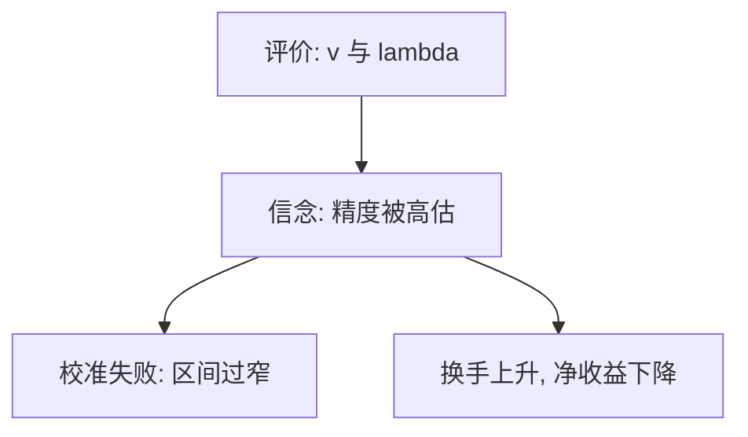

# 过度自信

人对自己的知识给出过窄的置信区间，对相对排名给出过高的位置——错的是信念，不一定是 $v$。

<footer>—— Alpert and Raiffa 的校准；Svenson, Acta Psychologica 1981；Odean, Journal of Finance 1998, 1999</footer>

[上一课](/econ/endowment-effect)动的是参考点上的评价。本课缺口换成信念：过度精确、过高估计、过优定位。不重写 $\lambda$。

## 问题

前景理论可以在正确概率上扭曲权重。过度自信是概率本身错了：置信区间覆盖真值的频率低于名义水平（Alpert 与 Raiffa 的校准）；多数人认为自己驾驶水平高于中位数（Svenson, 1981）。Odean（1998, 1999）把过度自信接到交易：人高估私有信号精度，成交量上升，事后平均亏损。Daniel、Hirshleifer 与 Subrahmanyam 的定价模型是后单元；本课先钉微观信念偏差。

缺口是在已有期望效用或前景理论上，把信念从客观 $p$ 换成过度精确的 $\hat p$，而不是再定义效用。

Moore 与 Healy 区分三种过度自信。交易量故事主要用过度精确：方差低估，而不是均值盲目乐观。

## 方法

校准测验：让人给出 90% 区间，看命中率。相对定位：让人报百分位。市场：比较换手与随后收益。本课不估计知情交易概率——那是微观结构。家庭侧：过度自信降低分散、提高个股集中、提高参与但伤害净收益。

## 机制

机制是后验过窄。贝叶斯更新若把信号精度设得太高，私有信息被过度加权，人愿意和别人交易。总交易量超过理性差异信念所能解释的水平。这与[EMH](/econ/emh)的联合假说不同：这里连主观概率的校准都失败，不只是 alpha 的风险调整。现时偏差改的是贴现；过度自信改的是条件分布。

自我归因（赢了归技能、输了归噪声）使过度自信不被数据消灭，DHS 课再用。

校准失败与概率加权要分开：加权是明知 $p=0.01$ 仍当 0.05 用；过度精确是把 90% 区间画得像 50%。Odean 的账户证据是换手与随后收益的负相关，不是盘口。主干 [EMH](/econ/emh) 的弱式针对历史价格；过度自信交易者可以制造成交量，价格是否可预测仍要联合一个风险模型。本课只钉信念输入先错了。

## 边界

难任务上过度自信、易任务上可能不自信。选择进入金融的人可能本身更过度自信，样本不是随机家庭。本课不把所有高换手写成过度自信：再平衡、税收、流动性需求同样产生交易。也不写限价单的排队策略。

后课默认：过度自信是信念校准失败；启发式是生成这些信念的心理捷径。

过度精确把置信区间画窄，私有信号被过度加权，换手上升。动的是 $\hat p$，不是 $v$。

自我归因让数据难以消灭误设，DHS 把它写成价格动态。

## 小结

- 过度精确使置信区间过窄，交易与集中度上升。
- 动的是 $\hat p$，不是 $v$；与损失厌恶分工。
- Odean：高换手家庭事后平均表现更差。
- 难任务上更过度自信，易任务上可能相反。
- 高换手还有再平衡与税收，不能全部归因。
- 出处：Alpert and Raiffa；Svenson 1981；Odean, *JF* 1998, 1999。
