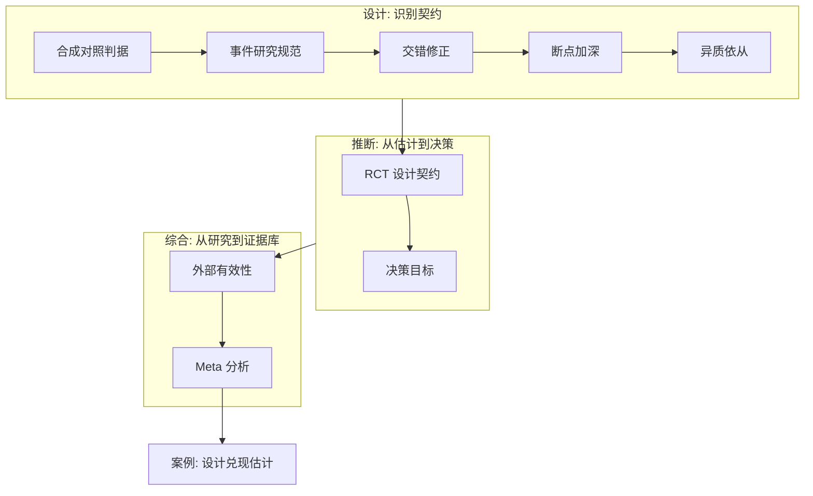

# 政策评估案例与收束

评估的成熟不是多一种估计量，而是每一步都问：假设写了没有、目标对准了没有、证据搬不搬得动——案例是这三问的考场。

<footer>—— 据 Card and Krueger, AER 1994；Abadie, Diamond and Hainmueller, JASA 2010；Finkelstein 等, QJE 2012 整理</footer>

[上一课](/econ/pe-meta-analysis)把多研究的合成收成估计问题。本课收束全课程：先把三个案例放回工具箱里各走一遍，再按读序重排十课。本课程到此收束。

## 问题

收束不靠清单，靠案例。**新泽西最低工资**（Card–Krueger 1994）：两州两组的差中差发现就业未降，主干[双重差分](/econ/difference-in-differences)以其为教具；它的后续推进全在对照的构造——相邻县洗掉区域趋势，一百多次上调的窗口读数把「受影响岗位的净损失」当作读数；两代文献的缠斗与元回归的收口在[最低工资：两代文献](/econ/minimum-wage-debates)。一个案例走过 DiD、预趋势、交错修正与 meta 全链条。**加州 99 号提案烟税与德国统一**：一个处理单位、没有门槛，合成对照的教具；按本课程第一课的判据读它们——处理前拟合是前提、安慰剂排位是推断、邻州走私是 SUTVA 威胁——案例的每一步推进都来自把可行判据当真。**俄勒冈医保抽签**（Finkelstein 等 2012）：彩票给随机化，名额有限给不依从——参保率升约 25 个百分点是第一阶段，健康与财务结局的效应沿 ITT 报，TOT 是依从者 LATE；「有保险」到「健康」的链条被后续工作分段评估，依从课与决策课的语言在同一个案例里交接。

三个案例的共同点：没有一个是因为「估计量先进」而推进了文献。最低工资赢在对照构造，烟税赢在可行判据，俄勒冈赢在设计契约写得干净——估计量只是把设计兑现。

## 方法

按读序重排全课程：

- [合成对照的深化](/econ/pe-synthetic-control-deep)：可行判据四条，修正方法与其代价。
- [事件研究的规范](/econ/pe-eventstudy-specification)：参照期、端点归并、队列加权、预趋势当诊断。
- [交错 DiD 的最新修正](/econ/pe-staggered-did-revisions)：诊断、定目标、选对照、显式聚合。
- [断点回归的加深](/econ/pe-rdd-deep)：带宽敏感性、操纵 bundle、离散驱动元、外推声明。
- [工具变量的深化：异质依从](/econ/pe-iv-heterogeneous-compliers)：LATE 是依从者的、工具特定的效应。
- [RCT 的设计与分析](/econ/pe-rct-design-analysis)：设计效应预算、按设计分析、ITT 与 TOT。
- [以决策为目标](/econ/pe-decision-target)：福利泛函、处理规则与后悔、试点的信息价值。
- [外部有效性](/econ/pe-external-validity)：四道断点，搬运的是参数与分布不是单点效应。
- [Meta 分析](/econ/pe-meta-analysis)：随机效应、两种筛子、异质性的元回归。

## 机制

十课能收成三条主线。**设计是识别契约**：每类设计都给出一组假设与可证伪检查——合成对照的拟合判据、事件研究的参照期、交错的干净对照、断点的局部随机、IV 的单调性与排除、RCT 的分配机制；契约条款写进报告，估计量才可审计。**推断对准目标**：从估计量到目标参数（ITT、LATE、ATT$(g,t)$、门槛效应）再到决策规则，每一步都要显式；名义水平、权重与错误不对称是这一段的常设检查点。**证据是组合物**：单研究的内部有效只是入场券，外推靠分布、调节结构与对筛子的校正；meta 把综合变成估计，案例把全部工具放回地面。

不这么做会错在哪：把课程读成估计量目录，案例只会被当成应用题；三条主线断任何一条，评估都退化成「跑一个显著的回归」。

## 边界

收束不是领域的边界：结构模型把「从未发生的规则」接走，那是下一门深钻课的事；本课程不越界去写它。三个案例也不构成「评估皆准」的证据——每个都留下未决的分布与边界，这正是把它们选进来的原因。读完本课程，默认的口径是：任何政策数字先问三问——假设、目标、搬运。

本课程到此收束。

## 小结

- 案例的推进来自设计兑现：对照构造、可行判据、设计契约。
- 三条主线：设计是契约、推断对准目标、证据是组合物。
- 报告的审计口径是三问：假设写了没有、目标对准了没有、证据搬不搬得动。
- 估计量是设计的兑现，不是课程的中心。
- 出处：Card and Krueger, *AER* 1994；Abadie, Diamond and Hainmueller, *JASA* 2010；Finkelstein 等, *QJE* 2012；Callaway and Sant'Anna 2021；Card, Kluve and Weber, *JEP* 2018。
