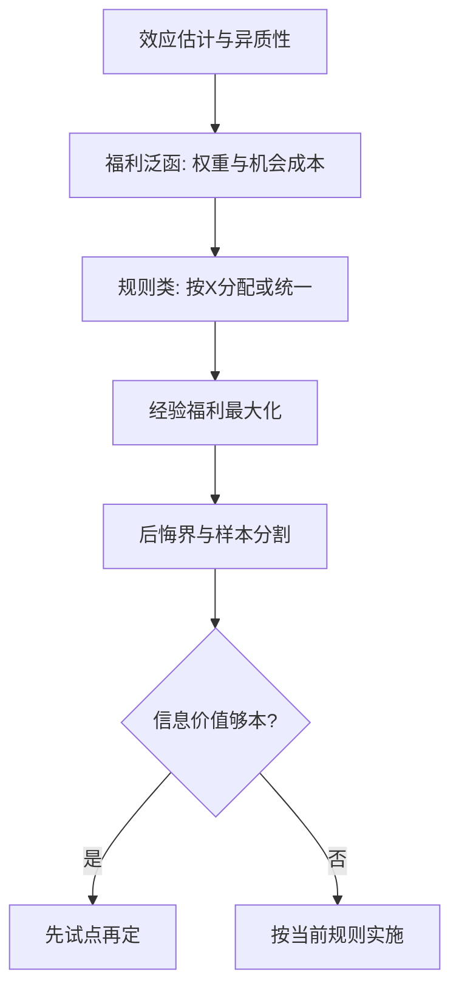
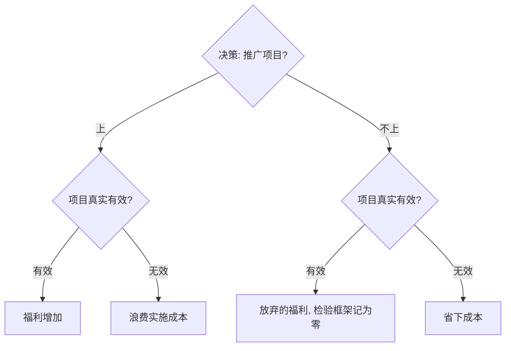

# 以决策为目标

把 $\hat\tau$ 印进报告不是终点：政策是选择，选择在损失函数下评价——估计为零与决策为零是两回事。

<footer>—— Wald, Statistical Decision Functions, 1950；Manski, Econometrica 2004；Kitagawa and Tetenov, Econometrica 2018</footer>

[上一课](/econ/pe-rct-design-analysis)把随机化实验的工程收在按设计分析上。到此为止，课程都在回答「效应是多少」；本课换目标函数：政策是**选择**——上不上、对谁上、多大范围上，选择的对错不在 $\hat\tau$ 的显著性里，在福利与损失里。Wald 1950 的统计决策理论是框架，Manski 与 Kitagawa–Tetenov 把它落成处理规则的可估问题。

## 问题

ATE 是描述，不是决策的充分统计。同一份 $\hat\tau$ 与置信区间，支持相反的决策：一个 CI 盖零的小效应，若项目近乎零成本，仍该上；一个大而显著的效应，若实施成本吃掉全部收益，就不该上。名义假设检验在结构上不编码**错误不对称**：把无效项目推广的代价与错过有效项目的代价，在 $\alpha=0.05$ 里被默认压平——前者有预算线上的数字，后者在检验框架里计为零。异质性同样换了角色：从「要不要控制」变成分配规则的原料——按 $X$ 分配处理还是统一处理，本身是被选对象。最后是信息的价值：试点不是延缓决策的官僚程序，是用小样本买关于大项目的信息投资，买多少要算。

数字实例：设项目人均成本 130 元、人均收益 120 元，$\hat\tau=120$ 哪怕在 1% 水平上显著也**不该上**（净收益 $-10$ 元）；反过来，$\hat\tau=15$ 但 CI 盖零、成本仅 1 元，则净收益 $14$ 元，该上。决策看的是差值 $\hat\tau-c$，显著性只描述 $\hat\tau$ 本身稳不稳。

决策损失矩阵里最大的格子常是「错过有效项目」：检验框架把它记为零，预算分析把它记成放弃的福利。名义水平从没承诺过对称，是使用者替它承诺了。

## 方法

把评估改写成决策问题的三件套。第一，定福利泛函：处理规则 $\pi$ 把协变量映射到「处理与否」，福利是它在人群上的期望净收益——分配权重与资金的机会成本进这里，不进回归。第二，找规则：经验福利最大化——在有限样本上直接最大化经验福利，得 $\hat\pi$术语翻译：「经验福利最大化」就是拿手头样本当账本，把每条候选规则（按 X 分配、统一上、都不上）的福利各算一遍，直接挑账面最高的那条。它不报 p 值，交付物是规则本身加上一条「最坏情形会亏多少」的后悔界。（Manski 2004；Kitagawa–Tetenov 2018 给出该规则的样本外后悔界，并允许约束到可实施的简单规则类）；规则类太富会过拟合，用样本分割或交叉拟合控住。第三，定信息投资：Dehejia 2005 把评估写成决策问题下试点值多少钱——先小后大、何时停，都按期望福利损失算，不按惯例算。报告随之改形：主交付从「$\hat\tau$ 与 CI」变成「规则、其后悔界、与最坏情形福利损失」。

## 机制

换目标改变一切下游。显著性不再是门票：决策看的是 $\hat\tau$ 相对成本的期望福利差，不是 $\tau=0$ 的否证。异质性从 nuisance 变成原料：分配规则的每一个分割点都要用证据撑，规则越细，过拟合与后悔界越紧。推断的重心从单个参数移到规则的**样本外表现**——这也提前回答了外推：规则要在目标人群兑现，研究人群的 $\hat\pi$ 搬不搬得动，是下一课的正题。

不这么做会错在哪：拿 ATE 加显著性做决策，零成本项目被 CI 盖零否决；按「谁受益多」随意分层，规则在样本外翻车；试点当成常规程序，既不算信息的账，也不按信息更新。

上图回答一个流程图没有回答的问题：决策损失矩阵具体长什么样。四个格子的代价结构只有进入福利泛函才会被比较——$\alpha=0.05$ 只控制第一类错误的频率，从不涉及「错过的福利」该记多少；这正是同一份 $\hat\tau$ 支持相反决策的机制根源。

## 边界

本课不宣称福利泛函客观：分配权重是价值判断，决策理论把它显式化，不替你选。极大极小与贝叶斯两条路线的完整比较不展开；序贯决策的推导留给专门文献。也不是所有评估都该写成决策——机制证据与描述性目标仍在。换目标不换纪律：识别假设、设计契约、上一课的全部条款照旧生效，变的只是从估计量到结论的那一步。

后课默认：决策要的是目标人群的福利；效应往目标人群搬的过程，下一课拆。

## 小结

- 估计是描述，决策是选择；选择要福利泛函，不要显著性。
- 名义 $\alpha$ 不编码错误不对称；损失矩阵才编码。
- 处理规则用经验福利最大化加后悔界，规则类别太富会过拟合。
- 试点按信息价值定价，先小后大是被算出来的。
- 出处：Wald 1950；Manski, *Econometrica* 2004；Dehejia, *J. Econometrics* 2005；Kitagawa and Tetenov, *Econometrica* 2018。
