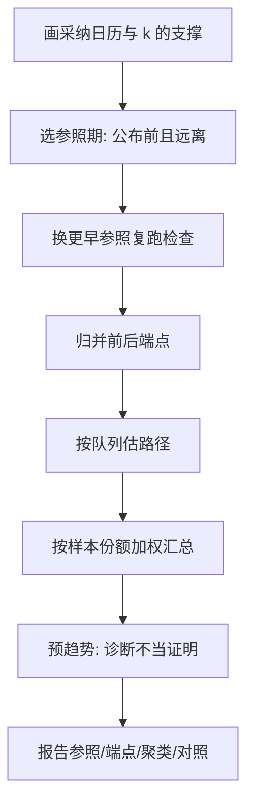
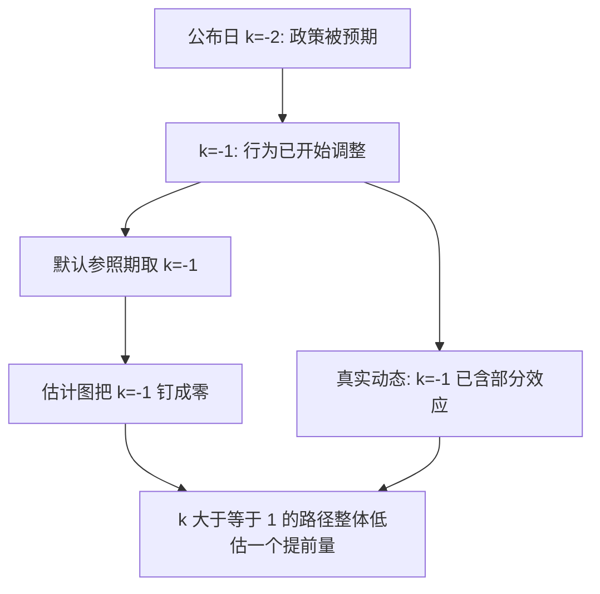

# 事件研究的规范

事件图能画出来，不等于识别成立；参照期、端点与队列这三个选择先于任何系数——图上每一段路径都是这三个选择画出来的。

<footer>—— 据 Sun and Abraham, Econometrica 2021；Roth, Pretest with Caution, AER: Insights 2022 整理</footer>

[上一课](/econ/pe-synthetic-control-deep)把合成对照从装置收成可行判据：拟合是前提、凸包是边界、安慰剂是设计检验。本课换到时间锚定的设计。主干[事件研究](/econ/event-study-econ)已钉了相对路径、无预期与金融 CAR 的对照；本课补「规范」二字：参照期怎么选、端点怎么处理、预趋势检验能证到哪一步、交错下系数怎么加权。这一课是设计与诊断的合同文本，下一课的交错修正在它之上展开。

## 问题

事件研究回归把日历对齐到事件日，省略一期作参照，其余系数读成动态路径。三个自由度不在估计量里自动正确。**参照期**：默认省略 $k=-1$，但预期效应最集中的恰是处理前最后一刻——政策公布日早于生效日时，$-1$ 已被预期污染，整条路径以它为零点，等于把提前反应从效应里减掉。**端点**：$k$ 越大，剩余在窗内的单位越少、日历拉开越远；远端系数是不均衡样本上的长差分，噪声大却照样被读者读成「持续效应」。**队列**：交错采纳下，把所有队列摁进一条 pooled 路径，是 Sun–Abraham 指出的污染加权——早队列的动态被打进晚队列的系数，接口在主干[交错 DiD](/econ/staggered-did) 已留。

预趋势检验是第四个坑。Roth 2022 的要点：检验通过不等于平行趋势成立——功效可以很低，偏离也可以不是平的；检验未通过后的常见「修复」（丢前期、缩窗口、换结局）是在看过检验之后选规格，选择本身重新引入偏倚。

直觉类比：选参照期像给体重秤「归零」——归零按钮按下时秤上若已站了东西，之后所有读数都会少算那一份。政策公布日早于生效日时，$k=-1$ 上人们已经在抢跑，把 $k=-1$ 钉成零点，等于带着预期效应归零，整条动态路径被整体拉低。

端点归并的具体做法：把 $k\ge K$ 并成一格、$k\le -K$ 并成一格，相当于报两个长差分。不归并时，远端系数常由十几家单位驱动，置信带宽到什么都读不出，但仍会被读出「效应持续」。

## 方法

规范流程五步。第一，画采纳日历与事件时点分布，确认每格 $k$ 上有多少单位在撑。第二，选参照期：落在公布之前、且离公布足够远；同时换一个更早参照复跑，路径若位移，说明原参照已被预期穿透。第三，归并端点，不报只由零星单位支撑的格子。第四，交错下按队列估路径、按样本份额加权（Sun–Abraham），不报 pooled TWFE 事件图。术语翻译：「队列」就是同一批采纳处理的单位——2015 年采纳的省份是一支队列，2018 年采纳的是另一支。「按队列估路径」是给每支队伍各画一张事件图、再按队伍大小加权平均；混在一条回归里，早队伍的动态会被错记进晚队伍的系数。第五，报告四件套：参照期与归并规则、聚类层级、对照构成、预趋势检验当诊断不当证明。推断沿[聚类标准误](/econ/clustered-se)的口径，政策在群层就在群层聚。

## 机制

对齐的机制是把异质日历收成相对时间，让「处理前」成为一条可画的对照路径；弱点也在对齐：参照期的零点是人为钉的，钉在预期里，路径整体平移而系数不失真。规范因此都是**把自由度显式化**：换参照检查平移、归并端点砍掉支撑薄的格子、按队列拆开污染。预趋势检验在机制上是一个功效有限的原假设检验——它只能否证，不能证实；把「没检验出」读成「没有」，是把第二类错误当成了证据。

不这么做会错在哪：不归并端点，结论被两三家单位翻动；不换参照，预期把「提前抢跑」计成零；不拆队列，一条平均路径同时捏着几十个不同时点的政策。

上图回答的问题是参照期污染的传导链条：五步流程图讲「规范怎么做」，这张讲「参照钉错时路径怎么骗人」——$k=-1$ 被预期穿透后不是那一个系数错，而是整条路径以它为零点整体平移，后端效应全部被低估。

## 边界

本课不把事件系数读成结构参数，「从未出现过的规则」是结构课的题；连续处理、同一单位多次事件的重叠窗口，只标注要排开或只留首次，不展开。金融的事件窗与 CAR 沿主干口径，不重写。规范的尽头要说清：这条路径是给定对照与参照下的约化形式动态效应，换一个设计决策，路径随之移动——移动本身就是设计报告的一部分。

后课默认：报事件研究先报三个选择；交错面板的完整修正，下一课接手。

## 小结

- 参照期要落在预期之前；$-1$ 是默认，不是安全。
- 端点归并，远端格子的支撑与带宽要报出来。
- 交错下按队列估路径、按份额加权，不报 pooled 图。
- 预趋势检验可证伪不可证实；未通过的「修复」是二次选择。
- 报告四件套：参照、端点、聚类、对照构成。
- 出处：Sun and Abraham, *Econometrica* 2021；Roth, *AER: Insights* 2022；MacKinlay, *JEL* 1997。
