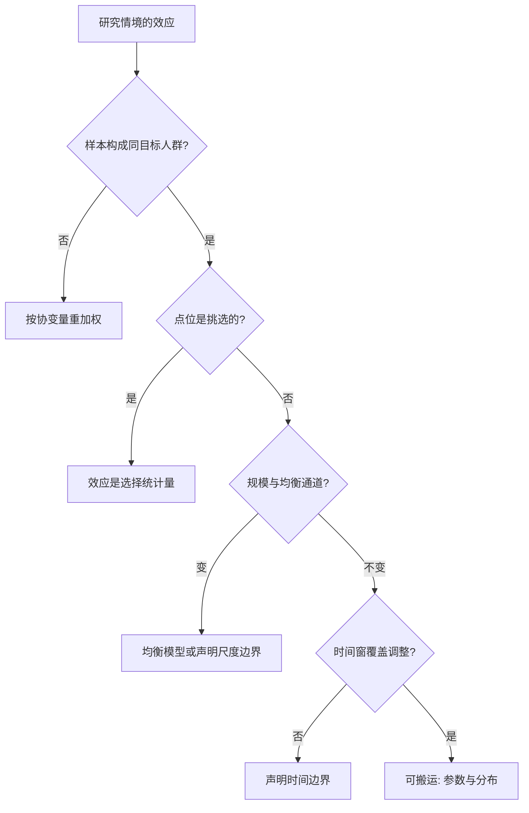

# 外部有效性

内部有效只是入场券：样本、点位、规模与时间四道断点，任何一道都能让「在此处为真」变成搬运事故。

<footer>—— Allcott, QJE 2015；Deaton and Cartwright 2018；Athey and Imbens 2017</footer>

[上一课](/econ/pe-decision-target)把评估的目标改成福利与规则，而规则要在目标情境兑现——效应从研究情境搬过去的过程，就是本课。内外部有效的分界在[实验经济学方法](/econ/experimental-methods)已经划过；本课把外推的断点拆开：断在哪、为什么断、怎么搬才是对的搬法。

## 问题

外推的失败有四个来源，彼此独立。**样本构成**：志愿者、被试池、行政数据覆盖面，都让研究人群不是目标人群——效应异质时，这是加权错误，不是噪声。**点位选择**：Allcott 2015 的要点最锋利——实施者与评估者会按已知效应挑点位（项目先在容易成功的点铺开，或在显著结果出来后扩点），于是文献里的平均效应是「点的选择统计量」，不是任何总体参数；内部有效到无懈可击的 RCT 也拦不住这一条。**规模**：pilot 的小规模效应在推广后改变价格、容量与市场结构——培训项目扩大十倍会压低毕业生工资溢价，补贴扩大十倍会抬高被补贴品价格；局部均衡到一般均衡，per-unit 效应本身就变了，实施机构的带宽同样随规模变。**时间**：短期反应不是长期效应的样本——资本调整、技能积累、规范迁移都在年际尺度上展开，两年试验读不出十年的世界。

Allcott 用同一节能项目在多个点位的数据把「按已知效应挑点」的方向算了出来：文献平均被系统性高估。挑大效应的点位发表，等于把均值当成了选择统计量——这与发表偏倚是两种不同的筛子。

## 方法

应对按断点分。样本构成：报告效应在协变量上的分布而不只报均值，把目标人群的加权效应当主交付——这正是决策课福利泛函的输入。点位选择：多点位置随机选点或注册点位，单点位研究声明「这是谁的点」；综述时把点位特征当调节变量记录。规模：区分 per-unit 效应与规模弹性，政策规模的效应估计要价更高——市场均衡的通道要么用均衡模型补，要么声明估计只在 pilot 尺度内有效（接口在[结构对约化形式](/econ/structural-vs-reduced)：约化 ATE 是「项目 $\times$ 情境」的合成物，弹性、MTE 曲线这类参数更可搬运，但搬运它们要模型正确）。时间：短窗效应配长期跟随，或显式声明时间边界。

## 机制

外推失败的机制是效应的**复合性**：$\tau$ 是项目 $\times$ 样本 $\times$ 点位 $\times$ 尺度 $\times$ 时间的乘积式合成物，任何一项从研究值变到目标值，$\tau$ 就变。内部有效控制的是「研究那一格」的混淆；外推要求的是其余格子的映射规则——前者是设计问题，后者是建模与证据组合问题，两者不可互相替代。这也是 RCT 与结构模型的分工：随机化把研究格的映射买断，结构把格子间的映射写出来；只有其一，搬运都缺一条腿。

不这么做会错在哪：单点位 RCT 的 $\tau$ 直接进别处的成本收益，决策课的福利计算从源头错起；多点复制只报均值，把分布的宽度藏掉；把「内部有效」当护身符，回避点位与规模问题。

## 边界

本课不给出「外推系数」的通用公式——不存在。Deaton–Cartwright 对 RCT 证据地位的批评提醒的是平衡：随机化解决分配问题，不解决搬运问题，两句话都要说。多情境外推的形式化装置——证据合成、调节效应、发表过滤——是下一课 meta 分析的地盘，本课只把「效应的分布比均值重要」这句铺垫放下。也不用外推怀疑主义否定评估：搬不动的是数字本身，能搬的是机制、参数与设计。

后课默认：外推是证据组合问题；多研究的正式合成，下一课。

## 小结

- 四道断点：样本构成、点位选择、规模与均衡、时间窗。
- 点位选择使文献均值成为选择统计量，与发表偏倚是两种筛子。
- per-unit 效应随规模变；pilot 数字直接乘总人口是常见事故。
- 可搬运的是参数、分布与机制，不是单点 ATE。
- 出处：Allcott, *QJE* 2015；Deaton and Cartwright 2018；Athey and Imbens 2017。
