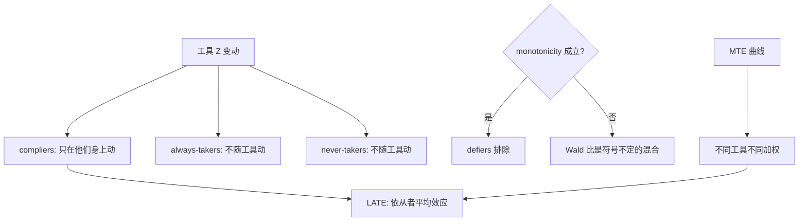
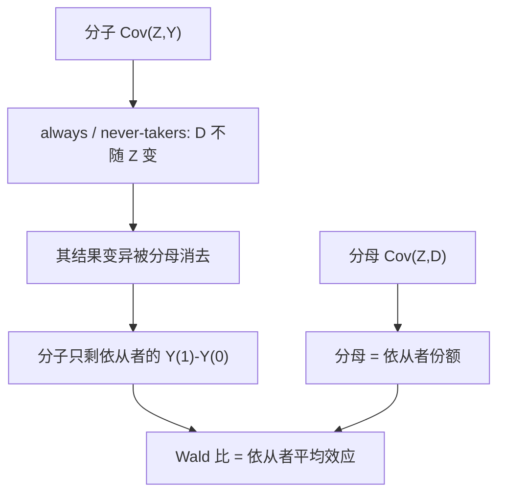

# 工具变量的深化：异质依从

IV 回答的不是「处理的效果」，而是「工具撬动的那条边际上，依从者的效果」；换一个工具，就换了一个问题。

<footer>—— Imbens and Angrist, Econometrica 1994；Angrist, Imbens and Rubin, JASA 1996；Heckman and Vytlacil, Econometrica 2005</footer>

[上一课](/econ/pe-rdd-deep)把门槛上的证据钉牢，模糊断点只留了一句接口：门槛 IV 估计的是门槛邻域内依从者的效应。本课展开这个接口。主干[工具变量与弱工具](/econ/iv-weak-instruments)钉了相关与排除、弱工具偏向 OLS；那里先用了常数 $\beta$。本课在效应异质下把 IV 的估计对象拆开：谁在依从、Wald 比认得谁、以及这个数字能回答什么政策问题。

## 问题

让潜在处理状态随工具取值：$D_i(z)$ 是「若工具定为 $z$，个体 $i$ 是否被处理」。按 $D_i(1)$ 与 $D_i(0)$ 把人口劈成四层：两边都处理的 always-takers、两边都不处理的 never-takers、只在工具向上时处理的 compliers、反向的 defiers。**单调性** $D_i(1)\ge D_i(0)$ 排除 defiers 后，Wald 比 $\mathrm{Cov}(Z,Y)/\mathrm{Cov}(Z,X)$ 识别的恰是依从者的平均处理效应（Imbens–Angrist 的 LATE）。这带来三个必须直面的问题。其一，LATE 是**工具特定的**：出生季度撬动的是「多读几个月书」的边际学生，距离大学的边际很远；换一个工具，撬动另一批人，数字不同。其二，排除在异质下读法更苛刻：Angrist–Imbens–Rubin 的假设结构要求工具对每层潜结果的作用只经处理状态传导，恰可识别时它仍不可检验。其三，依从者不可观测——你不知道谁被工具移动了——但他们的协变量画像可以恢复（Abadie 2003），这是 LATE 从一个数字变成一个群体的唯一途径。

直觉类比：把工具想成一张随机发放的优惠券。发不发都会买的是 always-takers，发了也不买的是 never-takers，见券才买的是 compliers，见券偏不买的是 defiers（被单调性排除）。IV 能度量的只有第三种人——券带来的销量变化全部发生在他们身上，前两种人对券毫无反应，数据里没有他们的效应信息。

Angrist–Krueger 的出生季度工具至今是好例子：它识别的只对「因义务教育约束多读了书」的人。对无论如何要读完高中的 never-takers，数据里没有任何关于他们的信息——份额小，则 Wald 比虽准，覆盖的人极少。

## 方法

报 LATE 时同时报四件：第一阶段（工具撬动处理率的幅度）、依从者份额（第一阶段本身就是它的估计）、依从者的协变量画像（Abadie 加权恢复）、以及工具的制度含义（它模拟的是哪种政策扩张）。数字实例：若奖学金使大学入学率从 50% 涨到 58%，第一阶段就是 8 个百分点——Wald 比的分母是 0.08，被撬动的依从者约占人口的 8%。其余 92% 的人（always- 与 never-takers）对奖学金毫无反应；这个 LATE 估计得再准，也只替这 8% 的人说话。视角再升一层：Heckman–Vytlacil 的**边际处理效应**曲线 $MTE(u)$ 按不可观测的进入意愿排开效应，IV 估计量是这条曲线在工具决定的区间上加权；工具不同，权重不同——这就是「换工具换问题」的正式说法。单侧不依从（对照组拿不到处理）时没有单调性问题，encouragement 设计最干净；fuzzy RDD 是同一语言：估计对象是门槛邻域内 compliers 的效应，恰好把上一课的接口接上。弱工具的纪律不变：分母近零时 Wald 比连依从者效应都保不住，先过[弱工具诊断](/econ/iv-weak-instruments)。

## 机制

机制是分层消去。Wald 比的分子 $\mathrm{Cov}(Z,Y)$ 里，always-takers 与 never-takers 的处理状态不随工具变，其结果变异被分母消去，剩下的分子只装着依从者的 $Y(1)-Y(0)$；分母装着依从者份额。IV 于是不是「更聪明的回归」，是把识别范围**收缩**到能被工具移动的那群人。政策含义随之改变：若目标政策改变的依从边际与工具不同（比如全国扩招撬动的是另一段入学分布），LATE 不能直接搬——搬的对象是 MTE 曲线的形状与依从者画像，不是单个数字。

不这么做会错在哪：把 LATE 当 ATE 报，等于用边际学生的教育回报回答全人口的平均回报；不报第一阶段幅度，读者无法知道这个数覆盖了多少人、是谁。

常见误区：初学者容易把 IV 结果写成「教育的回报率是 X%」。严格写法必须带限定语——「对被出生季度约束撬动的那部分边际学生」。这一步如果省了，后面拿这个数字去预测「全国扩招」的效果时，等于假设扩招撬动的也是同一批边际人，政策外推从结论句就开始错。

上图回答的问题是 Wald 比凭什么「恰好」只剩依从者：分层图（上表）画出人口怎么被劈成四层，这张画出消去机制——两层不随工具动的人在分子分母里同步出现、相消，分子分母各留下一半 Wald 比，识别不是运气，是消去法的代数结果。

## 边界

本课不做 MTE 的结构估计与政策外推测度，那要更重的模型假设；一般均衡与市场规模效应不进 LATE 语言。多值处理、连续工具的 LATE 定义只标接口。排除约束在恰可识别下依然不可检验，本课给出的只是画像与机制故事的可信度清单，不是检验。弱工具与异质同时出现时，名义置信区间最先失效，纪律沿主干口径。

后课默认：IV 的结论句写「对依从者」，不写「对所有人」；下一课从设计源头处理依从——随机化实验的 ITT 与 TOT。

## 小结

- 单调性排除 defiers 后，Wald 比识别依从者的平均效应。
- LATE 工具特定；正式说法是 MTE 曲线上不同工具的不同加权。
- 依从者份额就是第一阶段；画像用 Abadie 加权恢复。
- 政策外搬运的是曲线与画像，不是单个 LATE。
- 出处：Imbens and Angrist, *Econometrica* 1994；Angrist, Imbens and Rubin, *JASA* 1996；Abadie, *J. Econometrics* 2003；Heckman and Vytlacil, *Econometrica* 2005。
