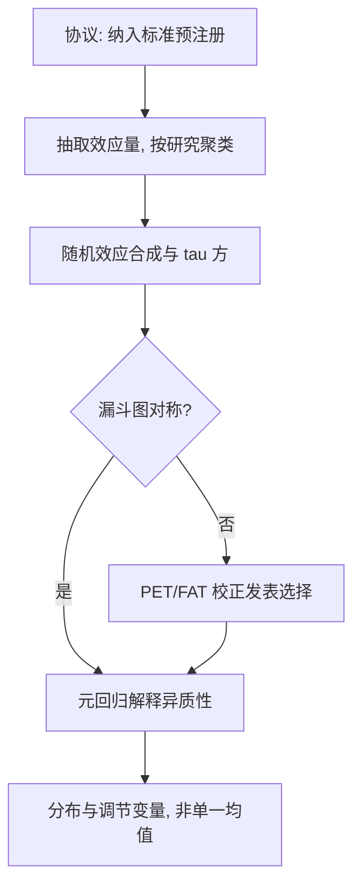
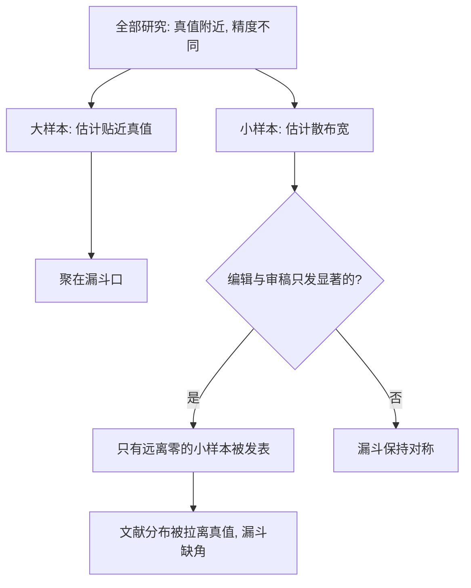

# Meta 分析

文献的平均效应不是参数，是统计量：它被发表过程筛过、被点位挑过；meta 分析的工作是把筛子翻过来看。

<footer>—— Glass 1976；Egger 等, BMJ 1997；Card, Kluve and Weber, JEP 2018</footer>

[上一课](/econ/pe-external-validity)把外推的断点拆开，留下一个尾巴：多点复制之后，证据怎么合成？本课写 meta 分析——Glass 1976 把「对分析的分析」命名成方法，把外部有效性从叙述变成估计。它是本课程综合单元的技术核心，也是[多重检验](/econ/multiple-testing-econ)与点位选择两道筛子的收口处。

## 问题

把一批研究的效应量平均起来，要同时回答三个问题，每个都有坑。**平均多少**：固定效应假设所有研究挤在一个真值上，几乎从不成立——研究来自不同人群、点位与实施质量；随机效应把研究间方差 $\tau^2$ 显式建模，权重从「只按精度」改成「精度加分布」，异质性大时固定效应的窄置信区间是假的。**异质性多大**：$\tau^2$ 与 $I^2$ 是要报告的主结果，不是脚注——分布的宽度才是外推的可用信息（上一课的口径）。**合成本身干净吗**：不干净。发表过程偏好小样本显著结果，漏斗图于是不对称；点位选择与规格搜索各筛一道；同一个研究里抽出的几十个估计高度相关，当独立观测平均，方差被假性缩小几十倍。合成不修复质量，只放大它——垃圾进，分布更宽的垃圾出。

数字实例：$I^2$ 读作「离散中研究间真差异占的比例」。若 30 个研究算出 $I^2=75\%$，意味着四分之三的离散来自「这些研究本来就在测不同的东西」，只有四分之一是抽样噪声——此时把研究挤成一个大数没有意义，分布的宽度本身才是答案。

Doucouliagos 与 Stanley 对几十年最低工资研究的元回归是最直白的示范：精选研究的弹性集中在小负值，校正发表选择后中位数趋近零——表观共识可以是筛子的形状。这与[最低工资：两代文献](/econ/minimum-wage-debates)里「对照构造之争」是同一现象的两个层次。

## 方法

工序五步。第一，定协议：纳入标准、结局、时段预先写死（医学的 PRISMA 传统），否则选择在检索阶段就发生。第二，抽效应量：标准化口径统一（均值差、弹性、对数几率），同一研究的多个估计按研究聚类，不进独立平均。第三，估合成：逆方差加权的随机效应模型，$\tau^2$ 用矩估计（DerSimonian–Laird）或其修订；异质性连同合成值一起报。第四，查筛子：漏斗图不对称性（Egger 检验）、PET/FAT 元回归（Stanley–Doucouliagos）把发表选择的斜率显式估出来；精确研究贴近真值、模糊研究被推离，形状本身就是证据。第五，解释异质性：元回归把调节变量放进模型——Card、Kluve 与 Weber 对主动劳动市场政策的元分析是范式：项目类型、目标群体、周期状态比国别更能解释 $\tau^2$，设计特征可携带，国别口号不可携带。

## 机制

机制是把「研究的抽样」显式建模：观测到的效应量 = 真值 + 研究层抽样噪声 + 研究间方差，第三项是随机效应对固定效应的全部增量。直觉类比：漏斗图像一张靶纸——枪法准的射手（大样本研究）弹孔集中在靶心，枪法散的（小样本）弹孔均匀散在四周，整体该呈对称漏斗。若纸上只见「离靶心远的弹孔」而不见同距离偏另一侧的，就是有人把打偏的成绩撕掉了：缺角本身就是筛子的指纹。发表偏倚在机制上是对「哪些研究可被观测」的截断——meta 的推断对象因此是**可观测文献的分布**，校正方法是在这个分布上反解筛选规则。不这么做会错在哪：投票计数（数显著结果的个数）把筛子隐形化；「综述叙事」把权重交给作者直觉；给研究质量加权的合成若不给权重规则，只是另一种叙事。

上图回答的问题是五步工序里「查筛子」一步的原理：工序图画 meta 怎么做，这张画发表截断怎么把漏斗掰弯——观测到的分布是「真值分布过筛后的条件分布」，Egger 检验与 PET/FAT 反解的正是这条筛选规则。

## 边界

meta 不能凭空修复识别：被合成研究的内生效障各不相同，合成放大它们而不是抵消。常见误区：初学者以为「多研究平均能抵消各自的偏误」。平均抵消的是**随机**噪声；若各研究都因同类原因向同一方向偏（都用同一套有漏的对照），平均后偏误原样保留，只是披上了「30 项研究共识」的外衣，反而更难被质疑。LATE 与依从边际跨研究不同（依从课的口径），直接平均不同工具的 LATE 是在平均不同参数。异质性的元回归受生态谬误与调节变量间的共线限制，解释要克制。协议化也止于检索与纳入——代码与分析层面的选择仍要靠复现包与数据透明兜底。

后课默认：证据综合的产出是分布与调节结构，不是一个大数；下一课把全部工具放回真实政策案例收束。

## 小结

- 随机效应是默认：研究间方差 $\tau^2$ 与 $I^2$ 是主结果。
- 发表与点位是两种筛子；漏斗不对称与 PET/FAT 把筛子显式化。
- 同研究多估计按研究聚类，不当独立观测。
- 异质性解释靠设计特征的元回归，国别口号不算解释。
- 出处：Glass 1976；DerSimonian and Laird 1986；Egger 等, *BMJ* 1997；Stanley and Doucouliagos；Card, Kluve and Weber, *JEP* 2018。
