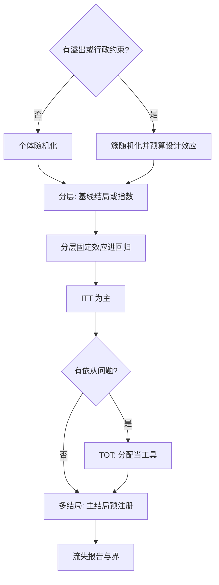
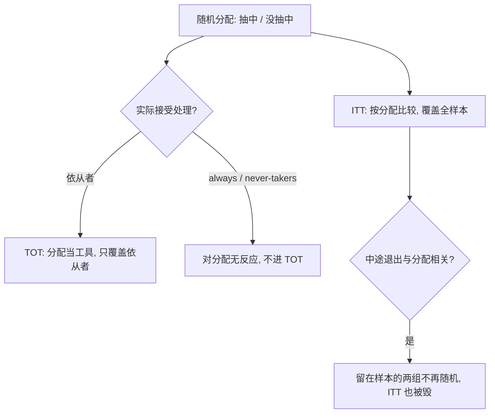

# RCT 的设计与分析

随机化买到的只是期望意义上的可比；设计上偷的懒，不会消失，会在方差、流失与名义水平里逐行还回来。

<footer>—— 据 Duflo, Glennerster and Kremer 2007；Bruhn and McKenzie, Journal of Economic Surveys 2009；Athey and Imbens 2017 整理</footer>

[上一课](/econ/pe-iv-heterogeneous-compliers)把 IV 的对象钉在依从者边际上——不依从本身就是一个设计问题。本课从源头处理依从：随机化实验。[实验经济学方法](/econ/experimental-methods)给了诱导价值与内外部有效的分界，[潜在结果](/econ/potential-outcomes)给了随机化的合法性；本课写设计与分析的工程细节：分组单位、分层、功效预算，ITT 与 TOT 的分工，以及「按设计分析」这条纪律。

## 问题

随机化保证的是分配机制与潜结果独立，于是两组在期望上可比；设计错误都不在「可比」上显形，而在别处。**分组单位**：政策有溢出（疫苗、信息、价格）时个体随机化把对照污染成部分处理，要按簇随机——而簇内的相关性立刻吃掉有效样本。**分层**：不做分层的纯随机在中小样本里会留下基线不平衡的坏抽签，事后加协变量救不回设计丢掉的那部分。**功效**：样本量若不按设计效应预算，试验结束时置信区间宽到回答不了政策问题——钱已花完。**流失**：中途退出若与处理相关，连 ITT 都不干净，因为留在样本里的两组不再是随机的两组。**多结局**：二十个结局指标各用名义 5%，主结论的名义水平早已坏掉，那是[多重检验](/econ/multiple-testing-econ)的现成口径。

设计效应 $1+(m-1)\rho$ 的账要会算：簇均 $m=40$、组内相关 $\rho=0.1$ 时，有效样本缩到约五分之一——同样的钱，MDE 差一倍不止。簇随机不做这笔预算，是功效虚高的最常见来源。

## 方法

设计三步。第一，定随机化单位：有溢出或行政单位约束就用簇，接受功效损失。第二，分层：分层变量用基线结局或其预测指数（利润指数），层数有限、每层够大；配对随机化是极端分层（Bruhn–McKenzie 的综述口径）。直觉类比：分层随机像「先分堆、再抛硬币」——按基线把人先分成几摞，再在每一摞内部各抛一次硬币。这样每摞里两组人数天然均衡，基线比较不靠运气；不分层的纯随机在中小样本里可能整摞落进同一组，事后加协变量救不回这份损失。第三，预注册主结局与主规格，把 $m$ 压回 1。分析按设计走：随机化用到的分层必须以分层固定效应进回归，否则精度白丢；ITT 为主——抽中与实际接受分开报；不依从时 TOT 用随机分配当工具，估计对象正是上一课的依从者 LATE，这里只换语境；差异流失要报两组流失率与流失者的基线差，并给界；簇随机配簇级聚类或随机化推断（[聚类标准误](/econ/clustered-se)的口径），设计形态允许时随机化推断是最贴设计的检验。

## 机制

机制核心是**按设计分析**：合法的推断单位是随机化发生的那一层。术语翻译：ITT（intention-to-treat）是「分到就算」的口径——按抽签结果分组比较，不管实际接不接受处理；TOT 是「真的接受了处理的人」身上的效应。ITT 常因不依从被稀释变小，但政策推广时面对的正是「有人不遵从」的现实，所以 ITT 是决策该用的口径，TOT 只回答「药对依从者有多灵」。分层信息不进回归，设计给的精度被扔掉；簇被当个体，名义标准误比真的小好几倍；看过数据再挑主结局，随机化保证的 $\alpha$ 作废。这些都不是哲学立场，是设计契约的条款——随机化用一份分配机制换了可比性，分析的每一行都在决定这份契约是否被履行。

不这么做会错在哪：不做设计效应预算，试验功效虚高近五倍；不做流失分析，把「差异流失后的样本」当随机样本解释；ITT 与 TOT 不分开，读者拿依从者效应当全员效应用。

上图回答的问题是「ITT 与 TOT 各自量的是谁、何时失效」：方法图给出设计选择的流程，这张画出分配到接受之间的第二道门——不依从把 TOT 缩到依从者，差异流失连 ITT 的可比性都拆掉；推断的合法性逐级取决于哪一层的随机化还完好。

## 边界

本课不做伦理审查与知情同意的制度清单，也不把 RCT 写成评估的唯一金标准：内外部有效的分界沿[实验经济学方法](/econ/experimental-methods)，外部有效性是本课程后两课的正题。序贯试验与可选停止的推断不展开。RCT 与准实验的关系要摆正：它不是「更高级的 DiD」，是另一种识别契约——假设更少、可搬性更弱，两种契约的纪律一样硬。

后课默认：实验报告按设计条款读；估计量如何变成决策，下一课换目标函数。

## 小结

- 随机化单位跟着溢出与行政约束走；簇随机必须预算 $1+(m-1)\rho$。
- 分层变量用基线结局或预测指数，层数有限；分层进回归。
- ITT 为主；TOT 用分配当工具，对象是依从者 LATE。
- 差异流失毁掉 ITT，报流失率、基线差与界。
- 主结局预注册；多结局的校正沿多重检验口径。
- 出处：Duflo, Glennerster and Kremer 2007；Bruhn and McKenzie 2009；Athey and Imbens 2017；Imbens and Rubin 2015。
