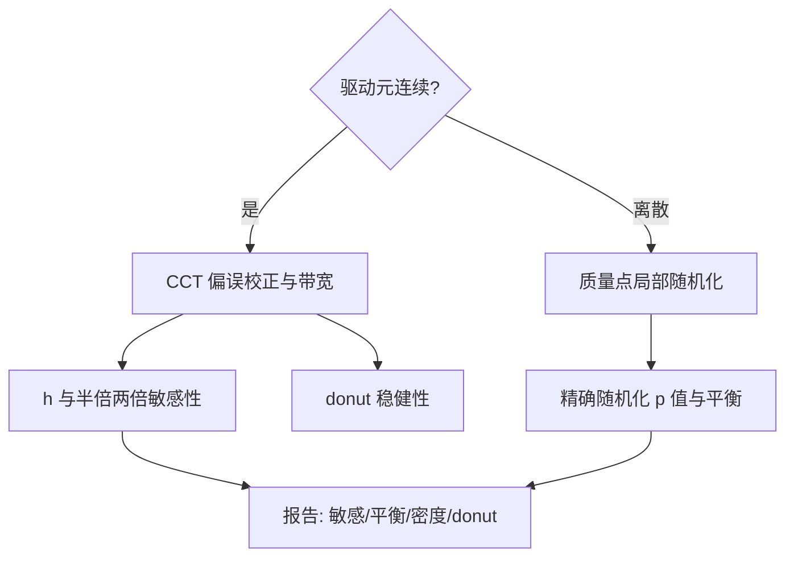

# 断点回归的加深

断点给出的因果是一英寸宽的世界；加深不是把这结论推宽，而是把这一英寸钉得更牢——带宽、操纵、离散驱动元，每一处都是钉子。

<footer>—— Imbens and Kalyanaraman, REStud 2012；Calonico, Cattaneo and Titiunik, Econometrica 2014；Gelman and Imbens 2019</footer>

[上一课](/econ/pe-staggered-did-revisions)把交错面板的目标参数钉在聚合与对照上。本课回到截面门槛设计。主干[断点回归](/econ/rdd)钉了清晰与模糊、局部多项式、Imbens–Kalyanaraman 与 CCT 带宽、McCrary 密度；本课加深四处：带宽内的偏误-方差账、操纵检验的升级、离散驱动元的另一套推断、从门槛外推的声明。

## 问题

带宽不是细节，是识别的一部分。CCT 的偏误校正把门槛附近曲率差扣掉，代价是方差上升；带宽每变一次，$\tau$ 就变一次——不报敏感性，等于把一个中间值伪装成常数。操纵检验同样要升级：McCrary 密度只能抓「可操纵且想操纵」的驱动元，分数恰在门槛附近的平滑密度不能排除研究者没见过的操纵；所以密度检验要与**协变量 bundle** 并用——基线协变量在 $c$ 处都不跳，是局部随机这一句话的另一组可证伪读数。离散驱动元是第三处：考试成绩整数、票数按席计，密度在门槛附近没有意义，质量点之间没有「几乎一样」的邻居，局部随机化推断（Cattaneo、Frandsen 与 Titiunik）换成「$c-1$ 与 $c$ 两个质量点的精确随机化检验」。第四处是外推：$\tau$ 只在 $c$ 的一英寸内成立，全局政策乘数要另加结构或分布外推假设，并显式声明。

Gelman–Imbens 的警告值得钉在墙上：全局高阶多项式在支撑两端的摆动能造出假断点。阶数是一或二的局部拟合加带宽敏感性，默认没有「拟合得越平滑越好」这回事。

## 方法

流程按驱动元分岔。连续驱动元：CCT 稳健偏误校正估计，报 $h$、$\tfrac12 h$、$2h$ 三档敏感性；协变量只作精度与平衡检验，不作条件化的借口；donut 稳健性——剔除 $c\pm\delta$ 再估计，对付恰在门槛上的精确操纵，代价是局部性更强、带宽内的样本更少。离散驱动元：放弃密度图，用质量点局部随机化：精确随机化推断出 $p$ 值，协变量平衡作随机化成立与否的检查。多门槛：逐个门槛报，再按门槛处样本份额池化，池化前后结论不同要解释。模糊断点：门槛 IV，估计对象是门槛邻域内依从者的效应——这个对象叫什么，下一课展开，本课只把第一阶段在 $c$ 的跳当第一阶段报。报告清单：带宽敏感、协变量平衡、密度或质量点图、donut、聚类层级。

## 机制

机制仍是局部随机：在 $c$ 的邻域谁略高谁略低像抛硬币。加深后的每一件工具都是对这一句话的一次攻击——密度图攻击「能否精确操纵」，协变量 bundle 攻击「是否还有没看到的排序」，donut 攻击「操纵恰好在门槛上」，质量点检验把抛硬币改成有限格点的抽签。带宽的账也在机制上：偏误来自门槛两侧曲率差，方差来自局部样本量，CCT 把偏误估计进置信区间，敏感性报告则让读者看到偏误-方差权衡本身。

不这么做会错在哪：只报一个带宽的估计，把权衡藏起来；离散驱动元硬画密度图，检验对象不存在；把 $\tau_{\mathrm{SRD}}$ 写成「该政策的效果」，一英寸被偷换成全国。

## 边界

本课不做全局外推的代数，kink 设计与地理边界断点只标接口；协变量条件化的进一步方法不展开。模糊断点的估计对象留到下一课——那是工具变量在异质效应下的正题。外推需要结构模型时，接口在结构估计的课，不在本课。断点的诚实口径：这里识别的是门槛处的处理效应，加多少外推假设，就宽多少，假设要写在数字旁边。

后课默认：RDD 报告带敏感性 bundle；门槛 IV 的对象与 LATE 语言下一课接走。

## 小结

- 带宽敏感性是设计报告的一部分，不是一个稳健性脚注。
- 操纵检验是 bundle：密度、协变量平衡、donut，互为补充。
- 离散驱动元换局部随机化推断，密度检验失效。
- $\tau$ 只在门槛处；外推幅度等于外加假设的幅度，要声明。
- 出处：Imbens and Kalyanaraman, *REStud* 2012；Calonico, Cattaneo and Titiunik, *Econometrica* 2014；Cattaneo, Frandsen and Titiunik 2015；Gelman and Imbens 2019。
