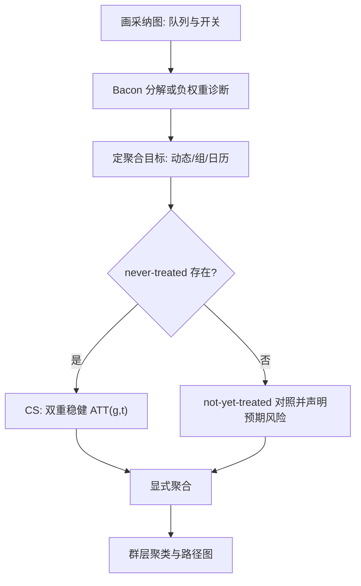
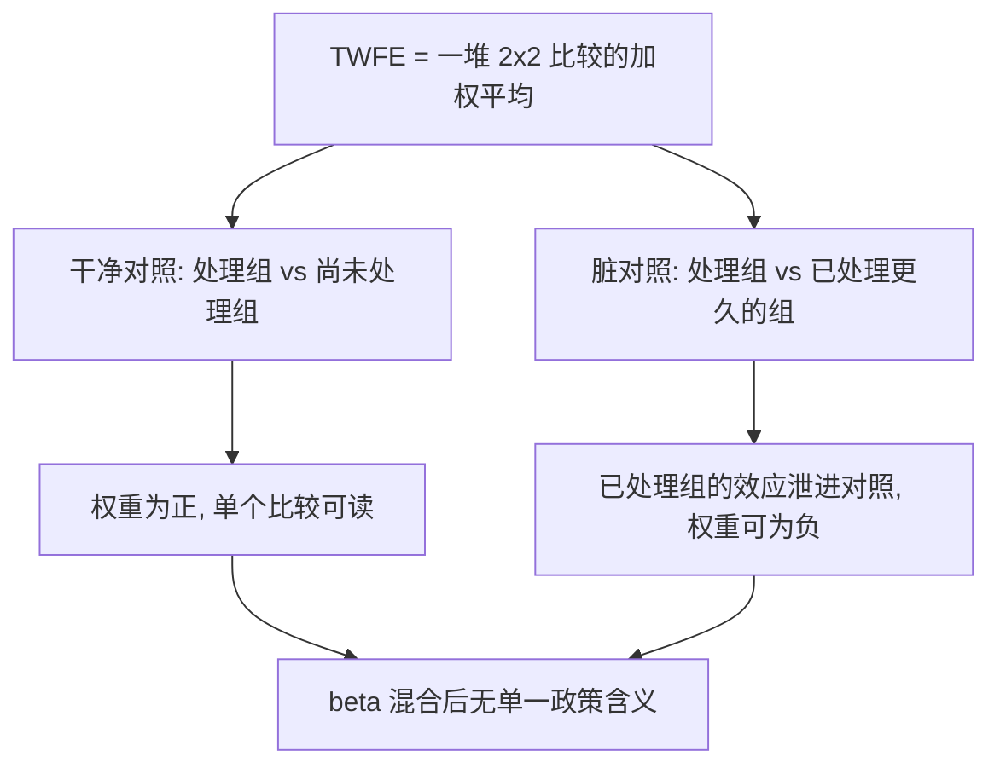

# 交错 DiD 的最新修正

TWFE 的错不是算错，是答错题：它一直在认真估计一个没人要的加权。修正潮的全部工作，是先把题写清楚——报哪个参数、拿谁当对照、按什么聚合。

<footer>—— Goodman-Bacon, J. Econometrics 2021；Callaway and Sant'Anna, J. Econometrics 2021；Sun and Abraham, Econometrica 2021</footer>

[上一课](/econ/pe-eventstudy-specification)把事件图钉在参照期、端点与队列三个选择上，队列问题被推到本课。主干[交错 DiD](/econ/staggered-did) 已给出 Goodman-Bacon 分解与「只用干净对照」的原则；本课把 2021 年前后的修正收成一套可执行的工序：诊断、定目标、选对照、聚合、推断。修订不是每年换一个新估计量，而是同一个原则在不同数据形态下的落法。

## 问题

分解是诊断，不是终点。Bacon 分解告诉你 TWFE 的 $\hat\beta$ 里混了多少「已处理当对照」的 $2\times2$，但它不回答该报什么。真正的工作从目标开始：同一组队列–时点效应 $\mathrm{ATT}(g,t)$，聚合方式不同，讲的是不同的故事——按事件时点聚合给动态路径，按采纳组聚合给组间分布，按日历时间聚合给当期总效应。不先定聚合，软件默认给的那一个数就被当成了「这个政策的效应」。第二个问题是对照的选择：never-treated 组最稳但可能不存在或太小；not-yet-treated 组样本多、功效高，但要求「尚未处理」本身是干净的——预期若已让他们提前行动，对照组照样被污染。直觉类比：拿 not-yet-treated 当对照，像拿「下学期也要补习、但现在还没开始」的同学当基线。若他知道自己迟早要补，现在的学习行为可能已经变了——「还没处理」不等于「没受影响」，预期效应从基线里漏进来，对照就不干净了。第三个问题是数据形态：处理有开关（进入又退出）、有剂量（处理强度连续）时，各估计量的保证范围不同，超出范围的用法要标注而不是硬跑。

功效的枯竭要提前看见：not-yet-treated 对照把功效买在「尚无人处理」的早期窗口；采纳图上晚期进入者占多数、never-treated 缺席的设计，后期 $\mathrm{ATT}(g,t)$ 会面临无对照可用。

## 方法

工序六步。第一，画采纳图：队列、处理开关与退出全在图上。第二，诊断：报 Bacon 分解或负权重份额，让「TWFE 不能用」成为有数字的陈述。第三，定聚合目标：政策问题要的是动态、组分布还是当期存量，先写下来。术语翻译：$\mathrm{ATT}(g,t)$ 读作「第 $g$ 批采纳者在第 $t$ 期的平均效应」——它是矩阵里的一个小格子。所谓聚合，就是把几百个小格子按不同权重平均成一个大数：按「处理后过了几期」平均得到动态路径，按「哪一批人」平均得到组间分布，按「今年是哪一年」平均得到当期存量。权重一换，故事就换。第四，选对照：有 never-treated 用之；没有则用 not-yet-treated 并声明预期风险。第五，估计：Callaway–Sant'Anna 在协变量下做条件平行趋势，倾向得分与回归双稳健并用；Borusyak、Jaravel 与 Spiess 的填补估计量用未处理格点估 $\alpha_i+\lambda_t$ 再外推，功效最高，代价是把模型推到已处理格点上；Sun–Abraham 的交互加权用在事件研究展示上。处理开关与剂量转给 de Chaisemartin–D'Haultfœuille 的框架。第六，推断：政策在群层就群层聚类，注意组内序列相关，路径图接上一课的四件套报告。

## 机制

机制是加权权从哪里来。TWFE 的权重由回归代数（残差化的处理方差）给出，符号不定；新估计量的权重由目标函数给出——你选了要平均的组与时点，权重就是你选的。这一换把「估计什么」从软件手里拿回研究者手里。两个假设各守一扇门：干净对照挡住已处理组当反事实，「无预期」挡住提前反应把效应搬进处理前；上一课的换参照检查与这一课的 not-yet 风险是同一扇门的两把锁。

不这么做会错在哪：只报诊断不换估计量，论文停在「TWFE 有问题」；换估计量不定聚合，三个数字各讲各的故事，审稿与读者各自挑一个用。

常见误区：初学者看到「负权重」以为是软件 bug 或数值误差。实际上负权重是 TWFE 加权代数的固有结果——有些「已处理当对照」的 $2\times2$ 被赋了负号，于是 $\hat\beta$ 可以落在所有单个 $2\times2$ 估计的取值范围之外：它不是哪个真实效应的估计，是没有人要的加权混合。

上图回答的问题是 TWFE 的错「错在哪一格」：工序图画修正怎么执行，这张把 Bacon 分解画成分解图——同一个 $\hat\beta$ 里干净与脏两类比较按不定号权重搅在一起；诊断（负权重份额）量的就是脏格子占了多少，修正估计量做的就是把脏格子从对照池里除名。

## 边界

本课不宣称某个新估计量全域最优：never-treated 充足时各种修正收敛到相近答案，分歧都在对照枯竭与开关剂量处。连续处理与 anticipated treatment 的完整代数不展开，只标接口。两期两组的 DiD 沿主干口径，不需要修正。修正是让估计对准目标，不是让所有研究得出同一个数。

后课默认：交错面板先诊断、定目标、选对照，再谈数字；下一课换截面门槛设计，不再拆时间加权。

## 小结

- 分解是诊断；修正是目标先行：动态、组分布、日历存量，先选一个。
- 对照只用 never-treated 或干净的 not-yet-treated，并声明预期风险。
- CS 双重稳健、填补法高功效、Sun–Abraham 管事件图；开关与剂量另有框架。
- 权重由目标函数给，不从软件默认里读结论。
- 出处：Goodman-Bacon 2021；Callaway and Sant'Anna 2021；Sun and Abraham 2021；de Chaisemartin and D'Haultfœuille 2020。
