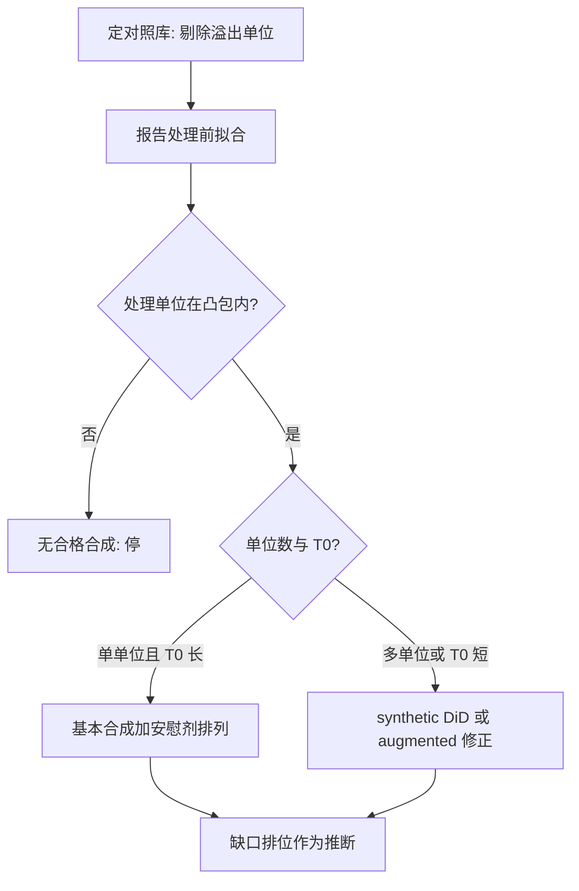
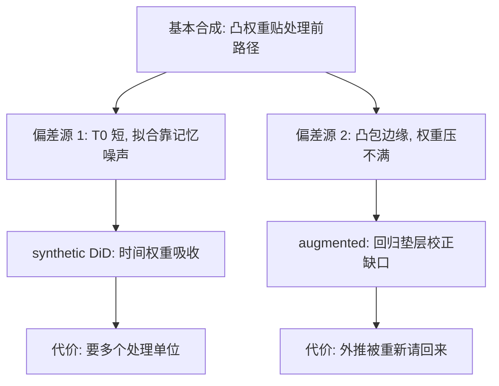

# 合成对照的深化

合成对照的深化不是换一套软件，而是换一套承诺：把「拟合得好」从结果改成前提，把推断从分布改成设计——前提塌了，点估计再漂亮也是噪声。

<footer>—— 据 Abadie, Using Synthetic Controls: Feasibility, Data Requirements, and Methodological Aspects, JEL 2021；Arkhangelsky, Athey, Hirshberg, Imbens and Wager, AER 2021 整理</footer>

[上一课](/econ/cb-independence-history)把经济史对照收在央行独立性上：2008 与欧债把最后贷款人扩到影子链与主权，财政主导可以吞掉法律独立，独立性指数不是充分统计。经济主干至此走完，本课开「政策评估深化」的深钻层。本课回到[合成控制](/econ/synthetic-control)：那里钉了凸权重、禁外推与安慰剂排列，缺口是它何时**可行**、偏差在哪、修正方法各付什么代价。本课程之后依次过事件研究的规范、交错修正、断点与工具、RCT，最后落到决策与证据综合。后课默认已经读完本课。

## 问题

[合成控制](/econ/synthetic-control)给了装置：对照库上的凸组合贴处理前路径，处理后缺口即效应。Abadie 2021 把使用条件收成一张**可行判据**清单。其一，处理前拟合必须好——这不是奖励，是前提：拟合差说明对照库张不出 $\hat Y_1(0)$，是设计失败，不是效应为零。其二，处理单位要落在对照库凸包内，水平与趋势都不是极端点；凸包之外不存在合格合成，负权重回归是把外推伪装成对照。其三，处理期内不能有只打处理单位的**同时冲击**：合成对照把处理后一切偏离都读成干预，区分不了干预与特异冲击。其四，$T_0$ 要够长——预测变量相对处理前期太多时，好拟合可以纯靠记忆噪声堆出来。

直觉类比：凸组合像调色盘混色——给对照库每个单位一个非负权重、加总为一，调出处理单位的「颜色」（水平与趋势）。处理单位若落在凸包内，总能调出近似色；若它本身是极端点（颜色在调色盘之外），无论怎么配都调不出，允许负权重等于往调色盘里加「不存在的颜料」——外推，不是对照。

### 修正方法与其代价

两个方向补基本装置的洞。augmented synthetic control（Ben-Michael、Feller 与 Rothstein）对处理前缺口再做一次回归修正，是双重稳健式的偏差校正：权重选不满时用回归垫层，代价是把外推重新请回来。synthetic DiD（Arkhangelsky 等）同时放单位权重与时间权重，在「只靠拟合」（合成控制，怕 $T_0$ 短）与「只靠平行趋势」（DiD，怕趋势不平行）之间插值，代价是要求有多个处理单位。

Abadie 2021 把「预测变量多、$T_0$ 短」列为高发伤：拟合优度会虚高。拟合图因此要当前提证明来读，不是当效应证据——拟合好只证明装置能动，不证明缺口是效应。

## 方法

实施顺序固定。第一步定对照库：剔除可能受溢出的单位（烟税案例里的邻州走私），只留同制度、同数据质量的对象。第二步报凸包判据与处理前拟合，不合格即停。第三步选修正：单处理单位、$T_0$ 长，基本合成加安慰剂；多处理单位或 $T_0$ 短，上 synthetic DiD 或 augmented。第四步推断：单单位没有常规标准误，安慰剂排列——把假处理派给对照单位，看真实缺口的 RMSPE 排位——是最小装置；时序口径可接共形推断。数字实例：把假处理轮流派给 30 个对照单位，各自算出处理前后缺口；若真实缺口排在第 3 大，排位就是 $3/30$——真实效应比 90% 的「假效应」都大。这是排位，不是 $p$ 值：它不承诺在零假设下均匀分布，只承诺设计层面的可比性。流程之外不做第五种变体。

## 机制

机制是把「对照」从平均改为加权：凸权重同时吸收单位固定效应与低阶共同趋势，于是平行趋势假设被换成「对照库能张成处理单位的 $Y(0)$ 路径」这一更可检验的陈述。偏差的两个来源对应两个修正：过拟合与 $T_0$ 短由 synthetic DiD 的时间权重吸收；权重压不到零（凸包边缘）由 augmented 的回归垫层吸收。两个修正都在基本装置吃紧时才值得启动——拟合本就好的案例硬上修正，是用方差换一个不存在的偏误。

不这么做会错在哪：把安慰剂排位当 $p$ 值解释（它是设计检验，不是检验水平）；把拟合图当证据正文（它是前提证明）；给单单位缺口配常规聚类标准误（没有这样的分布理论）。

常见误区：处理前拟合差时，初学者要么硬跑（把拟合噪声当缺口），要么以为「效应是零」。正确读法是第三种——对照库张不出 $\hat Y_1(0)$，反事实根本没造出来；这是设计层面的失败结论，出路是换对照库、加长 $T_0$ 或换设计，不是换一个估计量硬算。

上图回答的问题是「两个修正各补哪个洞、各付什么代价」：方法图画的是实施顺序（何时停、何时换修正），这张把偏差来源与修正方法对号入座——synthetic DiD 吸收 $T_0$ 短的过拟合，augmented 吸收凸包边缘的权重不满，两者都不是无条件升级，而是基本装置吃紧时的定向补丁。

## 边界

本课不处理合格对照库都凑不出的场景，也不把合成对照写成万能 DiD 替身：干预效应小而短、处理后噪声大时，排位检验没有功效；同时冲击不可排除时设计整体失效，修正方法救不了。交错多单位的大面板是接下来事件研究与交错 DiD 两课的地盘；外推成一般政策的范围问题留给本课程后段。

后课默认：少处理单位先过可行判据，再谈修正与推断；「合成得像」是前提，不是结论。

## 小结

- 可行判据四条：拟合好、凸包内、无同时冲击、$T_0$ 相对预测变量够长。
- augmented 修正权重不满，synthetic DiD 在拟合与平行趋势之间插值；各有代价。
- 单单位推断靠安慰剂排位，不是常规标准误。
- 拟合优度是前提证明；前提塌了设计即失败，不是效应为零。
- 出处：Abadie, *JEL* 2021；Abadie, Diamond and Hainmueller, *JASA* 2010；Arkhangelsky 等, *AER* 2021；Ben-Michael, Feller and Rothstein。
