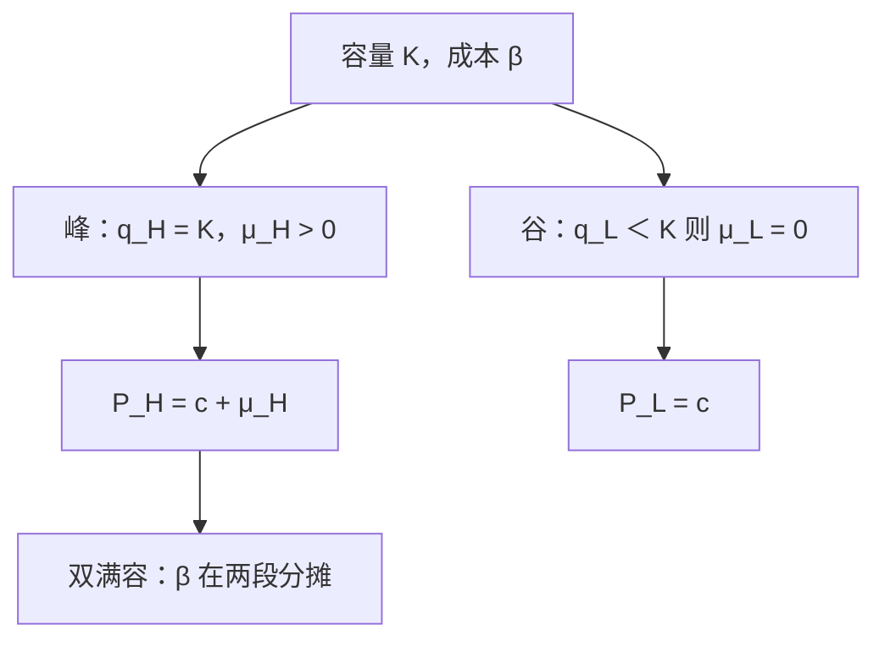

# 高峰负荷定价

容量在峰时才稀缺；峰时价格应含容量的影子价格，谷时只付运营的边际成本。

<footer>—— 据 Steiner, Peak Loads and Efficient Pricing, QJE, 1957；Boiteux 论电力高峰负荷整理</footer>

定位：[上一课](/econ/two-part-bundling)。两部收费把固定费与使用费拆开，抽取的是**人**的剩余。本课不重讲 $(A,p)$ 与捆绑。缺口是同一套产能在**时点**上稀缺：电厂、日内电网、旅馆的床，谷时闲置、峰时打满。容量的成本不该平均摊进每一个小时，而应作为峰时的影子价格出现。

## 问题

把一天分成峰 $H$ 与谷 $L$，运营成本 $c$ 每单位，容量成本 $\beta$ 按能同时服务的最大负荷收取。容量 $K$ 必须满足 $q_H\le K$、$q_L\le K$。有效率的价格（福利最大化、可补贴或总额转移可用时）满足：谷时若 $q_L\lt K$，则 $P_L=c$；峰时 $q_H=K$，则 $P_H=c+\beta$（更一般：$P_H=c+\mu$，$\mu$ 是容量约束的乘子）。缺口不是把峰谷写成[三级歧视](/econ/price-discrimination)的两个弹性组，而是：**$\beta$ 由谁在何时支付。**

若峰谷都打满（shifting peak），容量成本在两段需求之间分摊，Steiner 的图解给出交点，使 $q_H=q_L=K$。不要默认「峰永远独自承担全部 $\beta$」。

### 高峰负荷不是两部收费的改名

两部的 $A$ 对人收，与用了多少小时可以脱钩。高峰负荷对时点收，同一人在谷时应付 $c$、在峰时应付 $c+\mu$。容量是公共投入，但稀缺发生在峰时，影子价格必须按时点分化。把 $\beta$ 折进统一的 $A$，谷时用户会补贴峰时用户，容量会被过度申报。

Boiteux 在电力里同时写过预算约束与高峰负荷。本课先钉无预算约束的有效峰谷价；若还要盈亏平衡，再叠[拉姆齐](/econ/natural-monopoly-ramsey)乘子，峰时加价承担更多固定容量。

## 方法

规划：$\max$ 两时段剩余之和，约束 $q_t\le K$，成本 $c(q_H+q_L)+\beta K$。库恩–塔克给出上述 $P_t=c+\mu_t$，$\mu_L\mu_H$ 至少有一个等于 $\beta$ 的互补。需求给定为 $D_t(P_t)$（可加时段是教具；跨时替代把需求写成交叉价格，乘子仍是容量）。

比较静态：峰需求外移，$\mu_H$ 升、$K$ 升；谷需求外移，若仍不满容，只增加 $q_L$、不建厂。这与长期进入不同：这里「进入」的是容量单位，不是第二家厂商。

峰谷需求若高度替代，价差会自我限制，Steiner 的 shifting peak 更容易出现。不要把分时价差事先标成「峰永远更贵」而不解乘子。

实施可以用分时线性价，也可以用容量费加能量费——后者像两部，但容量费应按峰时责任分摊，不是按人头。不要把分时价写成限价簿的盘中价差。

## 机制

影子价格的机制是稀缺：多给峰时一单位消费，必须扩容一单位，社会成本是 $c+\beta$。谷时多消费只动 $c$，因为 $K$ 已被峰时付过。Steiner 的「谁是峰」由均衡内生：价差会抑制原峰、抬升原谷，直到负荷关系与乘子一致。

与自然垄断的接口：管网往往既次加又有高峰。拉姆齐处理的是预算，高峰处理的是时点稀缺；两套乘子可以同时存在。与两部的接口：对人收的 $A$ 不能代替 $\mu_H$——$A$ 不随峰时用量变，管不住容量申报。

计量与结算是实施细节：分时表把 $P_H,P_L$ 送给用户；容量责任按峰时负荷份额分摊，则接近两部里「谁造成 $K$ 谁付 $\beta$」。统一电价把 $\beta$ 摊进每一度谷电，谷时过度消费、峰时容量不够，这是把影子价格抹平的代价，不是需求弹性写错。

Steiner 1957 用的是可加的独立时段需求。跨时替代、储能、可中断合同会把「峰」变成可调度的集合，乘子仍在容量约束上，只是 $q_t$ 不再独立。

## 边界

随机需求、可靠性约束把 $\beta$ 换成期望停电损失，本课不写。输电拥堵的节点价是空间版高峰负荷，机制相同、地理不同。零售若不能分时计量，只能退回平均成本，回到次优。储能把谷时电力变成峰时供给，$K$ 的影子价格下降，时段划分变成内生。

也不要把峰谷价差写成限价簿盘中价差：这里没有时间优先。

后课默认：容量的边际社会成本出现在打满的那个时段；谷时不满容则不加 $\beta$。市场结构主干下一课进入寡占数量竞争，不再扩容时点。

## 小结

- 峰时价格含容量影子价格；谷时不满容只付运营 MC。
- 双满容时 $\beta$ 在时段间分摊，峰的身份是均衡对象。
- 不是三级分箱，也不是两部入场费的改名。
- 下一课把「一家面对需求」换成几家同时选产量。
- 出处：Steiner, *QJE*, 1957；Boiteux 的电力高峰负荷分析。
