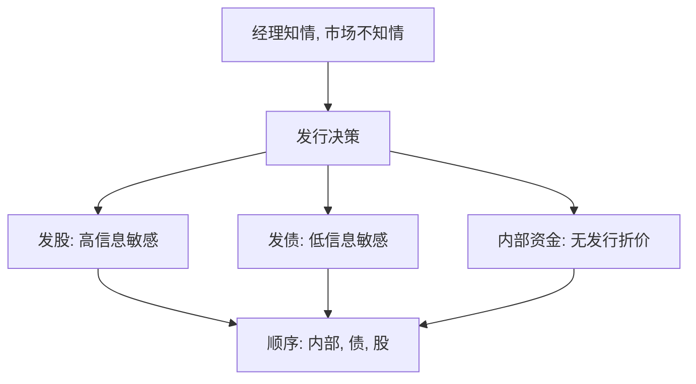

# 优序融资

若经理比市场更清楚资产价值，发股会被读成「现在被高估」；于是企业先用留存，再用债，最后才发股。

<footer>—— Myers and Majluf, Corporate Financing and Investment Decisions When Firms Have Information That Investors Do Not Have, Journal of Financial Economics 1984</footer>

定位：[权衡理论与破产成本](/econ/tradeoff-capital)。税盾对困境成本已经给出一个内部目标 $D^\ast$。本课缺口是 Myers（1984）立刻指出的残差：盈利企业往往杠杆更低，融资更像「有钱先用内部的」，而不像随时把杠杆调回目标。不重算税盾现值。

## 问题

静态权衡预测：利润高、税盾用得上、破产远的企业，应当更能扛债，目标杠杆更高。观察却经常相反——盈利公司债少、现金多。若把这解释成「它们还没调回去」，必须有一种摩擦，使**发股去贴近 $D^\ast$** 本身很贵。

Myers 与 Majluf（1984）把摩擦写成信息不对称：经理知道项目与资产的价值，外部投资者只看到发行决策。在[柠檬市场](/econ/akerlof-lemons)里，卖者一开口就泄漏质量；这里「卖的」是股权。缺口不是再找一个目标比率，而是：在经理追求现有股东利益时，发行决策如何被定价，以及这如何排出融资顺序。

优序（pecking order）不是监管排序，是逆向选择下的成本排序：内部资金几乎无泄漏，无风险债泄漏少，股权泄漏最多。Myers 1984 把它对照静态权衡，称为资本结构之谜的一条解。

## 方法

设企业有一个正 NPV 项目，但现金不够。若按公平价格发股，项目应当上。若市场无法区分被低估与被高估的企业，发股的均衡价是混合价。被低估的企业会发现：新股东分走的价值大于项目 NPV，于是宁可不发、放弃项目。被高估的企业乐意发。市场料到这一点，发股折价更重，低估者更不愿发——逆向选择收紧。

债务的信息敏感度较低：在接近无风险时，债权人不大分享资产被低估的上行，发行折价轻。内部资金不经过发行市场，没有这层折价。于是融资顺序是：留存收益 → 债务 → 股权。权衡里的 $D^\ast$ 可以仍在，但被低估时企业不会为了贴近它去发股。

这与[信号发送](/econ/spence-signaling)方向相反：Spence 的教育是有成本的可观察行动；Myers–Majluf 的发股是可能被拒绝的行动。企业不是用发股来分离类型，而是尽量避免走这条泄漏最大的路。

## 机制

机制是现有股东与新股东之间的价值转移，不是破产法。经理若站在现有股东一边，就会把「被低估时发股」当成向新投资者输送。债务契约在好状态不稀释股权，所以同一信息不对称下，债的稀释更轻。累积的融资决策于是留下债务容量：内部资金耗尽后先用债，杠杆是历史残差，不是时刻对准的 $D^\ast$。

权衡并未被逻辑取消。税盾与困境成本仍在，只是信息不对称给「朝 $D^\ast$ 调整」加了一道发行成本。两种理论预测不同的比较静态：权衡看税率与资产有形性；优序看赤字（投资减内部资金）与过去的盈利。后课的股利要处理内部资金「太多」时为什么还要吐出去——优序单独解释不了派息。

## 边界

不要把优序读成「永远不发股」。项目极大、债务容量用尽、或信息对称化（招股说明书、分析师覆盖）之后，股权仍会出现。也不要把银行[资本监管](/econ/basel-capital)下的「尽量少持普通股」写成优序：监管资本不是信息敏感证券的排序，是损失吸收顺序。

本课不写股利平滑，不写自由现金流的代理冲突。Jensen 的债务纪律与优序的「债是相对不敏感的融资」不是同一句话：一个管吐出现金，一个管如何为新项目筹资。

## 小结

- 权衡给出 $D^\ast$；信息不对称使朝它发股变得很贵。
- Myers–Majluf：发股有柠檬折价，融资优序是内部、债、股。
- 杠杆可以是融资历史的残差，不必是时刻对准的目标。
- 出处：Myers and Majluf, *JFE* 1984；Myers, *Journal of Finance* 1984。
