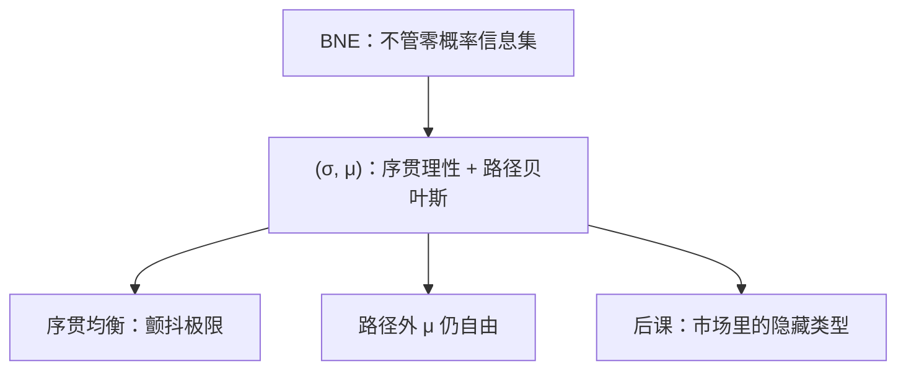

# 完美贝叶斯与信号精炼

均衡必须在每个信息集上给出信念，策略在该信念下最优，信念在路径上由贝叶斯法则更新。

<footer>—— 据 Kreps and Wilson, Sequential Equilibria, Econometrica, 1982；Fudenberg and Tirole, JET, 1991 整理</footer>

[上一课](/econ/bayesian-nash)的 BNE 把类型写进策略，但不约束零概率信息集。信号博弈里，接收者看见一个「不该出现」的行动，后验随便写，可以撑住「我若偏离你就当成最坏类型」的恐吓。缺口是：给每个信息集配上信念，并要求策略在这些信念下序贯理性。本课钉完美贝叶斯均衡（PBE）的最低要求，并指出它仍太松，为柠檬与发送信号做准备。

## 问题

扩展式加类型之后，许多信息集不是子博弈的根（信息集不是单点）。SPE 用不上。[子博弈完美](/econ/subgame-perfect)删空威胁的那把刀，在这里不够。Kreps–Wilson 的序贯均衡用颤抖生成处处正概率，再取极限，得到策略与信念的一对 $(\sigma,\mu)$。教科书里的 PBE 弱一点：路径上贝叶斯，路径外信念任意但策略对该信念最优。

最低两条：（1）序贯理性：在每一信息集，给定 $\mu$ 与他人策略，行动是最佳应答；（2）路径上的 $\mu$ 由 $\sigma$ 与先验经贝叶斯得到。缺（1）会回到不可信；缺（2）会让人「看见发生了的事却不更新」。

### PBE 仍允许很怪的路径外信念

偏离若是零概率，贝叶斯没有定义。接收者可以把偏离全归给高成本类型，从而吓阻发送者。Cho–Kreps 直觉标准等，用「谁更想偏离」来砍这些信念，本课只点名，不展开精炼族。柠檬与 Spence 会碰到分离、混同、以及靠怪信念撑住的混同。

信号博弈时序：自然抽类型 → 知情者发信号 → 接收者在信息集上形成 $\mu$，选行动。分离：不同类型发不同信号，路径上信念退化到真类型。混同：信号无信息，$\mu$ 停在先验。

## 方法

对象：有限类型、有限信号与行动的扩展式。解概念：PBE。计算常先猜分离或混同，再反推使激励相容成立的信念与行动，最后检查路径外：若某信号无人发，指定一个 $\mu$，使无人想改发这个信号。

序贯均衡要求路径外信念也是颤抖极限，比任意 PBE 紧。主干后课用 PBE 说话即可；需要砍均衡时再引直觉标准。

## 机制

信念是接收者决策的状态变量。没有 $\mu$，说「看见信号后选 $a$」没有概率论证。路径上贝叶斯保证均衡自我一致：你用来吓我的那条后验，不能与你自己的策略矛盾。路径外的自由，则是恐吓的剩余空间——精炼要砍的正是这块。

与完全信息 SPE 的连续性：若类型退化成一点，PBE 回到 SPE。不完全信息多出来的，全是信念。后课市场失灵不是新的均衡定义，而是把类型读成质量、生产率、风险，把信号读成价格、教育、合同菜单。柠檬将只用价格这一维信号；Spence 让知情者先选有成本的 $e$。两课都在 PBE 里算分离与混同，不再改解概念。

## 边界

PBE 定义在文献里不完全统一（Fudenberg–Tirole 对多期有额外「不得用无关类型的信息」等）。应用时写清：路径贝叶斯、序贯理性、以及路径外信念的限制（若有）。连续信号空间的偏离更难指定 $\mu$。

后课默认：隐藏类型、可观察行动的互动，解是 PBE；混同与分离是候选，怪信念撑住的混同视为脆弱。

## 小结

- BNE 不够；PBE 给每个信息集信念，并要求序贯理性。
- 路径上必须贝叶斯；路径外信念默认自由，故 PBE 仍松。
- 分离与混同是信号博弈的两类候选。
- 更强精炼（序贯、直觉标准）用来砍怪信念。
- 出处：Kreps and Wilson, *Econometrica* 1982；Fudenberg and Tirole, *JET* 1991。
