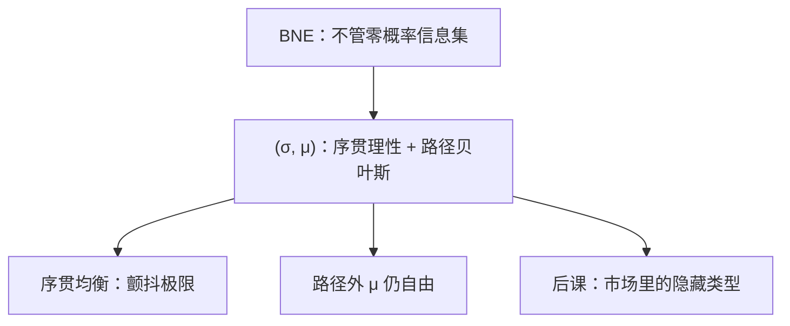
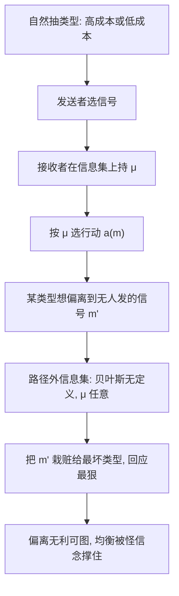

# 完美贝叶斯与信号精炼

均衡必须在每个信息集上给出信念，策略在该信念下最优，信念在路径上由贝叶斯法则更新。

<footer>—— 据 Kreps and Wilson, Sequential Equilibria, Econometrica, 1982；Fudenberg and Tirole, JET, 1991 整理</footer>

[上一课](/econ/bayesian-nash)（不完全信息与贝叶斯纳什）。的 BNE 把类型写进策略，但不约束零概率信息集。信号博弈里，接收者看见一个「不该出现」的行动，后验随便写，可以撑住「我若偏离你就当成最坏类型」的恐吓。缺口是：给每个信息集配上信念，并要求策略在这些信念下序贯理性。本课钉完美贝叶斯均衡（PBE）的最低要求，并指出它仍太松，为柠檬与发送信号做准备。

## 问题

扩展式加类型之后，许多信息集不是子博弈的根（信息集不是单点）。SPE 用不上。[子博弈完美](/econ/subgame-perfect)删空威胁的那把刀，在这里不够。Kreps–Wilson 的序贯均衡用颤抖生成处处正概率，再取极限，得到策略与信念的一对 $(\sigma,\mu)$。教科书里的 PBE 弱一点：路径上贝叶斯，路径外信念任意但策略对该信念最优。

最低两条：（1）序贯理性：在每一信息集，给定 $\mu$ 与他人策略，行动是最佳应答；（2）路径上的 $\mu$ 由 $\sigma$ 与先验经贝叶斯得到。术语翻译：这两条合起来像「配了案卷的侦探」——$\mu$ 是案卷（在每个信息集上写明「大概率是谁在行动」），序贯理性是「按当前案卷选最优动作」。BNE 的毛病是零概率信息集上没有案卷只能瞎猜；缺第二条则是拿着案卷不肯更新，推理自相矛盾。缺（1）会回到不可信；缺（2）会让人「看见发生了的事却不更新」。

### PBE 仍允许很怪的路径外信念

偏离若是零概率，贝叶斯没有定义。接收者可以把偏离全归给高成本类型，从而吓阻发送者。Cho–Kreps 直觉标准等，用「谁更想偏离」来砍这些信念，本课只点名，不展开精炼族。柠檬与 Spence 会碰到分离、混同、以及靠怪信念撑住的混同。

信号博弈时序：自然抽类型 → 知情者发信号 → 接收者在信息集上形成 $\mu$，选行动。分离：不同类型发不同信号，路径上信念退化到真类型。混同：信号无信息，$\mu$ 停在先验。

弱 PBE 允许路径外任意 $\mu$；序贯均衡用颤抖极限把 $\mu$ 也管住。
主干后课用弱 PBE 算柠檬与 Spence，需要砍时再点直觉标准。

## 方法

对象：有限类型、有限信号与行动的扩展式。解概念：PBE。计算常先猜分离或混同，再反推使激励相容成立的信念与行动，最后检查路径外：若某信号无人发，指定一个 $\mu$，使无人想改发这个信号。

序贯均衡要求路径外信念也是颤抖极限，比任意 PBE 紧。主干后课用 PBE 说话即可；需要砍均衡时再引直觉标准。

```mermaid
flowchart TD
  BNE["BNE：不管零概率信息集"] --> PBE["(σ, μ)：序贯理性 + 路径贝叶斯"]
  PBE --> SEQ["序贯均衡：颤抖极限"]
  PBE --> LOOSE["路径外 μ 仍自由"]
  PBE --> MKT["后课：市场里的隐藏类型"]
```

## 机制

信念是接收者决策的状态变量。没有 $\mu$，说「看见信号后选 $a$」没有概率论证。数字实例：分离均衡里高成本类型发贵信号、低成本发便宜信号，先验各 50%。接收者看见贵信号，贝叶斯给出 $P(\text{高}\mid\text{贵})=\frac{0.5\times 1}{0.5\times 1+0.5\times 0}=1$——后验 100% 指向高成本。混同均衡里两类发同一个信号，信号不带信息，$\mu$ 停在先验的 50% 不动。路径上贝叶斯保证均衡自我一致：你用来吓我的那条后验，不能与你自己的策略矛盾。路径外的自由，则是恐吓的剩余空间——精炼要砍的正是这块。

```mermaid
flowchart TD
  NAT["自然抽类型: 高成本或低成本"] --> SIG["发送者选信号"]
  SIG --> REC["接收者在信息集上持 μ"]
  REC --> ACT["按 μ 选行动 a(m)"]
  ACT --> DEV["某类型想偏离到无人发的信号 m'"]
  DEV --> OFF["路径外信息集: 贝叶斯无定义, μ 任意"]
  OFF --> BLUFF["把 m' 栽赃给最坏类型, 回应最狠"]
  BLUFF --> HOLD["偏离无利可图, 均衡被怪信念撑住"]
```

上图回答的问题是「怪信念具体怎么撑住一个均衡」：解概念阶梯图给出定义的强弱排序，这张画出恐吓的传导链——偏离是零概率事件，贝叶斯在那里无话可说，接收者把栽赃写进 $\mu$ 就能让任何偏离都不划算；直觉标准等精炼砍的正是这条链的第 6、7 节。

与完全信息 SPE 的连续性：若类型退化成一点，PBE 回到 SPE。不完全信息多出来的，全是信念。后课市场失灵不是新的均衡定义，而是把类型读成质量、生产率、风险，把信号读成价格、教育、合同菜单。柠檬将只用价格这一维信号；Spence 让知情者先选有成本的 $e$。两课都在 PBE 里算分离与混同，不再改解概念。

## 边界

PBE 定义在文献里不完全统一（Fudenberg–Tirole 对多期有额外「不得用无关类型的信息」等）。应用时写清：路径贝叶斯、序贯理性、以及路径外信念的限制（若有）。常见误区：初学者看到「路径外信念任意」就以为 PBE 可以乱写一气。自由度只在于「用哪个信念去撑均衡」，策略必须对这个信念序贯理性——于是同一博弈常有多个 PBE，精炼（直觉标准、序贯均衡）的工作就是把靠荒唐信念撑住的那些筛掉。连续信号空间的偏离更难指定 $\mu$。

多期信号还要求不能用「与该信息集无关的类型」去编后验，否则 PBE 的定义要按 Fudenberg–Tirole 加限制。主干后课用静态信号博弈，不踩这条。

后课默认：隐藏类型、可观察行动的互动，解是 PBE；混同与分离是候选，怪信念撑住的混同视为脆弱。

### 先猜分离或混同，再给路径外指定信念

算均衡时先猜分离或混同，反推激励相容，再给无人发送的信号指定 $\mu$，使无人想改发。这不是新定义，是 PBE 的常规算法。柠檬几乎只有混同（一个价格）；Spence 两种都算。Cho–Kreps 直觉标准再砍「低类型更不想发的偏离被栽赃给低类型」的混同，本课只点名。Kreps–Wilson 序贯均衡用颤抖给路径外信念一个极限来源，比任意 PBE 紧。

多期信号还要求不能用「与该信息集无关的类型」去编后验，否则定义要按 Fudenberg–Tirole 加限制。主干后课用静态信号博弈。

接收者策略是 $a(m)$，发送者预见到 $a$ 与 $\mu$。没有成对的 $(\sigma,\mu)$，「看见 $m$ 之后选 $a$」没有概率论证。

## 小结

- BNE 不够；PBE 给每个信息集信念，并要求序贯理性。
- 路径上必须贝叶斯；路径外信念默认自由，故 PBE 仍松。
- 分离与混同是信号博弈的两类候选。
- 更强精炼（序贯、直觉标准）用来砍怪信念。
- 出处：Kreps and Wilson, *Econometrica* 1982；Fudenberg and Tirole, *JET* 1991。
