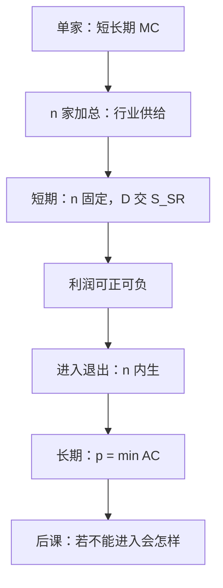

# 完全竞争的短期与长期

自由进入把长期价格钉在平均成本的最低点；短期里工厂数目给定，价格由需求与既有供给相交决定。

<footer>—— 据 Marshall, Principles of Economics；Viner, Cost Curves and Supply Curves, 1931 整理</footer>

上一课[短长期与沉没成本](/econ/sunk-cost)给了单家厂商的停产规则与长短期成本包络。本课不重讲 AVC 与沉没的定义。缺口是：价格仍是参数。市场结构课序从这里打开——把许多价格接受者叠成行业供给，再让需求来定 $p$，并问进入之后 $p$ 停在哪。

## 问题

[利润供给](/econ/profit-supply)的 $q(p,w)$ 是一家的反应。短期厂商数目 $n$ 固定（进入成本已沉没或来不及建厂），行业供给 $Q_{\mathrm{SR}}(p)=n q_{\mathrm{SR}}(p)$（可加异质厂商）。需求 $D(p)$ 与之相交得短期均衡价格。缺口不是再写 $p=\mathrm{MC}$，而是：**谁保证这个 $p$ 让在位者刚好不亏、潜在进入者刚好不想进？** 短期不保证。会计利润可以正可以负。

长期：进入、退出把 $n$ 变成内生。若厂商相同、要素价格不随行业扩张而涨，自由进入把 $\pi$ 赶到零，$p=\min\mathrm{AC}$，每家产在有效规模。行业长期供给在该价格上无限弹性。要素价格随行业上升时，长期供给向右上倾斜——那是外部不经济，不是单家 DRS 的简单加总。

### 零利润是进入条件，不是会计恒等式

CRS 无沉没时，上一课已说 $\pi$ 在零与无穷之间刀刃。有 U 形 AC 时，零利润是 $p=\min\mathrm{AC}$ 的几何，经济利润为零，要素按机会成本付酬。不要读成「厂商没钱可赚所以不生产」：生产在有效规模上发生，只是没有超额。沉没的进入成本摊进 AC，正是为了让「零利润」含正常回报。

价格接受加自由进入，不自动给出福利最优——那是一般均衡课的第一福利定理，需要完整的商品空间与没有外部性。本课只钉局部市场的价格形成。

## 方法

短期：给定 $n$ 与各家 $z_f$，把停产点以上的短期 MC 水平加总，与 $D(p)$ 联立。参数移动：需求冲击先改 $p$，再沿短期供给调 $q$；在位者的准租金可以涨。长期：允许 $n$ 变，新均衡在 $p=\min\mathrm{AC}$ 与 $D(p)=n q^*$，其中 $q^*$ 是有效规模。比较静态要声明走的是哪一条曲线，否则「供给定理」会把短期弹性当成长期。

相同厂商是教具。成本异质时，长期留下的是 AC 足够低的那些，边际上那家零利润， inframarginal 有租金。本课不把租金写成垄断——来源是稀缺的低成本投入，不是向下的需求曲线。

本课产品同质、信息完全、无策略互动。下一课撤掉「许多家加自由进入」，让单独一家面对整条需求。

## 机制

短期 $p$ 变动大、数量调整受既定 $z_f$ 限制，所以供给较陡。长期可以建厂、进入，弹性变大。Marshall 的时期分析就是这套时间分层，不是另一套偏好。进入把超额利润吃掉的机制是：正利润吸引模仿，$n$ 升、$p$ 降，直到 $\pi=0$；亏损则反方向。没有进入壁垒时，壁垒不是本课的对象——垄断课才把壁垒当结构。短期准租金（$p$ 高于 AVC、低于 AC）补偿的是已经沉没的 $z_f$，不是垄断势力：勒纳指数下一课才出场，本课 $P=\mathrm{MC}$ 在停产点以上始终成立。

行业长期供给水平的机制是：复制有效规模的工厂不抬要素价格。若土地、矿藏随需求一起涨，$w$ 变成 $Q$ 的函数，单家 AC 上移，行业曲线倾斜。那是外部成本，不要写成单家 IRS/DRS 的误加总。

需求的来源是消费课已经写过的马歇尔需求，本课把它当成行业 $D(p)$，不再对个人加总一遍。要素价格若被本行业抬动，一般均衡会把 $w$ 内生化；局部均衡把 $w$ 当参数，这是本课的工作边界。

量化栏的连续竞价形成的是订单簿价格，不是这里的 $D$ 交 $S$。本课 $p$ 是参数均衡，没有报价策略。

## 边界

产品差异、策略数量、产能约束，都会让「加总 MC」不再是行业供给。那些是本课序后段。也不处理匹配摩擦与数量配给：出清靠价格，不靠排队。税收归宿后课会用本课的短长期弹性，但税本身不在这里引入。

IRS 与巨大沉没使自由进入的零利润均衡可以不存在，只留下一家——下一课垄断把这件事当成结构。量化栏的连续竞价不是这里的 $D$ 交 $S$：本课 $p$ 是参数均衡，没有订单队列。

后课默认：完全竞争短期 $n$ 固定、长期自由进入且经济利润为零；对照垄断时，比较的就是这一基准。

## 小结

- 短期行业供给是既定 $n$ 下 MC 的加总；价格由需求相交决定。
- 长期进入把 $p$ 钉在 $\min\mathrm{AC}$；零利润是进入条件。
- 短、长期弹性不同，比较静态必须声明时期。
- 下一课撤掉进入与价格接受，面对向下的市场需求。
- 出处：Marshall, *Principles of Economics*；Viner, 1931；Mas-Colell, Whinston and Green 第 10 章。
