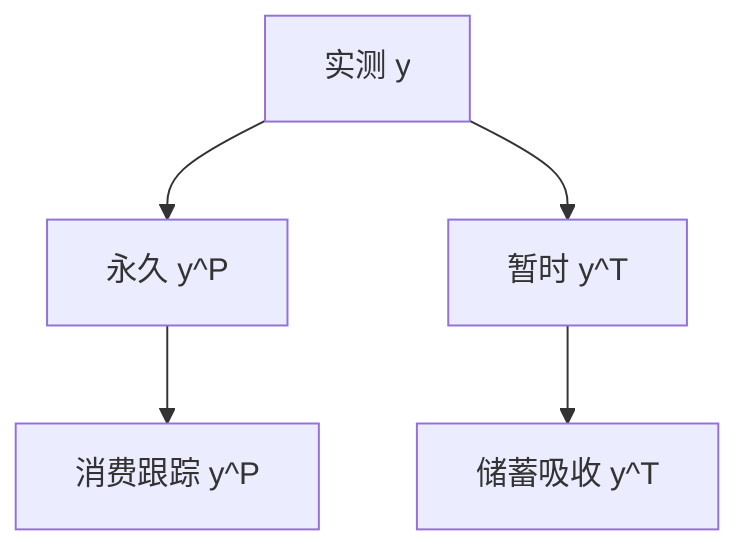

# 永久收入假说

消费跟的是持久资源，不是本周发薪；把暂时收入当成持久的，会把储蓄率看成谜。

<footer>—— Friedman, A Theory of the Consumption Function, 1957</footer>

[上一课](/econ/life-cycle-hypothesis)用有限寿命把储蓄写成年龄计划。本课缺口换成 Friedman 的永久收入假说（PIH）：无限期（或很长的视野）下，把收入拆成永久成分与暂时成分，消费主要跟踪前者。不重导 Modigliani 的年龄隆起，也不重写欧拉。

## 问题

LCH 强调退休这一确定的零劳动收入段。Friedman（1957）面对的是另一组事实：短期边际消费倾向低、长期高；农民与小企业主收入更抖但消费更稳。他把实测收入写成 $y=y^P+y^T$，永久收入 $y^P$ 是人力资本与非人力财富所支撑的可持续消费流。暂时冲击应被储蓄吸收，消费对 $y$ 的回归系数被 $y^T$ 的方差稀释——这是测量误差式的识别，不是新的效用公理。

Hall（1978）后来把 PIH 写成理性预期下的欧拉：在所列假设下 $\Delta c$ 不可被已有信息预测。本课先钉 Friedman 的分解；随机游走是同一骨架的预期版本，已在[欧拉课](/econ/consumption-euler)出现，此处只引用。

永久不是「永远不变」。利率、寿命、人力资本的新信息会改 $y^P$。改的是水平，不是把暂时波动一对一写进 $c$。

## 方法

二次效用、完全市场、已知利率时，确定性等价：消费等于永久收入（或年金价值）。储蓄是暂时收入加预防性项（预防性下一课才打开）。经验操作：用职业、教育、过去收入构造 $y^P$ 的代理，看 $c$ 对 $y^P$ 与 $y^T$ 的不同斜率。

与 LCH 的分工：LCH 给年龄和退休；PIH 给随机或高频收入的永久/暂时切法。两者都反对同期 $C=cY$。本课不把流动性约束请回来当理论。

## 机制

机制是资本市场把暂时资源在时间上摊开。人不是对每周工资作凯恩斯反应，而是对财富的新息作一次水平调整。增长的经济里，永久收入随生产率趋势上移，消费趋势跟随，储蓄率不必趋势性上升——这与简单 LCH 加总可以并存。

公司金融的股利平滑是近亲：经理把永久盈利当股利，暂时盈利当留存。本课不写股利，以免吞并。也不写限价簿上的成交作为「收入实现」。

Friedman 的识别是统计的：把 $y$ 对 $y^P$ 的回归稀释写成测量误差，短期 MPC 低、长期高就不再是「人短视」。Hall 把同一想法换成正交性：$\Delta c$ 对已有信息的回归系数应为零。经验拒绝留给约束与谨慎；本课先把零假设钉在永久成分上。与 LCH 不要争谁更「真」：有限寿命加退休是日历，永久/暂时是随机分解，后课缓冲存量两者都要。

## 边界

二次效用关掉预防性储蓄；借贷约束关掉年轻人对 $y^P$ 的提前消费。这两条使 PIH 的过度敏感/过度平滑成为后课对象。股权溢价之谜用总量消费的平滑当证据，与 PIH 的微观平滑不是同一检验：那里缺的是 $\sigma(m)$，这里缺的是对 $y^T$ 的保险。

后课默认：确定性等价 PIH 是基准；打开 $u'''\gt 0$ 与约束之后，缓冲存量修正它，而不是退回 $C=cY$。

永久成分随新信息跳水平；暂时成分应被储蓄吸收。Hall 把这句话写成正交性。

与 LCH 近亲但不替代：一个给退休日历，一个给高频收入的切法。

## 小结

- Friedman：消费跟踪永久收入，暂时收入进储蓄。
- 与 LCH 近亲：一个强调年龄与退休，一个强调永久/暂时分解。
- Hall 的随机游走是 PIH 的理性预期写法，欧拉课已给。
- 短期 MPC 低可以是测量误差式稀释，不必是短视。
- 确定性等价在下一课被谨慎拆掉。
- 出处：Friedman, *A Theory of the Consumption Function*, 1957；对照 Hall, *JPE* 1978。
