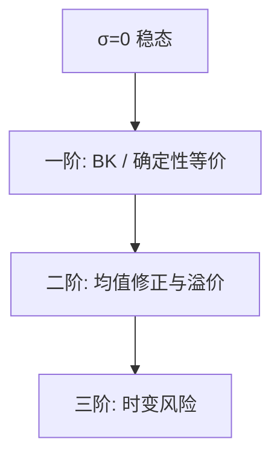

# 扰动法与高阶

把冲击尺度当成扰动参数，政策函数在确定性稳态邻域按阶展开；一阶是确定性等价，二阶才见风险。

<footer>—— Judd, Perturbation methods；Schmitt-Grohé and Uribe, Solving Dynamic General Equilibrium Models Using a Second-Order Approximation, JEDC 2004</footer>

[上一课](/econ/blanchard-kahn)给出一阶唯一解。对数线性在一阶关掉了方差。本课缺口是：**升阶**。二阶扰动让风险溢价、确定性等价失效、福利的二阶项重新出现。不重数 BK 的根。

## 问题

令冲击为 $\sigma\varepsilon_t$，政策 $g(s,\sigma)$。$\sigma=0$ 时退回确定性稳态。对 $\sigma$ 与状态偏导，逐阶解线性方程：一阶系数即 BK 的决策规则；二阶出现 $\sigma^2$ 项与状态的二次型。Schmitt-Grohé–Uribe：二阶近似下，均值会离开确定性稳态（常数项修正），资产回报出现协方差项。缺口不是再线性化一次，而是声明一阶 IRF 不能回答的问题要用二阶及以上。

三阶才让风险溢价随状态变（时变溢价）。Fernández-Villaverde 与 Rubio-Ramírez 把扰动接到似然。本课只钉阶的经济学，不写张量代数。

## 方法

隐函数定理在 $F(g,g',\sigma)=0$ 上对参数求导。计算上：一阶用 QZ；二阶把已知一阶系数代入二次恒等式。修剪（pruning）避免高阶项的爆炸伪周期。福利：Lucas 的消费波动成本是二阶，必须在二阶政策（或确定性等价加二阶效用）上算；用一阶消费波动配二阶效用要声明。

与 VFI 对照：扰动快、适合高维平滑模型；在约束绑定、ZLB、离散选择处失败，因为政策不可微。那些点用投影或 OccBin 一类分段线性。

## 机制

机制是泰勒在 $\sigma$ 方向。风险以方差的形式从二阶进入决策：预防性储蓄、债券溢价、开放经济的风险分享缺口，都是 $\sigma^2$ 量级。IRF 在二阶对冲击符号不再对称：大衰退与大繁荣的线性镜像被打破。确定性等价的宏观含义：若只关心一阶矩的脉冲，许多模型用一阶就够；若关心资产价格或福利排序，不够。

Smets–Wouters 类估计多数仍在一阶线性高斯，似然好写。把扰动升阶再估计，是后课贝叶斯的延伸，不是默认。

Judd 的扰动与投影是两条数值路线：一个在一点展开，一个在区间上加权残差。下一课投影。

## 边界

本课不把高阶写成交易策略，不估计期权。全局多重均衡、大灾害（disaster）使展开点本身可疑。异质主体加分布状态时，扰动要对测度做函数泰勒，技术上可行但本课不展开——HANK 常用序列空间或投影，不默认三阶 DSGE。

后课默认：一阶 = 确定性等价 IRF；二阶及以上才谈风险修正。下一课：当局部展开不够时，用基函数在全域配平残差。

## 小结

- 扰动按冲击尺度升阶；一阶 BK，二阶见风险与均值修正。
- 约束与不可微政策打断扰动。
- 福利比较至少二阶。
- 出处：Judd；Schmitt-Grohé and Uribe, *JEDC* 2004。
