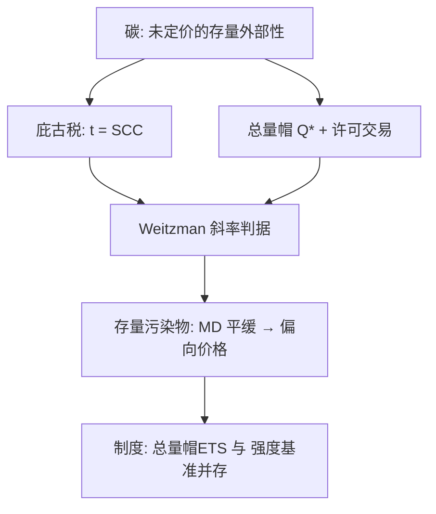
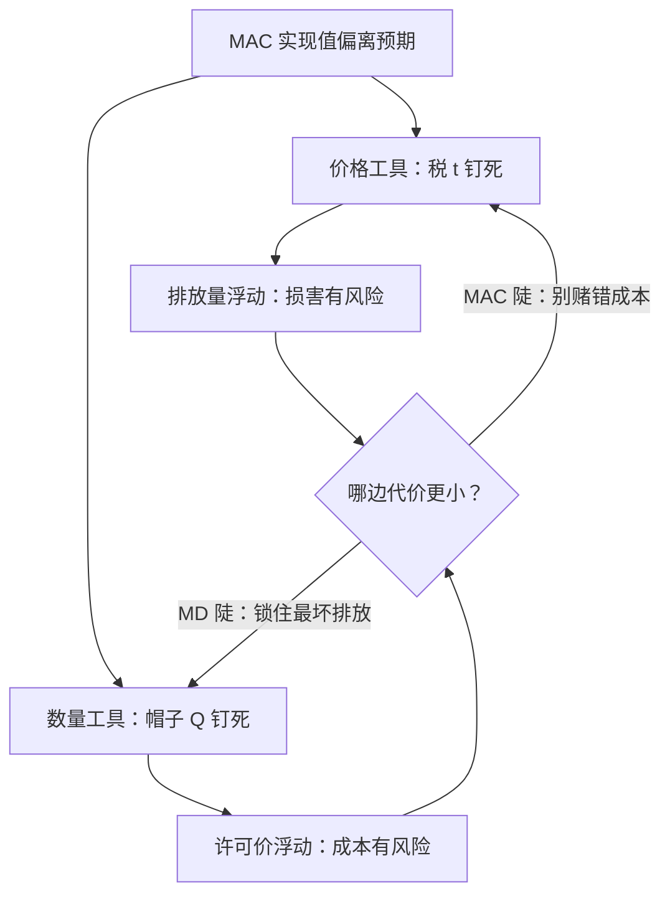

# 庇古税与碳定价

同一条边际损害曲线，可以从纵轴用税钉住，也可以从横轴用帽子钉住；确定的世界里两种写法等价，不确定的世界里要比较两条曲线的斜率。

<footer>—— Weitzman, Prices vs. Quantities, RES 1974；Pigou, The Economics of Welfare, 1920</footer>

[上一课](/econ/deadweight-loss-measure)给商品税的三角形记了浪费账，也留了一个例外：矫正外部性的楔子挤掉的是负剩余活动，三角形是校正收益。[外部性与庇古税](/econ/externality-pigou)立起 $t=\mathrm{MD}(q^*)$ 的一阶纠正，把 Weitzman 的比较推给不确定情形；[总量管制与许可证](/econ/cap-and-trade)同样把不确定悬置。本课把两笔欠账一起还上：碳的社会成本怎么定，价格与数量工具在不确定性下怎么选，最后看这套逻辑在既有制度里长成了什么样。

## 问题

碳是全球性、存量型、跨代的外部性：一吨排放的损害散布在几十年与所有纬度上，没有任何市场把它写进排放者的一阶条件。庇古税的税率就是碳的社会成本 SCC：一吨额外排放引致的全部未来边际损害的贴现现值。缺口有两层。其一，SCC 不是观测值，是模型加伦理参数的产出——损害函数、敏感度、贴现率都进公式，争论先落在贴现。其二，$\mathrm{MD}$ 与边际减污成本 MAC 都不确定时，「钉价格」与「钉数量」不再是同一政策的两种写法：钉住 $t$ 则排放浮动，钉住 $Q$ 则许可价浮动，谁的损失小要比较曲率。

术语翻译：SCC（碳的社会成本）就是「这一吨多排的碳，未来几十年给全社会造成的全部边际损害，折算成今天值多少钱」。它不是市场上挂牌的价，而是模型算出来的账单——损害函数怎么设、未来打个几折（贴现率），每个都能把数字改写一遍。

### Weitzman 的斜率判据

不确定性下，价格工具的期望福利损失与数量工具之差由两条曲线的斜率比决定：$\mathrm{MD}$ 随排放陡（阈值型损害，越过临界点损失跳升）时，数量工具把最坏情形锁住，帽子更安全；MAC 陡（减污成本对未知数敏感、损害平缓）时，价格工具少付「选错帽子」的代价。碳是存量污染物：当年多排一吨的边际损害几乎不随当年总量变化，$\mathrm{MD}$ 对当年排放近似水平——按判据偏向价格工具；只有当损害函数出现不可逆临界点，天平才翻回数量。

## 方法

SCC 的计算：把一吨排放经碳循环转成浓度路径，经损害函数转成逐期损害，按贴现率加总。Nordhaus 2017 用第二代 IAM（DICE 家族）给出每吨约 31 美元（2010 年美元）的中心估计，并展示贴现率是最大杠杆——纯时间偏好降零点几个百分点，估计就上一个台阶；伦理参数与实证参数在同一个数字里，报告必须分开。工具侧：税钉 $t$，排放随 MAC 实现值浮动；总量帽与可交易许可钉 $Q$，价格浮动；确定性下二者收敛到同一点（科斯与 Montgomery 的世界），实践里出现价格下限、上限与线性调节费，都是承认不确定性后的混合工具。

数字实例：同样一吨碳在 100 年后造成 1000 元损害，按年贴现率 1% 折现约合今天 370 元；按 3% 只剩约 52 元。贴现率从 1% 改到 3%，一行公式没改，SCC 就缩水近九成——所以贴现率之争不是技术细节，而是「未来的人算多重」的伦理立场之争。

## 机制

税让每个排放者把减污做到边际成本等于 $t$，成本有效性由价格机制完成，与许可市场把 MAC 对齐到 $p_\ell$ 是同一组一阶条件。制度对照一句各：EU ETS 自 2005 年起用绝对总量加配额拍卖，是「帽子」路线的标本；中国全国碳市场 2021 年上线、先覆盖发电、以强度基准分配配额——总量随产量浮动，价格信号更弱，等于把「帽」写成了「单位产出的帽」。两套制度是同一逻辑对不确定性与增长的不同折中。收入侧接上一课：碳税收入若用来压低其他扭曲税率，平方律给出一条对冲项；但税基互动同时抬高减污的真实成本，净方向看两边斜率，不是免费午餐。

不确定性落地时，两种工具各自锁死什么、放开什么：

直觉类比：钉价格像是宣布「每吨碳收 100 元，排多少随缘」；钉数量像是宣布「全年只许排 100 万吨，价钱随缘」。碳的边际损害曲线当年近乎水平——多排一点损害几乎不变——所以让排放浮动代价不大；可一旦存在越过临界点损害跳升的风险，就该反过来锁死数量、让成本去浮动。

SCC 的数量级之争首先是贴现率之争：把纯时间偏好压到近乎为零，同一个模型家族的估计会翻几倍——先声明贴现与损害假设，再读税价数字。

## 边界

SCC 是分布不是常数：损害函数、敏感度与折现假设每一个都能改一个数量级。碳价管不住泄漏：未覆盖辖区的排放与碳边境调整把它变成贸易问题。非凸与临界点使「边际一吨」失去良好定义，边际工具在悬崖边失灵；免费配额是把租金送给在位者，归宿按[归宿课](/econ/tax-incidence-statutory)的要素通道走。后课默认：见到任何「碳价」，先问它是价格工具还是数量工具、帽子是绝对还是强度、收入去了哪里——加深课序在这里把楔子的三问收齐：谁承担、损失多少、该不该楔。

## 小结

- 矫正税把边际损害写进私人一阶条件；碳价税率即 SCC。
- SCC 是贴现加总的模型量，贴现率与损害假设是最大杠杆（Nordhaus 2017）。
- 确定性下税与帽等价；不确定下按 Weitzman 斜率选：MD 陡用数量，MAC 陡用价格。
- 碳的存量结构使 MD 平缓，判据偏向价格工具；不可逆临界点翻回数量。
- EU ETS 钉绝对总量，中国以强度基准起步，是同一逻辑的两种制度化。
- 出处：Pigou 1920；Weitzman 1974；Nordhaus 2017；Dales 1968 与 Montgomery 1972 见主干课。
