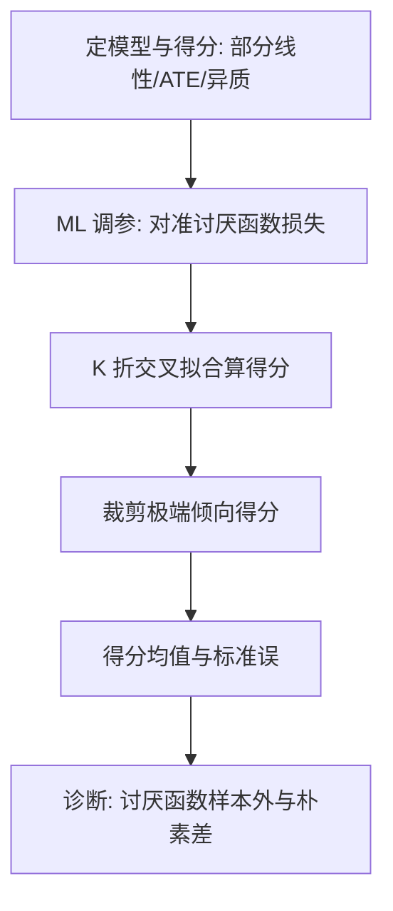
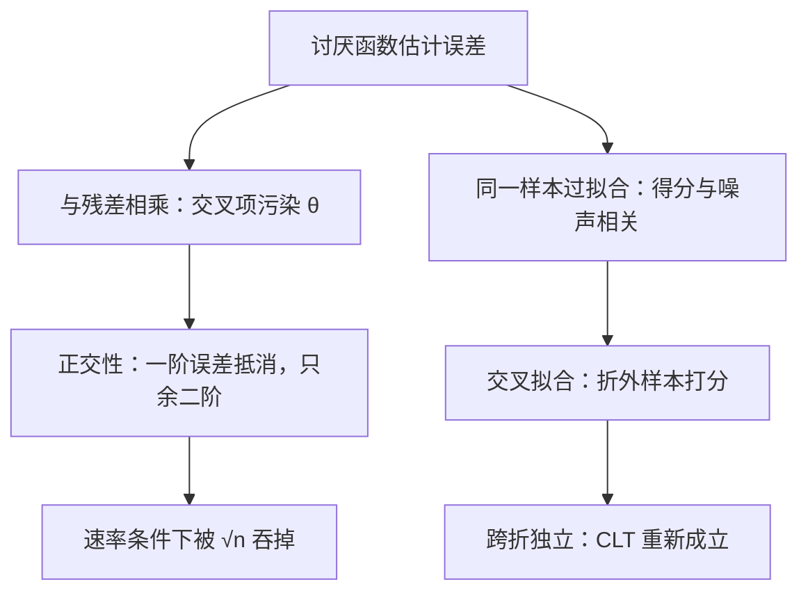

# Double ML 的深入

DML 的两根柱子各管一件事：正交把讨厌函数的速率要求放宽，交叉拟合把过拟合的偏倚赶回独立样本——少任何一根，灵活模型都会把偏倚伪装成效应。

<footer>—— 据 Chernozhukov, Chetverikov, Demirer, Duflo, Hansen, Newey and Robins, Double/Debiased Machine Learning, Econometrics Journal 2018 整理</footer>

[上一课](/econ/pm-ml-causal-deep)把因果 ML 的地图与元学习器铺开，DR-学习器被押后到本课。主干课[机器学习与因果](/econ/ml-causal-econ)与量化栏的[双重机器学习 DML](/quant/double-machine-learning)都钉过：Neyman 正交得分加交叉拟合，让灵活 ML 估讨厌函数时低维目标仍可 $\sqrt n$ 推断。本课深入三处：正交性的来源、异质效应的 DR-学习器、以及实施清单里最容易翻车的偏差源。

## 问题

部分线性模型 $y=\theta d+g(x)+u$。朴素做法——ML 预测 $y$、ML 预测 $d$、残差对残差回归——何时失效？两条伤。其一，讨厌函数估计不够快时，$\hat g-g$ 与 $\hat m-m$ 的交叉项以 $\sqrt n$ 可见的幅度进 $\hat\theta$，正则偏差直接污染目标。其二，交叉项期望为零要求残差与真实误差独立，同一样本上的过拟合破坏独立性。要问的因此不是「用不用 DML」，而是「我的收敛率与划分方案够不够撑起 $\sqrt n$」。

术语翻译：讨厌函数（nuisance）指为了拿到答案不得不估、但本身不是答案的那些函数——这里是控制变量如何影响结局的 $g(x)$ 和处理如何被分配的 $m(x)$。它们像做菜用的水和油：必须经手，但没人进餐厅是为了点一杯油。

### 正交性从哪来

Neyman 正交是得分对讨厌函数的 Gateaux 导数为零：讨厌函数的一阶估计误差不进目标，速率要求从 $\sqrt n$ 放宽到 $n^{-1/4}$，灵活 ML 够得着。这个思想在 Neyman 的 C(α) 统计量与 Robins–Rotnitzky 的双重稳健估计里已有雏形，DML 把它工程化。ATE 的 AIPW 得分更进一层：倾向得分与条件回归两个讨厌函数其一达到 $\sqrt n$ 即可——双重稳健。部分线性的残差化可上溯 Robinson 1988。

数字实例：$n=10^4$ 时，$\sqrt n$ 速率要求讨厌函数误差缩到 $0.01$，而 $n^{-1/4}$ 只要求 $0.1$——宽松整整十倍。DML 的意义就是把对机器学习模型的门槛从「非参精度做到 0.01」（大多数算法做不到）降到「0.1 就够」（普通算法够得着），代价要靠第二根柱子来付。

### DR-学习器与交叉拟合的账

异质效应：把 AIPW 伪结果当标签、对 $x$ 做第二段回归，这是 DR-学习器（Kennedy 2023）——伪结果在「倾向正确或回归正确」之下均以 $\sqrt n$ 收敛到真效应，第二段回归只需非参速率。交叉拟合的账本：分 $K$ 折，每折用其余 $K-1$ 折估讨厌函数、回本折算得分，跨折的近似独立性恢复了中心极限定理的使用条件，过拟合偏倚从「样本内相关」变成「跨样本无关」。DML1 与 DML2 的差别只在得分怎么汇总——折内平均再平均，或全样本解矩条件；实现的一致性比两者之别更要紧。

AIPW 得分里 $1/\hat e(x)$ 一项在倾向得分趋近零或一时方差爆炸：先画 $\hat e(x)$ 的分布，重叠差的区域要么裁剪要么分域估计，并报告结论对截断阈值的敏感性——权重爆炸不是小样本吓唬人，是识别假设在数据上失守的信号。

## 方法

实施清单固定。一，目标与得分先于算法：部分线性、ATE 还是 $\tau(x)$，得分不同。二，调参对准讨厌函数自己的损失（交叉验证），不用 $\hat\theta$ 的稳定性当标准——后者把正则偏差藏进选择。三，$K=5$ 起步；面板与聚类数据按时间块或聚类切分，不随机切。四，得分裁剪极端值并报敏感性。五，报告四件：得分均值与标准误、讨厌函数的样本外表现、朴素样本内估计与 DML 的差、截断敏感性。最后一件常被省略：两套估计差得多，往往恰是偏差校正真的在干活，而不是哪一套错了。

## 机制

正交为什么成立：AIPW 与部分线性得分的构造在推导里恰好把一阶变分项配平，讨厌函数的估计误差只以二阶项进入，二阶项在速率条件下被 $\sqrt n$ 吞掉。交叉拟合为什么救推断：无交叉拟合时 $\hat g$ 由同一样本估出，得分与噪声相关，中心极限定理的中心项随样本漂移；交叉拟合把这份相关换成跨折独立，$\sqrt n$ 正态重新成立。DR-学习器的机制同源：伪结果本身是目标的无偏二步估计，第二段回归消化的是剩余的非参误差。

两根柱子各堵住一条失效路径，合起来才通向 $\sqrt n$ 推断：

直觉类比：交叉拟合像考试前不许看原题——讨厌函数在 A 卷上估，到 B 卷上打分。估错带来的偏倚与 B 卷的噪声无关，跨折平均后互相抵消；若在同一个样本上又估又测（自估自测），误差会系统性地偏向自己这边，平均不掉。

## 边界

识别仍是 CIA 或 IV，DML 不提供外生性；不重叠毁掉 IPW 分支，弱工具下部分线性的推断另有专门的弱工具稳健方法，正交不治弱工具。遗漏变量的敏感性分析不在此展开。机器学习 nuisance 的函数类选择决定 $n^{-1/4}$ 是否现实——模型太弱，速率假设落空；模型过拟合，交叉拟合来救，但救不了系统性错设定。下一课换数据形态：当控制与结局本身是文本。

## 小结

- DML 的两根柱：Neyman 正交把讨厌函数速率要求放到 $n^{-1/4}$，交叉拟合恢复 CLT 的独立性条件。
- ATE 用 AIPW 双重稳健得分；异质效应用 DR-学习器把伪结果当标签回归。
- 调参对准讨厌函数损失；K 折按时间与聚类切；裁剪极端倾向得分并报敏感性。
- 朴素样本内估计与 DML 的差是诊断量：差得多往往说明偏差校正真的在干活。
- 出处：Robinson, *Econometrica* 1988；Chernozhukov, Chetverikov, Demirer, Duflo, Hansen, Newey and Robins, *Econometrics Journal* 2018；Belloni, Chernozhukov and Hansen, *JEP* 2014；Kennedy, DR-learner, *EJS* 2023。
