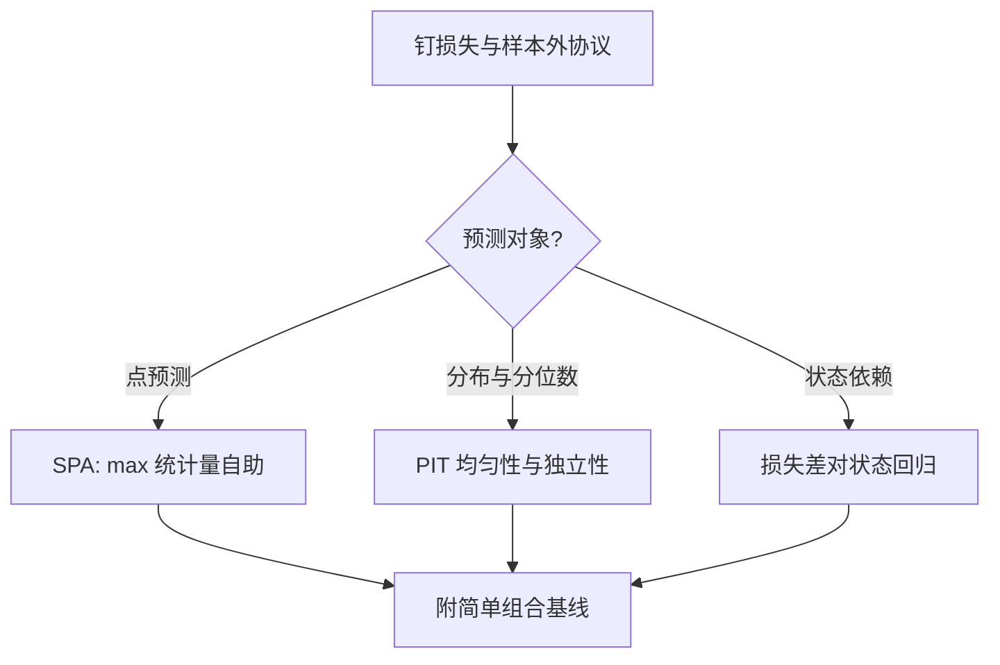

# 预测评估的深化

评估的深化不是把检验换成更响的名字，而是把「谁更准」拆成三问：在哪个损失上、对多少竞争者、在什么状态下——拆不开，冠军多半是数据窥探的产物。

<footer>—— 据 White, A Reality Check for Data Snooping, Econometrica 2000；Giacomini and White, Tests of Conditional Predictive Ability, Econometrica 2006 整理</footer>

[上一课](/econ/se-case-map)把「结构估计深化」收成一具工具箱：八课共用一条骨架——观测选择、反演不可观测、均衡与动态重放、验证；支撑内的问题优先找设计，支撑外才动结构。主干收束之后，本课开「预测与机器学习计量」的深钻层，先在评估这一端深化。缺口是 DM 的三个「只」：只比较两个对象、只看无条件均值、只评点预测。选型台上站着一排竞争者，预测器越来越多交出分位数与分布，优劣随状态翻转。后课默认已经读完本课：接下来两课造预测器，再把同一批工具送进因果问题。

## 问题

三个缺口。其一，竞争者是一族而不是一对。扫几百个规格挑出样本外最好的那个，再对它单独跑 DM，p 值是挑过的：两两检验的零假设数按平方增长，冠军的「显著」把选择过程的运气计成了能力——这正是[多重检验](/econ/multiple-testing-econ)的机制在预测评估里的翻版。其二，点预测只约束位置。预警与风控要的是尾部：两个均值同样准的预测器，一个分位数系统性偏窄，换分位数损失排名立刻翻转。其三，无条件比较把状态平均掉。常态期靠惯性外推的模型赢，转折点全错；损失差的样本均值为正，条件上随周期变号。

### 三条深化

多模型比较交给 reality check：把「最好的那个」的损失差统计量当作 max 统计量，在「无一竞争者胜过基准」的零假设下自助出它的分布，选择损耗于是进了检验。Hansen 的 SPA 先剔除明显劣等者再做，减少无效自由度，功效更高。分布预测交给概率积分变换：预测密度正确时 $z_t=F_t(y_t)$ 独立同均匀分布；直方图看均匀，自相关看动态，Berkowitz 检验补参数功效。条件评估交给 Giacomini–White：滚动窗口下把损失差对状态变量回归，检验条件期望损失差为零，绕开被估参数在有限样本里添乱的修正。

Reality check 与 SPA 都要求竞争者的损失面板在同一评估窗口内对齐：有模型晚发布一年，就把全家族窗口截短重算，而非各拿最长的窗口拼冠军——错位窗口的 max 统计量没有可解释的零假设。

## 方法

实施顺序固定。第一步钉损失与协议：损失先于模型，样本外窗口与再估计频率写死，沿用上一课口径。第二步按预测对象分支：点预测走 SPA 对整族竞争者；分位数与密度预测先过 PIT 的均匀与独立，再谈排序；条件问题用 Giacomini–White 补状态维度。第三步才读冠军，报告必须带三行：全家族的检验统计量、最优者的相对损失、简单组合基线——组合常赢，因为它在做收缩。

## 机制

机制一，挑选损耗可估。max 统计量在原假设下没有解析分布，但损失差的联合分布可从历史预测误差自助出来；记录每个自助样本的最优者，得到的正是「选择之后的运气」的分布。跳过这一步，两两 DM 的族错误率随竞争者数平方增长。机制二，PIT 把「密度对不对」变成「概率对不对」：若 $F_t$ 是真分布，$z_t$ 落在任何区间的概率相等且不随时间相关；直方图缺口指认失配区间，自相关指认动态失配。机制三，条件评估改写零假设而非加协变量：Giacomini–White 检验「滚动窗口估计出的预测器」的条件损失差，被估参数是预测器的属性而非噪声，检验对估计误差稳健。

不这么做会错在哪：拿样本内拟合替冠军辩护（上一课已判）；拿全窗口均值掩盖状态翻转；拿点预测协议去评分位数模型。

## 边界

统计精度不是经济价值：分位数损失最小的模型按盈亏重排是常态，决策口径要把损失换成收益，是另一张表。Reality check 治数据窥探的推断伤，不治挖掘本身：同一批数据反复加竞争者，自助出的原假设分布也在漂移。PIT 检验联合校准，均匀但不独立仍是坏预测器。样本外协议与稀疏预测器是后两课的缺口。

## 小结

- DM 是两两、无条件、点预测的检验；深化沿三条线：多模型 SPA、分布预测 PIT、条件评估 Giacomini–White。
- 多竞争者的显著性要把选择损耗算进零假设，用 max 统计量的自助分布，不是两两 DM 挑最小 p。
- 分布预测把「密度对不对」变成 PIT 的均匀性与独立性，Berkowitz 检验补参数功效。
- 报告永远带简单组合基线：组合在做收缩，常是免费的强对手。
- 出处：Diebold and Mariano, *JBES* 1995；White, *Econometrica* 2000；Hansen, *JBES* 2005；Giacomini and White, *Econometrica* 2006；Diebold, Gunther and Tay, *JBES* 1998；Berkowitz, *JBES* 2003。
