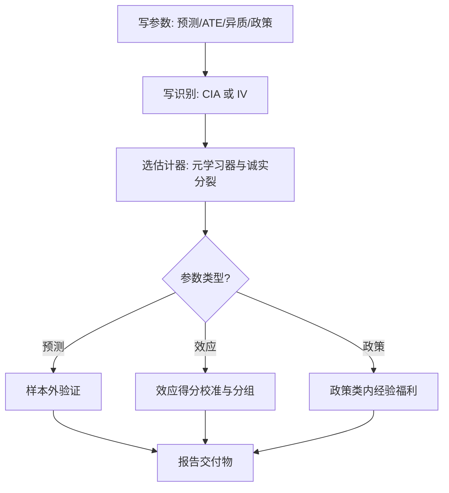

# 机器学习与因果的深化

预测器再准也不回答反事实；「预测政策问题」的价值在于承认这一点之后，把只需要预测的决策从效应估计的整套装置里解放出来。

<footer>—— 据 Kleinberg, Ludwig, Mullainathan and Obermeyer, Prediction Policy Problems, AER 2015；Athey and Imbens, Annual Review of Economics 2019 整理</footer>

[上一课](/econ/pm-regularized-econ)把正则化的推断线收在双选择与去偏上。缺口从「估计系数」升级到「回答反事实」。主干课[机器学习与因果](/econ/ml-causal-econ)已经钉过底线：ML 只估讨厌函数，不创造外生性；正交加交叉拟合把 ATE 拉回 $\sqrt n$ 推断；事后挑选控制会低估标准误。本课深钻因果侧的地图：预测问题与因果参数的分工、异质效应的估计器族、以及从效应到政策的最后一跳。

## 问题

四个参数常被「机器学习」一个词盖住：$E[y\mid x]$（预测）、$E[y(1)-y(0)]$（平均效应）、$\tau(x)$（异质效应）、$\pi(x)$（最优分配规则）。目标不同，损失、验证标签、可检验性全部不同。最常见的错位是拿预测精度替效应估计背书：特征对 $y$ 有预测力，不等于对效应有调节力。Kleinberg 等 2015 把这条边界正面用起来：当决策只需要预测不需要效应（谁会缺席听证、谁会再入院），预测器直接上线，绕开效应估计的整套装置；而「培训该分给谁」才需要 $\tau(x)$，必须过识别设计。

### 元学习器与诚实分裂

异质效应没有直接标签——$y(1)$ 与 $y(0)$ 只见其一——只能间接构造：S-学习器把处理当特征放进一个模型；T-学习器分组建模再相减；X-学习器（Künzel 等 2019）用两组各自的补全差再加权，样本不均衡时更稳；DR-学习器把双重稳健得分当伪结果回归，留到下一课。因果树（Athey–Imbens 2016）的关键是诚实分裂：一半样本定叶子的划分，另一半估叶子内的效应——选择与估计分开，标准误才有理论；森林化（Wager–Athey 2018）补渐近正态与区间。政策学习是最后一跳：Kitagawa–Tetenov 2018 在受约束的政策类里最大化经验福利，回答的不是「效应多大」而是「按 $x$ 分配的最优规则是什么」，评估靠福利损失界，不靠系数显著性。

保释决定只需要「被告人若释放，弃保潜逃概率」的预测；再就业培训的分配才需要异质效应。两类问题被同一个词「预测」盖住时最危险：前者用预测精度验收，后者必须过识别——错拿前者做后者，是把风险评估当成因果承诺。

## 方法

流程五步固定。先写参数：四个里要哪个。再写识别：CIA 或 IV 从哪来，ML 不参与这一步。第三选估计器：异质用元学习器加诚实分裂，均值用下一课的 DML。第四选验证：预测参数用样本外；效应参数只能用代理——效应得分的校准、诚实分裂下的区间、有子实验时分域对照。第五做政策映射：声明政策类与约束（预算、公平性），报福利损失界而非系数表。每一跳都有交付物，跳不过去的环节停下来，而不是换个更花哨的模型。

## 机制

诚实分裂为什么救推断：树的过拟合来自「用同一份数据既找划分又估效应」，分裂之后另一半数据面对固定的划分做估计，经典中心极限定理适用，叶子效应的置信区间有出处。预测与效应的错位为什么普遍：两者的监督信号不同——一个对 $y$，一个对只可见一方的伪效应——能分出 $y$ 的特征自然不需要能调节 $\tau(x)$，反之亦然。政策学习的机制是把决策问题的损失显式化：福利损失界直接惩罚「把好配置分错」的规则，估计误差与优化误差分开记账。

不这么做会错在哪：拿整体 ATE 分配资源（掩盖异质）；拿叶子的显著名单当政策规则（没有福利记账）；拿预测指标验收效应模型（错位验收）。

## 边界

识别不因算法改变：CIA、IV、不重叠的假设清单照旧，算法只改变讨厌函数的填充质量。元学习器的相对优劣依讨厌函数收敛率与两组样本配比，没有全胜者。$\tau(x)$ 的逐点验证不可行——反事实不可观测——只能校准与分组，「异质效应被验证了」的说法要拆开看。文本作为特殊的 $x$ 与 $y$ 是另一条通道，接后面两课；均值效应的正交得分装置正是下一课的地盘。

## 小结

- 四个参数四种损失：预测、ATE、异质效应、政策规则；目标错配是最贵的错误。
- 异质效应靠元学习器间接构造；诚实分裂把选择与估计分开，推断才有理论。
- 预测准不背书效应准；只需要预测的决策应直接用预测器，不必假装估效应。
- 政策学习在受约束的政策类内最大化经验福利，评估靠福利损失界。
- 出处：Kleinberg, Ludwig, Mullainathan and Obermeyer, *AER* 2015；Athey and Imbens, *PNAS* 2016；Wager and Athey, *JASA* 2018；Künzel, Sekhon, Bickel and Yu, *PNAS* 2019；Kitagawa and Tetenov, *Econometrica* 2018；Mullainathan and Spiess, *JEP* 2017。
