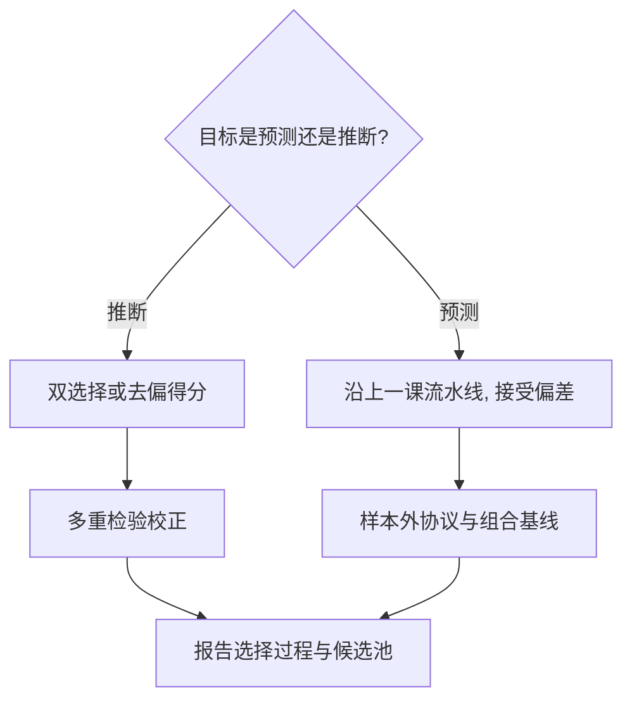

# 正则化回归的计量解释

同一个 Lasso 能做两件事：预测时偏差是免费的，推断时偏差是致命的——分不清这两件事，选出来的显著性只是选择过程的回声。

<footer>—— 据 Leeb and Pötscher, Can One Estimate the Conditional Distribution of Post-Model-Selection Estimators?, Econometric Theory 2005；Belloni, Chernozhukov and Hansen, JEP 2014 整理</footer>

[上一课](/econ/pm-sparse-methods)把高维预测器钉在稀疏假设与样本外验证上，并留下一句话：入选集合是随机对象，系数带收缩偏差。计量经济学家的诉求不止预测——要系数、要区间、要检验。缺口是：惩罚世界里的推断怎么做，以及什么情况下根本做不到。

## 问题

两个陷阱。其一，挑选后的显著性：用同一份数据先选模型、再对入选变量做 OLS 的 t 检验，检验的分布已被挑选改变。Leeb–Pötscher 2005 的不可能性说得更狠：模型选择估计量无法被一致地估计——真实参数附近，估计量的分布随参数值移动，任何置信区间要么无限宽要么失覆盖。其二，规格搜索的多重性：扫 $\lambda$、扫变量、扫子样本，挑显著的报告，名义 $\alpha$ 与族错误率脱钩，这接[多重检验](/econ/multiple-testing-econ)的纪律：只展示显著规格等于隐瞒 $m$。

### 罚的另一面：先验与收缩

贝叶斯读法把罚变成先验：ridge 是高斯先验下的后验众数，Lasso 是拉普拉斯先验；Zellner 的 g 先验把先验信息强度随样本量参数化，贝叶斯模型平均（BMA）给出另一条路——不选模型，把不确定性摊在模型族上。经典侧的先声是 James–Stein 1961：平方损失下收缩估计一致优于最大似然，维数三即生效——「往零收」在决策论上不是妥协，是可兑现的免费午餐。

### 推断的正路：双选择与去偏

post-double selection（Belloni–Chernozhukov–Hansen 2014）：关心 $d$ 对 $y$ 的效应时，对 $d$ 过一遍变量选择（防遗漏变量偏差），对 $y$ 过一遍（防只预测 $y$ 的变量带来的选择偏倚），两个入选集合并起来跑 OLS。两类偏差都被压到 $\sqrt n$ 之下，常规推断恢复。工具变量侧同理：用 Lasso 从高维候选里构造最优工具（Belloni–Chen–Chernozhukov–Hansen 2012）。另一路是对 Lasso 本身去偏：把压缩掉的偏差用一步修正加回去，得到近似正态的估计量。

有效自由度 $\mathrm{df}(\lambda)=\mathrm{tr}(H_\lambda)$ 是收缩世界的「变量个数」：岭回归的 df 从 $p$ 连续降到零，Lasso 的 df 约等于入选数。报告 df 而不是数变量，才能在不同罚之间对齐复杂度。

## 方法

流程先声明目标。预测目标：沿上一课流水线走，接受偏差，不解读系数。推断目标：三选一——post-double selection 之后 OLS；desparsified Lasso 的去偏得分；BMA 的模型平均后验。控制变量的候选池必须预先声明，选择过程（哪一步筛、用了什么 $\lambda$）写进报告；显著性声明过多重检验校正。省略这一步，等于把规格搜索的幸运当成了发现。

## 机制

为什么双选择有效：遗漏与选择两类偏差都以与样本相关的速率进入估计量，$\sqrt n$ 收敛要求它们低于 $\sqrt n$；两遍选择正是把它们按可证的界限压下去，剩下的误差进入常规渐近正态。为什么朴素 post-selection 崩：入选集合是随机的，条件在「选中了这些变量」上做推断，等于把选择事件当成已知事实，t 统计量的零分布随之变形；Leeb–Pötscher 的不可能性说明这不是实现细节，是数学边界。df 的直觉同源：每个被收缩的系数贡献一份小于一的「自由度份额」，复杂度的账要按罚后的实际自由度记。

## 边界

稀疏推断仍依赖稀疏假设：不稀疏时，去偏区间的宽度按真相发散——这恰是诚实的表现，说明数据不支持那些系数。弱工具不因 Lasso 消失，最优工具的构造仍要过弱工具诊断。BMA 的结论对先验敏感，敏感性要做而不是辩解。识别从不来自惩罚：正则化改变估计的方差与偏差，不改变外生性来源。这些工具箱如何整体进因果问题，下一课给地图。

## 小结

- 挑选后的 t 检验无效；Leeb–Pötscher：模型选择估计量不存在一致估计，这是边界不是技巧问题。
- 罚即先验：ridge 对高斯、Lasso 对拉普拉斯；BMA 把模型不确定性摊开而不是挑一个。
- 推断正路是 post-double selection 或去偏得分；控制池与选择过程必须预先声明并写进报告。
- $\mathrm{df}(\lambda)$ 是复杂度的统一账本，跨罚对齐复杂度用 df 不用变量个数。
- 出处：James and Stein 1961；Leeb and Pötscher, *Econometric Theory* 2005；Belloni, Chen, Chernozhukov and Hansen, *Econometrica* 2012；Belloni, Chernozhukov and Hansen, *JEP* 2014；Zellner 1986。
