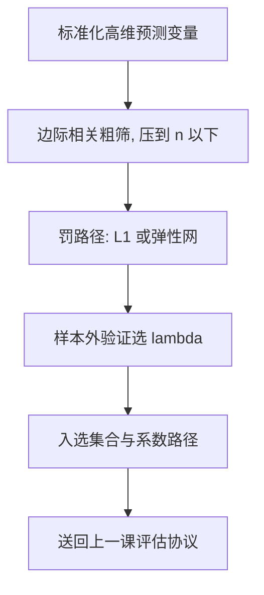
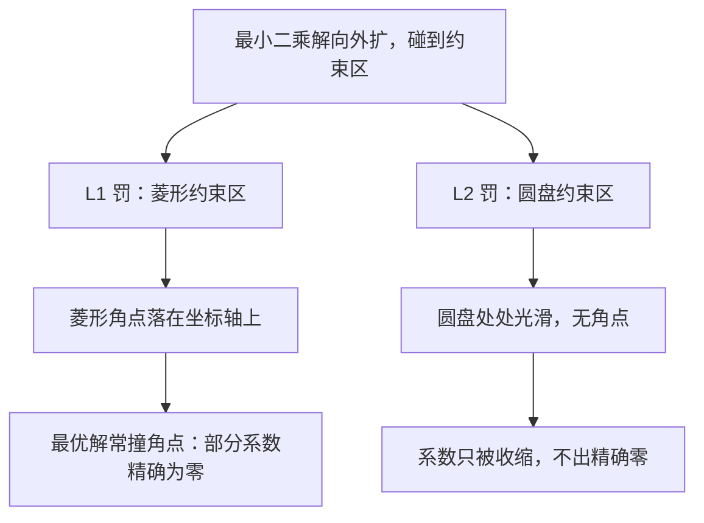

# 稀疏方法

高维的救星不是更聪明的估计量，而是一个可以被检验的工程假设：信号是稀疏的——多数系数就是零，剩下那些往零收。

<footer>—— 据 Tibshirani, Regression Shrinkage and Selection via the Lasso, JRSS-B 1996；Fan and Lv, Sure Independence Screening, JASA 2008 整理</footer>

[上一课](/econ/pm-forecast-eval-deep)把评估协议钉成三条线：多模型 SPA、分布预测 PIT、条件评估，并要求任何冠军先过这张表、附带组合基线。本课转向生产端：宏观大面板、成百上千的高频特征、文本词表，预测变量个数 $p$ 逼近甚至超过样本量 $n$，OLS 要么不可逆要么方差爆炸。缺口是：怎么在高维里造出值得送进那张评估表的预测器。惩罚之后系数还能不能推断，留到下一课。

## 问题

$p$ 大时误差方差按 $p\sigma^2/n$ 涨：不减自由度，样本外预测必崩。经典应对是逐步选择，但它不稳定：数据微动，入选集合整批翻新，预测方差反而更大。缺口因此是同时做两件事的估计量：把多数系数精确压到零（选择），把留下的往零收（收缩），且超参数由样本外验证决定——协议上一课已备好。

稀疏假设是这一步的全部赌注：存在小的 $s$，$s\ll p$，真信号集中在 $s$ 个变量上。赌对了，有效自由度从 $p$ 降到 $s$，方差回到 $s\sigma^2/n$ 的量级；赌错了（信号真的摊薄在所有变量上），稀疏方法系统性丢信号——这要靠上一课的样本外比较来发现，而不是靠信仰。

数字实例：$p=500$ 个候选变量、$n=200$ 个观测时，OLS 的误差方差按 $p\sigma^2/n$ 计约为 $2.5\sigma^2$——比系数本身还大，样本外必崩。若真信号只集中在 $s=10$ 个变量上，有效自由度压到 10，方差骤降到约 $0.05\sigma^2$，缩小五十倍。这就是「方差预算」四个字的账。

### 三件工具与一个筛选器

岭回归（Hoerl–Kennard 1970）加 $L_2$ 罚：共线性下数值稳定，但不产生精确零。Lasso（Tibshirani 1996）加 $L_1$ 罚：几何上的角点让一部分系数恰好为零，收缩与选择一步完成。弹性网（Zou–Hastie 2005）在两者之间插值：强相关的一组变量，Lasso 会任意挑一个丢掉其余，弹性网把组一起留住。非凸惩罚（SCAD，Fan–Li 2001）走向 oracle 性质：渐近下像知道真模型一样估大系数、压零系数。变量极多时先做确定性筛选（Fan–Lv 2008）：按边际相关粗筛，把 $p$ 压到 $n$ 以下再上惩罚——单步筛选会漏掉只在偏效应里活着的变量，筛选集因此要放宽。

Lasso 的软阈值算子 $\mathrm{soft}(z,\lambda)=\mathrm{sign}(z)\,(|z|-\lambda)_+$ 把绝对值低于 $\lambda$ 的系数拉成精确的零；「精确零」正是选择与收缩合并为一个估计量的机制，也是它有偏的来源。

直觉类比：两个高度相关的变量像成绩几乎相同的双胞胎，Lasso 只肯留一个，丢哪个全凭噪声抽签；弹性网把双胞胎一起留下、分摊权重，入选名单因此稳定得多。

## 方法

流水线固定：标准化预测变量（罚对尺度敏感），定罚路径 $\lambda_1\gt\lambda_2\gt\cdots$，沿路径用样本外验证选 $\lambda$（时序数据用前向滚动，不用随机 K 折），报告入选集合与系数路径，最后送进上一课的评估协议与组合基线比。$\lambda$ 读作偏差—方差旋钮：$\lambda=0$ 回到 OLS（方差最大），$\lambda$ 拉满全部压零（偏差最大），样本外误差是两者的 U 形交点。

## 机制

机制一，几何产生零：$L_1$ 球的角点落在坐标轴上，最优解碰到角点，对应系数精确为零；$L_2$ 球处处光滑，只收缩不选择。机制二，自由度账本：Lasso 的有效自由度约等于入选变量个数，$s$ 小则方差项小；稀疏假设因此不是审美，是方差预算。机制三，相关组的不稳定性：两个替代变量高度相关时，Lasso 按噪声随机二选一，系数路径在组内跳变——这解释了为什么入选集合的「经济学解释」不可靠，弹性网与自助重采样诊断的正是这个伤。

不这么做会错在哪：用样本内拟合选 $\lambda$（过拟合免费奖励复杂度）；用随机 K 折切时序面板（信息从未来泄漏回过去）；把入选变量当因果解释（下一课的缺口）。

$L_1$ 与 $L_2$ 的几何差异解释了「选择」从哪来：

常见误区：用样本内残差平方和选 $\lambda$ 永远会选到 0——不罚当然最好，过拟合被免费奖励。$\lambda$ 只能由样本外误差定；时序数据还得用前向滚动验证，随机 K 折会把未来的信息泄漏给过去，样本外成绩虚高。

## 边界

稀疏方法交付预测器，不交付推断：Lasso 系数带收缩偏差，入选集合是随机对象，对它做 t 检验的分布已被选择改变——这是下一课的主题。信号不稀疏时，收缩反而输给别的函数类：金融面板上线性、树与浅网络的样本外对比可参 [Gu-Kelly-Xiu 与 NN3](/quant/gkx-nn3)，没有哪个模型族全胜，评估协议说了算。本课不碰非参数与集成，不处理测量误差；罚的贝叶斯读法与推断修正接下一课。

## 小结

- 高维的缺口是方差预算：稀疏假设把有效自由度从 $p$ 压到 $s$，是可检验的工程赌注。
- 岭回归稳定共线性，Lasso 兼做收缩与选择，弹性网救相关组，SCAD 求 oracle 性质，SIS 先筛大 $p$。
- $\lambda$ 是偏差—方差旋钮，只能由样本外验证（时序用前向滚动）决定。
- 入选集合不稳定是相关组的伤；系数与入选变量都还不能当推断读。
- 出处：Hoerl and Kennard, *Technometrics* 1970；Tibshirani, *JRSS-B* 1996；Zou and Hastie, *JRSS-B* 2005；Fan and Li, *JASA* 2001；Fan and Lv, *JASA* 2008。
