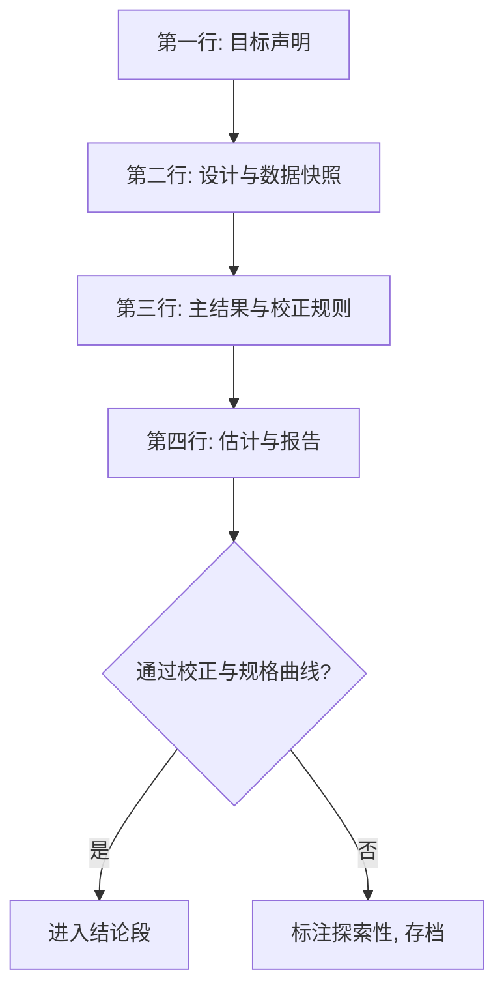

# 实证设计规范与收束

实证失败大多不在估计量，而在规范：目标没钉、搜索无记录、幸存者上桌、数据不可复现——四样都不需要新技术来治，需要的是流程。

<footer>—— 据 Simonsohn, Simmons and Nelson, Specification Curve Analysis, Nature Human Behaviour 2020；Gelman and Loken 2014 整理</footer>

[上一课](/econ/pm-text-as-data)把文本量钉在测量三问与点-in-time 上。本课是「预测与机器学习计量」的最后一课，本课程到此收束：前六课给了评估协议（SPA、PIT、条件评估）、生产工具（稀疏方法、正则化推断）、因果装置（元学习器、DML、文本测量），本课把它们收成一份可执行的规范——目标怎么声明、主结果怎么保护、稳健性怎么报、证据怎么存。

## 问题

规范缺失有四类伤。目标未声明：预测与因果混线，预测指标验收效应模型。规格搜索无记录：试过的规格只有幸存者上桌——Gelman–Loken 称之为「分叉小径的花园」，显著性成了分析路径的属性。主结果事后搬家：预分析定的终点，写报告时换成显著的那个。数据与代码不可复现：快照、种子、环境缺失，结论无法被审计。四类伤的共同点：没有一类能靠换更高级的估计量来治。

### 双轨与三件套

生产分双轨。预测轨按[第三课](/econ/pm-regularized-econ)的协议走：样本外窗口、[多模型 SPA](/econ/pm-forecast-eval-deep)、校准、组合基线。因果轨按识别声明、得分或设计、异质与政策映射走，识别假设在估计之前写下。两轨的目标声明写在分析第一格。主结果保护：预分析计划先写终点；规格曲线把合理规格全集的效应分布画出来，报「显著的比例与效应的形状」，不挑幸存者。多重检验纪律接[多重检验](/econ/multiple-testing-econ)：族内校正（Holm、Benjamini–Hochberg、Romano–Wolf），探索性结果明确标注。可复现三件套：点-in-time 数据快照、随机种子与锁定环境、从原始数据到表格的自动化管道。

规格曲线的读法：结论的稳健性是「全规格分布的位置」，不是「有没有一个显著的」。画出来之后，只在两成规格里显著的效应与九成规格里同号的效应，证据等级完全不同——这一步不加任何新估计，只把研究者自由度从看不见变成分布。

## 方法

流程一页纸。第一行写目标：预测轨还是因果轨，参数是哪一个。第二行写设计与数据：识别假设或样本外协议、窗口、快照日期。第三行写主结果与验证规则：终点、校正方法、规格全集的定义。第四行才是估计与报告：效应量加不确定性加决策含义一行；预测模型报校准与经济价值两行；所有转换（裁剪、缩尾、聚合、词典更换）登记在案。越出流程的探索照做，但输出必须标注「探索性」，不得进入结论段。

## 机制

规范是统计装置的乘数：DM 与 SPA 假设评估窗口诚实，DML 假设控制池预先声明，文本测量假设点-in-time——前六课的每个装置都吃规范红利，也都被规范缺失摧毁。规格曲线的机制是把自由度显形：显著性在全规格分布上的位置才是证据；预注册把「什么时候定的」钉死，事后搬家无处发生。可复现三件套让审计成为可能：审查者能沿管道重跑出同一张表，争论才落在判据上，不是数据上。

课程收束在此完成：从[预测评估的深化](/econ/pm-forecast-eval-deep)的损失差协议出发，经[稀疏方法](/econ/pm-sparse-methods)与正则化的推断约束预测器，经[机器学习与因果的深化](/econ/pm-ml-causal-deep)与[Double ML 的深入](/econ/pm-dml-deep)把工具送进反事实，经[文本作为数据](/econ/pm-text-as-data)扩展数据形态——机器学习没有替计量经济学回答识别问题，它把每个经典估计量的讨厌函数位次填得更满；填得再满，目标声明、主结果保护与可复现三件套仍是那道闸门。

## 边界

规范不救识别错误：假设清单错，流程再干净也是干净的错。预注册压抑探索，探索要留出并标注，探索发现的检验换新数据做。规范有成本，小样本与快速迭代按比例裁剪——但「按比例」的判断本身要预先声明，不能事后援引。大模型时代文本与代码的复现边界还在收紧：模型版本、解码参数都进三件套，否则管道不可重放。

## 小结

- 实证第一行是目标声明：预测轨与因果轨分开跑，指标与验证各自独立。
- 主结果用预分析计划保护；规格曲线报全规格分布，不报幸存者。
- 多重检验校正、点-in-time 快照、种子与管道复现是三件套，缺一即规范缺失。
- 本课程到此收束：从 DM 的损失差到 DML 的正交得分再到文本测量，机器学习加深了计量的每个装置，识别与规范的闸门一道未变。
- 出处：Simonsohn, Simmons and Nelson, *Nature Human Behaviour* 2020；Gelman and Loken 2014；据 Diebold and Mariano 1995、Chernozhukov et al. 2018、Gentzkow, Kelly and Taddy 2019 整理。
