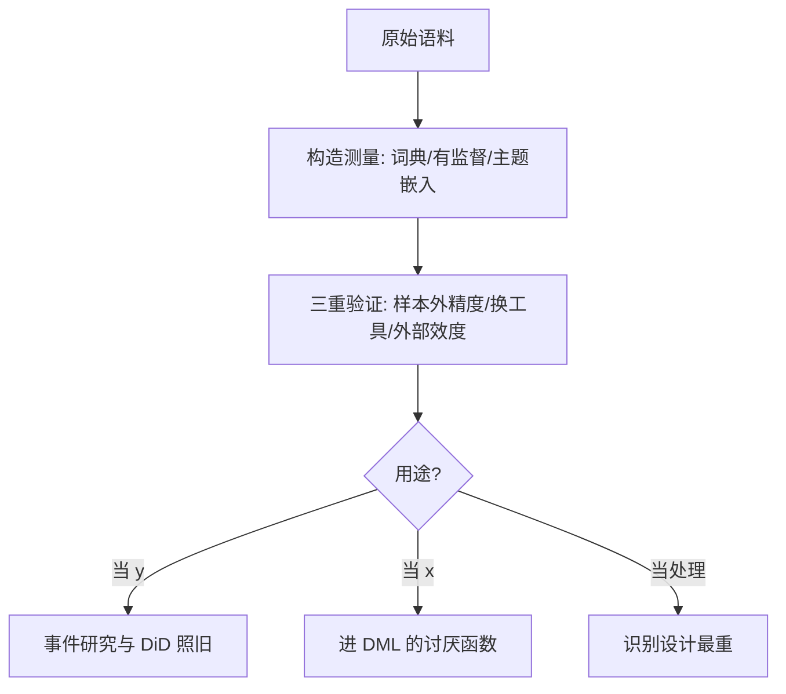

# 文本作为数据

任何进入回归的文本量——情绪分、立场分、不确定指数——都是一次测量决策；测量要验证，验证之后才有资格谈因果。

<footer>—— 据 Gentzkow, Kelly and Taddy, Text as Data, Journal of Economic Literature 2019 整理</footer>

[上一课](/econ/pm-dml-deep)把 DML 的得分、交叉拟合与实施清单钉深。缺口换数据形态：经济学的大数据越来越多是文本——财报、新闻稿、电话会纪要、议会与央行发言。Gentzkow–Kelly–Taddy 2019 把「文本作为数据」收成计量问题：文本量是测量，测量要验证，验证之后才能进估计与因果。

## 问题

文本的原始形态是高维离散对象——词袋、字符流。任何进入回归的文本量都把高维对象压成一维，这是一次测量决策。三个问题随之而来。测得准不准：分类器的样本外精度，不是样本内拟合。测的东西对不对：通用情绪词典把金融语境里的「负面」词一律记负，10-K 里大量会计术语被误伤——Loughran–McDonald 2011 为金融文本重训词表，换词典即换测量。测量与因果的关系：文本量当结局 $y$、当回归元 $x$、当处理的代理，三种用法的要求完全不同，混用是最常见的翻车点。

### 三种构造与两个指数

词典法：词表打分，透明可审计，代价是上下文盲。有监督法：Gentzkow–Shapiro 2010 测媒体立场，用「两党共同提案与单党提案」的措辞差异生成训练标签，把立场变成可估计的量——标签的构造本身就是识别设计。生成式与表征法：LDA（Blei–Ng–Jordan 2003）把文档表成主题分布，词向量（Mikolov 等 2013）把词表进连续空间，语义相似变成几何。指数法把前几者组合成可跟踪的时间序列：Baker–Bloom–Davis 2016 的经济政策不确定性指数（EPU）按月扫报并人工核验；Hassan 等 2019 从电话会纪要里量公司层面政治风险，把测量挂钩后续的游说支出与盈余波动做外部效度。

EPU 的构造本身就是验证模板：报纸来源限定、三组检索词（不确定×经济×政策）、按月归一、人工剔除误报条目，再与宏观波动和投资的相关挂外部效度——每一步都可复制、可批评，这与「调出一个模型」的区别正是测量与拟合的区别。

## 方法

流程按用途分支。文本当 $y$：先定测量再定识别——政策前后语气变化的评估仍是事件研究与 DiD，测量误差进衰减系数，词典更换要做稳健性。文本当 $x$：高维文本特征进[上一课](/econ/pm-dml-deep)的讨厌函数位次，由正交得分消化其维数；处理之后产生的文本绝不能当控制。文本当处理的代理（谁接触了哪类信息）：测量与分配同时内生，识别设计最重，词典精度救不了。一切用途都要点-in-time：用今天才发布的词表或模型回测历史文本，会把未来信息泄进测量——这与回测里的前视偏差同源。

## 机制

验证为什么是中心环节：文本量在回归里扮演的角色与其测量性质纠缠——分类器的偏差不是白噪声，是系统性偏移，衰减与放大都朝着错的方向。样本外精度、换工具的稳健性、与外部效度的三重验证，把「编了个指数」变成「有个测量」。金融专用词表的机制同源：同一个词在不同域的效价不同，测量模型的训练分布必须匹配使用分布——通用域词表进金融文本，测的是语言学不是经济学。

不这么做会错在哪：拿样本内分类精度当测量效度；把模型生成的文本量当外生变量；用后来的词表回放历史语料还报告「历史规律」。

## 边界

本课不教 NLP 工程——分词、预训练与服务化在大模型栏，这里只管测量与推断。大语言模型当标注器是新的测量仪器，误差结构仍在验证纪律之下，且要防「模型间的共同偏置让两套标注互相印证」。语言随年代演化，固定词典会漂移：同一个词在不同年代效价不同，长期面板要按十年段重验。文本嵌入的因果解释——「语义即变量」——默认是误读。测量之后怎么把整条实证线收进规范，是最后一课的事。

## 小结

- 文本进回归前先过测量三问：样本外准不准、测的是不是目标构念、换测量工具结论稳不稳。
- 词典透明可审计，有监督靠标签设计，主题与嵌入降维；EPU 与公司政治风险是验证模板。
- 用途分三种：当 $y$ 识别设计照旧，当 $x$ 进 DML 的讨厌函数，当处理代理时识别最重。
- 点-in-time 是文本数据的硬约束；今天的词典与模型回测昨天会泄漏未来。
- 出处：Gentzkow, Kelly and Taddy, *JEL* 2019；Gentzkow and Shapiro, *Econometrica* 2010；Loughran and McDonald, *JF* 2011；Baker, Bloom and Davis, *QJE* 2016；Hassan, Hollander, van Lent and Tahoun, *QJE* 2019。
