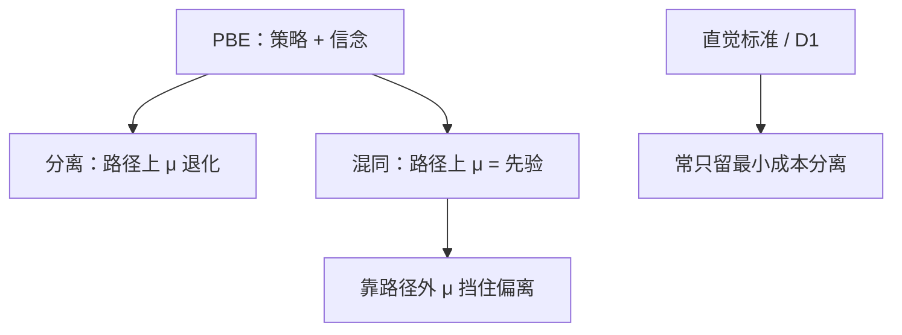

# 混同与分离

完美贝叶斯均衡可以是所有类型发同一信号，也可以是各发各的；两类均衡的差别在路径外信念，不在教育是不是生产。

<footer>—— 据 Spence, QJE, 1973；Mas-Colell, Whinston and Green, Microeconomic Theory, ch. 13</footer>

[上一课](/econ/spence-signaling)已经用单交叉写出最小成本分离，并说明混同靠怪信念撑住。缺口是把两类 PBE 的构造写全：策略、路径上信念、路径外信念各写什么，精炼删哪一类。本课不重讲「教育可不提高产出」的故事，只把混同与分离当成信念–策略的两套解。

## 问题

两类型 $\theta\in\{L,H\}$，信号 $e$，接收者后验 $\mu(e)$，支付（工资、价格）等于后验期望。PBE：发送者对后验最优，接收者在路径上贝叶斯，路径外信念任意（再加精炼）。分离：$\mathrm{supp}(e_L)\cap\mathrm{supp}(e_H)=\emptyset$，路径上 $\mu$ 退化到真类型。混同：两类选同一 $e^p$，路径上 $\mu$ 等于先验。半分离：一类型纯、另一类型混，本课只作边界。

分离的构造：先定低类型的完全信息最优 $e_L$（常为 $0$），再找最低 $e_H$ 使低类型模仿不划算、高类型宁可分离。单交叉保证这段不等式有解。再高的 $e_H$ 也是分离 PBE——路径外把更低的 $e$ 判给低类型即可。混同的构造：选 $e^p$，工资等于平均产出；对任何 $e\neq e^p$，指定 $\mu(e)$ 使两类都不想偏。常见撑法是 $\mu(e)=0$（判给低类型）。直觉标准：若低类型更不愿意发某个 $e'$，则不该把 $e'$ 判给他，于是许多混同垮、浪费型分离也垮，留下最小成本分离。

### 构造先于故事

同一套 $(e,\mu)$ 可以贴在教育、担保、广告上。差别只是成本函数谁更陡。本课不再解释「为什么学校存在」，只写这两类均衡各自需要哪些信念。

MWG 第 13 章把 Spence 收成：分离的激励相容几何 + 混同对路径外信念的依赖。Cho–Kreps 直觉标准、Banks–Sobel 神性、D1 是同一精炼家族；课堂上最小成本分离几乎总是唯一幸存者。

混同不是「没有信息」，而是路径上信息量为零。
分离不是「信息完全」，而是路径上类型被点识别；路径外仍可任意。
精炼改的是允许哪些任意，不是改贝叶斯公式。

## 方法

对象：两类型、连续信号、竞争性接收者、PBE。步骤：(1) 写分离候选，检查双方 IC；(2) 写混同候选，补全路径外 $\mu$；(3) 用直觉标准删。不要在每一步重算教育的生产函数。

## 机制

单交叉给出无差异曲线一次相交，于是存在一段 $e$ 只对高类型划算。分离把这段变成路径。混同把这段藏起来：人人停在 $e^p$，偏离者被信念惩罚。PBE 过松，正因为惩罚可以任意狠。精炼要求惩罚与「谁更想偏离」一致，混同就失去惩罚工具。这是信念的约束，不是成本函数变了。

与柠檬对照：柠檬是没有 $e$ 的退化混同，切断靠价格。有 $e$ 之后，混同仍可能，但多了一维用来分离。筛选课把时序反过来，混同/分离改写在菜单上，不是在发送者的 $e$ 上；本课保持知情者先动。分离的工资等于真产出，混同等于平均产出；两者的福利差是信号耗散减去柠檬式错配。精炼留下最小成本分离，等于把耗散压到刚好挡住低类型，再高的分离 PBE 被删。

只写「存在混同」而不写路径外 $\mu$，等于没构造。
分离若声称唯一，必须声明用了哪条精炼，否则更高的 $e_H$ 也是 PBE。

两类型已经够把时序与信念钉住；连续类型把分离收成微分方程，混同变成区间池，精炼更绕，本课不写。

## 边界

多于两类型，分离是一条 $e(\theta)$ 微分方程，混同可以是区间上的池。连续类型下完全混同往往更难精炼掉，也更难完全分离而不耗散。廉价空谈没有单交叉，混同/分离改用 Crawford–Sobel 的区间分割，不在本课。接收者若有市场力，工资不再等于产出，IC 的数字改，两类均衡的定义不改。

后课默认：谈 PBE 先声明是混同还是分离，并写出路径外信念；精炼后默认最小成本分离，除非题目明确要混同。

### 路径外不是可以不写的附录

只写「存在混同均衡」而不写 $\mu(e')$，等于没构造。分离若声称唯一，必须说明用了哪条精炼，否则高 $e$ 的分离也是 PBE。MWG 把这一点写在精炼小节；本课把它当成构造的一部分。

半分离：低类型在 $e_L$ 与 $e_H$ 之间随机，高类型纯。路径上 $\mu(e_H)$ 由贝叶斯钉死，不能任意。它介于两类之间，精炼往往也不留。

## 小结

- 分离：不同类型不同信号，路径上后验退化。
- 混同：同一信号，路径上后验等于先验，靠路径外信念维持。
- 精炼通常删混同与浪费分离，留最小成本分离。
- 教育故事已在上节；本课只钉两类 PBE 的构造。
- 出处：Spence, *QJE* 1973；MWG, ch. 13。
