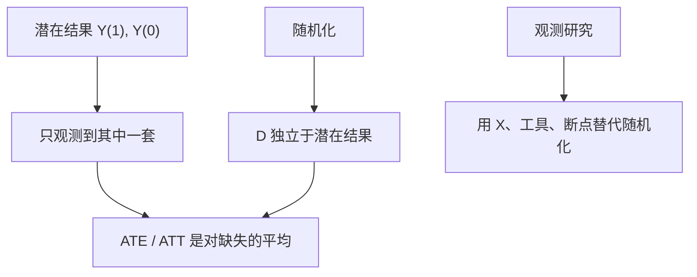

# 潜在结果

因果不是回归系数的别名：每个人有两套潜在结果，观测到的永远只是其中一套；平均处理效应是对不可观测对照的陈述。

<footer>—— Neyman, On the Application of Probability Theory to Agricultural Experiments, 1923；Rubin, Estimating Causal Effects of Treatments in Randomized and Nonrandomized Studies, J. Educ. Psychol. 1974</footer>

[上一课](/econ/gibbard-satterthwaite)把无转移时的策略证明收到不可能定理。本课起计量经济学：先给出**潜在结果**，后课的 OLS、工具、双重差分才有对象。定价核、限价簿协议不在本课重写。后课默认已经读完本课。

## 问题

看见「接受培训的人后来工资更高」，可以把相关写成 $\mathrm{Cov}(Y,D)>0$。Holland（1986）强调：因果问的是同一人在 $D=1$ 与 $D=0$ 下的 $Y_i(1)-Y_i(0)$，其中一套永远缺失。缺口不是再讲工资方程从哪来，而是把「若他当时没接受处理」写成合法对象，并声明平均掉个体缺失之后还剩什么。

单位 $i$、二值处理 $D_i\in\{0,1\}$，潜在结果 $Y_i(1),Y_i(0)$，观测

$$
Y_i = D_i Y_i(1)+(1-D_i)Y_i(0).
$$

个体处理效应 $\tau_i=Y_i(1)-Y_i(0)$ 不可识别。平均处理效应 $\mathrm{ATE}=\mathbb{E}[\tau_i]$、处理组平均 $\mathrm{ATT}=\mathbb{E}[\tau_i\mid D_i=1]$ 是后课估计量要对准的参数。没有这套语言，遗漏变量、选择偏差、LATE 会对不准同一句话。

SUTVA：无干扰（$i$ 的潜在结果不依赖别人的 $D$）与处理无隐藏版本。聚类、一般均衡、溢出一旦重要，本课的二值潜在结果就要扩状态，不能假装还是 $\tau_i$。

## 方法

随机化使 $D\perp(Y(1),Y(0))$，于是 $\mathbb{E}[Y\mid D=1]-\mathbb{E}[Y\mid D=0]=\mathrm{ATE}$。观测研究把这句话换成可检验的替代：条件独立（给定 $X$ 后 $D$ 与潜在结果独立）、或后课的工具、断点、平行趋势。Imbens 与 Rubin 的教科书把设计放在估计之前：先说赋值机制，再谈回归。

回归可以是估计 ATE 的一种算法，不是因果的定义。把 $\beta$ 叫「效应」之前，必须指出它对应 ATE、ATT 还是加权混合。

## 机制

机制是反事实对照。科学实验用随机化制造对照；社会科学用制度、资格规则、外生冲击去逼近。选择偏差是 $\mathbb{E}[Y(0)\mid D=1]\neq\mathbb{E}[Y(0)\mid D=0]$：处理组即使未处理，基线也不同。条件独立把选择收到可观测 $X$ 里；收不干净就是后课遗漏变量。

与[显示偏好](/econ/revealed-preference)对照：那里从选择恢复排序；这里从赋值机制恢复对照。两边都禁止把「看见的差」直接叫结构。卢卡斯批判说政策规则一变简化式就变；潜在结果把「政策」写成对 $D$ 的干预，要求干预下 $Y(d)$ 稳定——这是稳定性假设，不是免费午餐。

Holland：因果效应是相对处理的，没有「绝对原因」。没有对照的处理，没有定义清楚的效应。

## 边界

本课不估一个培训项目，不把 ATE 写成「经济学的唯一目标」：政策常常要 ATT 或条件效应。一般均衡、市场价格反馈、溢出，破坏 SUTVA；那是后课结构模型与[异质处理效应](/econ/heterogeneous-effects)的缺口。量化栏的事件研究与因子回归有另一套对象，不在此重写。也不要把潜在结果与结构方程对立成教派：Rubin 给赋值，Marschak–Heckman 给均衡决策，后课会接。

后课默认：谈到「效应」时，先指潜在结果的哪一个平均；随机化是黄金标准，其余设计是替代假设。OLS 下一课只是在线性条件下估计某种加权平均，不是新的因果定义。

## 小结

- 因果参数是潜在结果的对照；观测方程把其中一套藏起来。
- ATE / ATT 是对缺失的平均；个体 $\tau_i$ 一般不可得。
- 随机化识别 ATE；观测研究必须另写赋值假设。
- SUTVA 排除干扰与隐藏版本；一破就要扩状态。
- 出处：Neyman 1923；Rubin, *J. Educ. Psychol.* 1974；Holland, *JASA* 1986；Imbens and Rubin, *Causal Inference* 2015。
