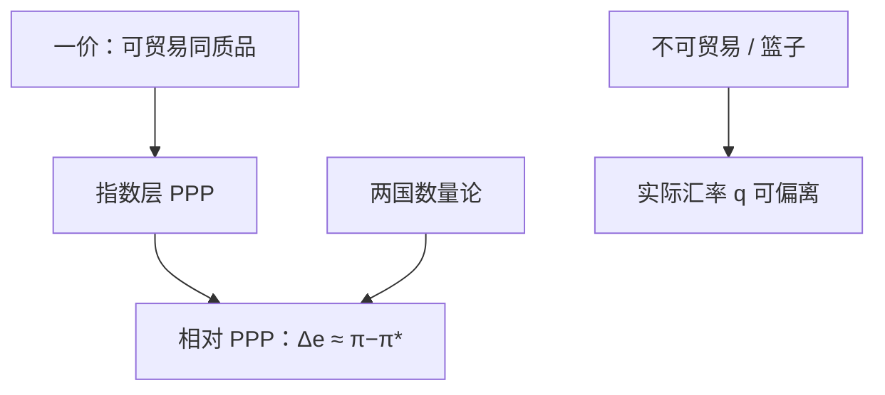

# 购买力平价与一价定律

一价定律说可贸易同质货物在扣除壁垒后不应有两套价格；购买力平价把这句话升到价格指数，于是名义汇率要对齐两国的 $P$。

<footer>—— Cassel 的购买力平价；对照 Friedman 对浮动汇率与相对通胀的论述</footer>

[上一课](/econ/open-ca)把 $CA$ 写成 $S-I$。那是数量账户，还没有两国价格如何换算。本课的缺口是：汇率作为两国货币的相对价格，如何与已经学过的 $P$ 对齐。一价定律是货物层；PPP 是指数层。蒙代尔–弗莱明用短期粘性价格与资本流动，长期仍要回到某种 PPP 或利率平价；本课只钉物价锚。

## 问题

对可贸易的同质商品，无套利要求

$$
P_i = E\cdot P_i^*,
$$

$E$ 为名义汇率（本币/外币），忽略运费与关税时即一价定律。对价格指数，绝对 PPP 写 $P=E P^*$；相对 PPP 写 $\Delta\ln E \approx \pi-\pi^*$。数量论在两国同时成立时，相对通胀差应对齐货币增长差，从而对齐 $\Delta\ln E$——Friedman 把浮动汇率读成让各国选择自己的 $\pi$，汇率去吸收，而不是用汇率去「创造」实际 $CA$。

缺口不是重讲指数：篮子不同，PPP 必有偏差。可贸易与不可贸易（Balassa–Samuelson）使实际汇率 $q=E P^*/P$ 可以长期偏离 1。本课允许 $q$ 慢变，仍把 PPP 当长期名义锚的参照，不是每季的交易策略。

实际汇率上升（按本定义）表示本国货物相对变贵。$CA$ 是否改善取决于吸收与支出转换，不是 PPP 偏差的符号单独决定。量化栏的 CIP 是有抛补的利率平价，对象是资产，不是 CPI 篮子。

## 方法

绝对 PPP 用同一篮子的国际价格比较；ICP、宾大世界表一类是发展核算里比较 $y$ 水平的工具，已在[收敛核算](/econ/convergence-accounting)用过购买力，这里接到汇率。相对 PPP 更适合通胀差：若 $q$ 均值复归，则 $\pi-\pi^*$ 主导 $\Delta\ln E$。

费雪方程两国各写一遍，实际利率差接实际汇率的预期变化（实际利率平价）。资产市场可以让 $E$ 超调，物价粘住时 $q$ 大幅摆动——那是蒙代尔短期，Dornbusch 超调是附录气质的对照，主干下节用 MF 处理流量 IS。

### PPP 不是交易策略

一价在关税、配额、定价市场分割下失败。PPP 用 CPI 时含住房与服务，更失败于短期。本课禁止把「PPP 低估」写成必升值的预测菜单；卢卡斯批判对「用历史回归买卖外汇」同样适用。

## 机制

若所有货物可贸易、价格灵活，货币扩张按数量论抬 $P$，为保持一价，$E$ 同比例贬值，实际变量与 $CA$ 的实物路径不变——开放经济的长期中性。短期 $P$ 粘住，$E$ 若被资产市场立刻推动，$q$ 变动，支出在本国与外国货物间转换，$CA$ 与 $Y$ 可以动。这正是下一课要把 IS 打开国境的原因。

铸币税与通胀差：更高的稳态 $\pi$ 伴随更高的 $\Delta\ln E$，不是用贬值去「促进出口」的长期菜单。自然率仍在：汇率名义值不永久改变 $u^*$。

LOOP 是货物市场套利。CIP 是债券加远期的金融套利，见 `/quant/irp`。UIP 用期望即期替代远期，是风险溢价为零的假说，不在本课检验。宏观用 PPP 当物价锚；量化栏用报价与基差当事实。Balassa–Samuelson：可贸易生产率高的国家，不可贸易价格更高，$q$ 可系统偏离绝对 PPP 而不违背 LOOP。

报价默认「一单位外币的本币价格」。相反报价只改口。用 CPI 检验 PPP 与用可贸易价格指数，答案不同。本课不把某个半衰期当定律。

## 边界

不要在此写完整的汇率微观结构。不要把黄金输送点当现代 PPP。关税与不可贸易使 $q$ 有趋势；发展核算里穷国物价更便宜，与巴拉萨–萨缪尔森一致，不是否定相对 PPP 作为通胀差的一阶故事。PPP 低估不是必升值的交易菜单。

后课默认：长期 $\Delta\ln E$ 对齐通胀差；短期 $q$ 可大幅偏离。下一课：资本流动与利率把 IS–LM 拉到开放。

## 小结

- 一价定律在货物层；PPP 是价格指数上的近似。
- 相对 PPP 把贬值接到通胀差，与两国数量论相容。
- 不可贸易与篮子使实际汇率可以长期不等于 1。
- 短期粘性下 $E$ 可先动，$q$ 驱动支出转换。
- CIP/UIP 的市场内容在量化栏，本课不重导。
- 出处：Cassel 的 PPP；Friedman 对浮动汇率与货币的论述。
