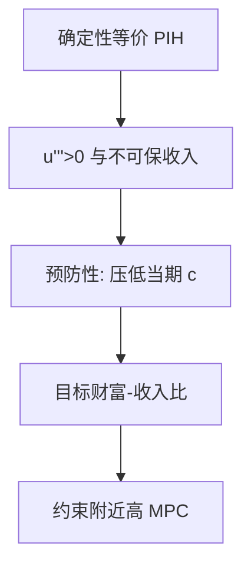

# 预防性储蓄与缓冲存量

若边际效用凸，收入风险本身就会提高储蓄：不是为了退休，是为了给坏年景留一笔缓冲。

<footer>—— Leland, Saving and Uncertainty: The Precautionary Demand for Saving, QJE 1968；Carroll, Buffer-Stock Saving and the Life Cycle/Permanent Income Hypothesis, QJE 1997</footer>

[上一课](/econ/permanent-income)的确定性等价把风险关掉。本课缺口是：当 $u'''>0$（谨慎）且劳动收入不可完全保险，欧拉里多出一项预防性溢价，目标资产变成缓冲存量。不重写 Friedman 的永久/暂时切法。

## 问题

二次效用使期望边际效用等于边际效用的期望，收入方差不进消费。Leland（1968）指出：凸的 $u'$ 让风险提高 $\mathbb{E}u'(c_{t+1})$，为恢复欧拉必须压低当期 $c$，即预防性储蓄。Kimball（1990）把谨慎系数 $-u'''/u''$ 从风险厌恶里拆出来。Carroll（1992, 1997）与 Deaton（1991）在借贷下限附近做成缓冲存量：人有一个目标财富–永久收入比，低于则储蓄，高于则消耗，消费对收入短期敏感，但不是 Keynes 的固定 $c$。

缺口是给 PIH 加上不可保风险，而不是重推 [vNM](/econ/expected-utility)。伯努利 $u$ 已有，只动三阶。

缓冲存量需要不耐烦（$\beta(1+r)<1$）或借贷约束，否则财富会漂到无限来自保。Carroll 把不耐烦与失业风险焊在一起，得到稳定的目标比。

## 方法

劳动收入含持久与暂时冲击，债券利率外生，可能有 $a_{t+1}\ge 0$。欧拉在约束不绑定时成立，绑定时变不等式。政策函数 $c(x)$ 对现金 $x$ 凹：穷时几乎吃掉收入，富时接近 PIH。目标缓冲使财富分布集中在约束附近，加总后仍有正的短期 MPC。

本课不估计谨慎系数。也不把股票当缓冲：参与之谜后课再写；这里的资产是无风险或广义流动性财富。

## 机制

机制是边际效用在低收入状态特别高。无法用 Arrow–Debreu 证券把劳动收入在状态间挪走时，唯一的自保是先存一笔。冲击到来，缓冲下降，MPC 上升，消费看起来「过度敏感」——下一课把这句话变成对流动性约束的检验。增长与退休仍按 LCH 提供慢变量；缓冲是快变量，对年收入波动作出反应。

与[股权溢价](/econ/equity-premium-puzzle)的接口：总量消费仍然平滑，因为缓冲在家庭之间对冲特异风险；谜用的是加总 $c$，不是否定微观预防性储蓄。

Kimball 的谨慎与 Arrow–Pratt 的厌恶不是同一阶：厌恶由 $u''$ 管对已知风险的价格，谨慎由 $u'''$ 管「要不要先存一笔」。二次效用厌恶仍在，预防性为零——这正是 PIH 确定性等价能写出来的原因。Carroll 的目标比把不耐烦与失业风险焊死，避免财富漂到无限；没有这条，预防性储蓄只有水平，没有缓冲存量的均值回复。

## 边界

完全市场或可对冲的收入风险把预防性项关掉。习惯形成改的是 $u$ 的状态变量，与谨慎不同。现时偏差也会提高流动资产需求，但动机是自我控制而非 $u'''$。本课不把三者混成一个「储蓄高」的故事。

后课默认：说到缓冲存量，指谨慎加约束下的目标财富；说到过度敏感，先问是不是约束绑住了欧拉。

目标财富–收入比把预防性储蓄从「永远更高」变成对冲击的均值回复。

特异风险在加总后可对冲，故微观缓冲与总量消费平滑可以同时成立。

## 小结

- 谨慎使收入风险进入储蓄，确定性等价失败。
- 缓冲存量：目标财富–收入比，约束附近 MPC 高。
- 不重写 PIH 的永久成分，只加上不可保风险。
- 谨慎是三阶，厌恶是二阶，二次效用关掉本课。
- 约束附近的高 MPC 接到下一课过度敏感。
- 出处：Leland, *QJE* 1968；Kimball, *Econometrica* 1990；Deaton, *Econometrica* 1991；Carroll, *QJE* 1997。
