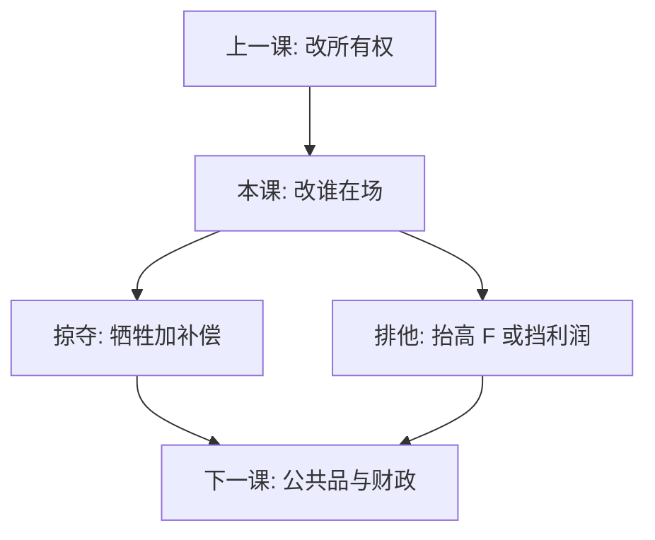

# 掠夺与排他

低于成本的价格若只在对手退出后才变得最优，那是掠夺；排他合同若把进入的沉没抬到无法覆盖，那是封锁。两者都改市场结构，而不是改一次静态加价。

<footer>—— McGee, Journal of Law and Economics 1958；Ordover and Willig, Yale Law Journal 1981；Ordover, Saloner and Salop 排他；对照 Tirole 与微观课掠夺性定价</footer>

[上一课](/econ/merger-simulation)通过改所有权让交叉弹性内部化。本课缺口是不合并也能改变 $N$：先牺牲、再在更少对手的市场里补偿；或用合同、兼容、渠道把对手的 $F$ 抬高。微观[掠夺性定价](/econ/predatory-pricing)已在完全信息、完美资本市场上给出 McGee 式怀疑。产业组织收束课把怀疑接到融资约束、多市场声誉，以及[纵向约束](/econ/vertical-restraints)、[网络与标准](/econ/network-standards-io)里已经出现的封锁。后课公共财政换题；本课是 IO 最后一课。

## 问题

掠夺两段：一期定价（或产品引入）在「对手留下」的反事实里不是利润最大；二期若对手退出，利润升高，贴现后补回。芝加哥：在位份额更大，亏得更狠；对手可关门等待或融资；事后加价招来新进入——补偿不可信。缺口是哪些摩擦让补偿可信：资本市场不完美、多市场竞争的声誉、网络预期。排他不必低于成本：独家、不兼容、拒绝互联，直接改进入博弈的第二阶段利润或第一阶段 $F$。

合并模拟假设 $N$ 外生或只在事后进入；掠夺与排他把 $N$ 当成策略对象。两套反事实不要混成一句「反竞争」。

### 低价不等于掠夺

学习曲线、促销、双边补贴都可以把当期价格压到会计成本以下，而不需要对手退出。Ordover–Willig 的检验是反事实利润：若对手被禁止退出，该行为是否仍最优。Areeda–Turner 用短期 AVC 当法律安全港，是近似，不是定义。平台一边免费，上一课已经排除「免费即掠夺」。

McGee 读标准石油：收购往往比亏本销售更便宜。这句话打的是「掠夺是常用工具」的叙事，并不证明均衡里掠夺不存在。

## 方法

完全信息单市场：逆向归纳下补偿失败，一期不牺牲。要让掠夺成立，加融资约束（对手亏不起、在位亏得起）、或声誉（这个市场的亏是给其他市场看的信号）。排他：计算对手在被挡住渠道 / 接口之后的进入后利润，是否仍覆盖沉没。网络：拒绝兼容等于强迫自建 $n$，与抬 $F$ 同构。经验：用事件或结构看「对手退出后加价是否发生」；没有补偿段，牺牲叙事不完整。

不要把占优厂商的日常低价当成结构证据。势力可以来自成本或网络，低价可以是竞争。

## 机制

共同机制是动态互补：今天的行为通过 $N$ 或 $n^e$ 改变明天的需求与成本。掠夺走价格路径；排他走合同与接口；限制进入定价走进入前信号——时序不同，结构目标相同。融资摩擦使「谁更能烧钱」进入支付矩阵，完全市场把这张牌拿走。多市场把一次亏写成声誉投资，单市场模型看不见。

与合并对照：合并立刻改 $\mathcal{H}$，受申报约束；掠夺与排他改 $N$，更难用事前模拟钉死，因为反事实路径更长。这是 IO 收束时留给公共财政的分界：市场失败若来自封锁，工具是竞争政策；若来自非排他的公共品，工具换税与支出。

Ordover–Saloner–Salop 把提高对手成本写成一般策略。纵向排他、标准封闭、掠夺性产品引入，都是同一导数的不同控制变量。

## 边界

本课不写起诉要件，不提供「如何定价才不算掠夺」的操作清单。不重推微观课已写的 Areeda–Turner 代数。量化栏没有对应的「掠夺交易策略」要写。产业组织在此结束：后课默认读者会用需求矩阵、沉没、网络与所有权读结构；下一课[公共品自愿供给失败](/econ/public-goods-free-rider)把失败从市场结构换成非排他消费。

## 小结

- 掠夺是改变 $N$ 才最优的牺牲；低价本身不是定义。
- 排他通过渠道、接口与沉没封锁进入，不必低于成本。
- 完全资本市场、单市场下补偿往往不可信；摩擦把它打开。
- 合并改所有权，掠夺与排他改谁在场，反事实更长。
- IO 收束于此；下一块是公共品与税。
- 出处：McGee 1958；Ordover and Willig 1981；Ordover, Saloner and Salop；Tirole。
