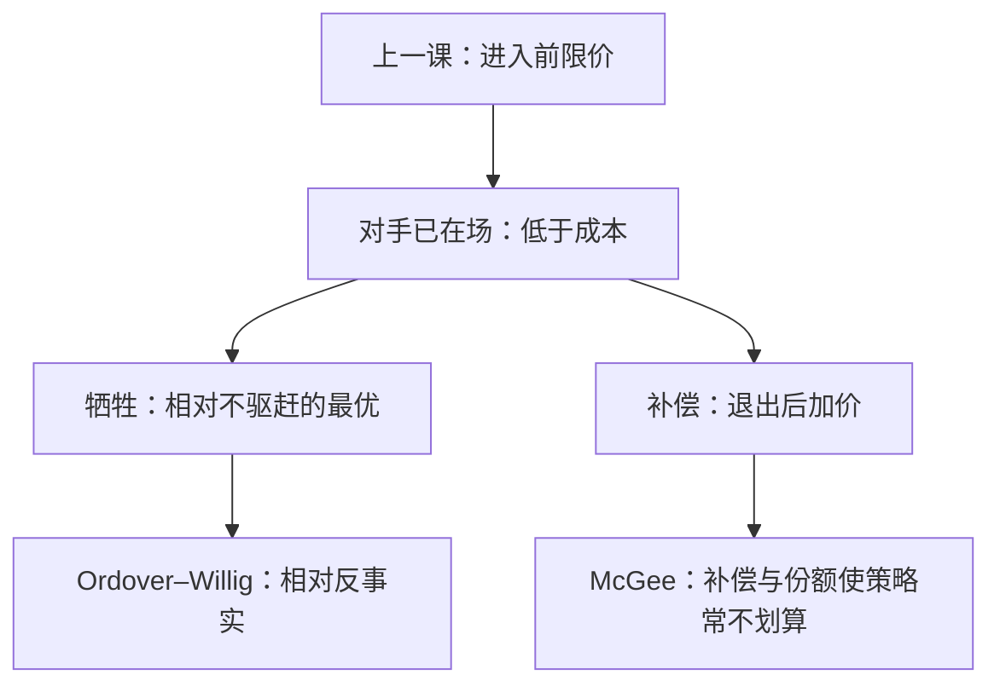

# 掠夺性定价

把价格压到成本以下以赶走对手，再在事后加价收回——逻辑上要过牺牲与补偿两关；麦吉对标准石油的阅读是：这条路往往不如直接买下对手。

<footer>—— 据 McGee, Predatory Price Cutting: The Standard Oil (N.J.) Case, Journal of Law and Economics, 1958；Ordover and Willig, Yale Law Journal, 1981 整理</footer>

[上一课](/econ/limit-pricing)（限制进入定价）。限价是进入**前**压低 $\pi_E$ 或发成本信号，不让第三家进来。本课不重写 Bain 的剩余需求或 Milgrom–Roberts 分离。缺口是时序反过来：对手已经在场，在位者把价格打到成本以下，图的是**退出**，再在更少的竞争里补偿。McGee 怀疑这条策略的理性；Ordover–Willig 给可操作的「若非为了退出就不会做」的定义。

## 问题

掠夺的两段：一期牺牲，$\pi$ 低于「不赶走对手」的最优；二期若对手退出，利润升高，贴现后补回牺牲。芝加哥式算法：在位者份额更大，低于成本的亏损也更大；对手可以关门等风头过、或向资本市场融资；事后加价又会招来新进入——补偿不可信。McGee 读标准石油：收购与铁路回扣比「亏本销售」更对得上账。缺口不是再写一次限价信号，而是：**低于成本吓阻，怎样与「只是狠竞争」分开，以及怀疑在哪一步打中策略。**

Ordover–Willig：若某定价（或产品创新）在对手留在场内时不是利润最大，只在计入「诱导退出」的资本利得后才划算，则定义为掠夺。牺牲检验看的是反事实，不是会计上的「亏了」。

### 低于成本不是定义本身

Areeda–Turner 用短期 MC（实践中 AVC）当安全港：高于此不视为掠夺。那是法律近似。经济定义要问：价格是否只有通过改变市场结构才合理。限价可以全程在 AC 之上；掠夺故意走过成本，因为目标是在位对手的退出，不是潜在者的进入计算。

McGee 1958 打的是「掠夺是垄断常见工具」的叙事，不是证明掠夺均衡不存在。融资约束、声誉、多市场，后来把补偿关重新打开——那些是边界，主干先把怀疑钉在完全资本市场、单市场、完全信息上。

## 方法

完全信息、无融资摩擦、单期补偿靠事后垄断：逆向归纳下，进入者知道在位者事后想涨价，自己可以再进；在位者预见到补偿失败，一期也不愿牺牲。于是均衡不是掠夺。要让掠夺成立，必须加：资本市场不完美（对手亏不起）、声誉（在这个市场亏，是为了吓其他市场）、或私有成本（看起来像限价的信号，但对手已在场）。

比较收购：若反托拉斯允许买下对手，McGee 的替代更便宜，掠夺更没必要。禁收购会把策略挤向价格战——规制改的是可行集，不是「价格低就是恶」。

本课不把「低价」写成合谋的惩罚路径。卡特尔的惩罚是为了维持高价；掠夺是为了减少家数。两者都可以低价，一阶条件不同。学习曲线、网络启动的一期低价，要用同一把反事实刀：对手留下时是否仍最优。

## 机制

牺牲的机制是跨期替代：一期少赚，换二期结构。补偿的机制是结构租金：少一家之后勒纳上升。McGee 卡住的是第二步的现值——在位者承担更大的一期亏损，而二期租金会被再进入稀释，除非有沉没壁垒。这与[可竞争](/econ/contestable-markets)同一把刀：没有沉没，事后加价不可维持。

Ordover–Willig 的机制是反事实：把「对手的存活」当成状态。只在「对手退出」这个状态下才最优的行动，才叫掠夺。价格高于可避免成本仍可能掠夺（若相对于不驱赶的最优已经牺牲）；低于成本也不一定（可能是促销、学习、网络启动）。

补偿还要求事后能挡住再进入。这把掠夺绑回壁垒：有沉没或[网络](/econ/network-externalities)时，赶走一家之后 $n$ 不会立刻回来，一期牺牲才有现值。无壁垒时，McGee 的「涨价即招来进入」把二期租金贴现到接近零。法律上的补偿检验（能否在合理期内收回）是这条机制的制度版本，不是另一套定价理论。

限价对潜在进入，掠夺对在位对手。私有成本时两者外表都是低价，但信息结构不同：一个改进入者的信念，一个改在位者的存活。不要合成一个「限价式掠夺」口头禅。

## 边界

声誉与融资约束打开掠夺均衡，并不把 McGee 的单市场算术作废。AVC 安全港是诉讼规则；经济定义仍用反事实。

多市场声誉：在这个市场上亏，是为了让其他市场的潜在者更新信念——牺牲在这里，补偿在别处，McGee 的份额算术对不上单一市场。融资约束把「关门等风头」关掉，深口袋才成为策略。这些是打开掠夺均衡的开关，不是把怀疑整章作废。

下一课[霍特林](/econ/hotelling)把差异做成位置；低价不再是唯一策略。后课默认：掠夺要同时过牺牲与补偿；完全信息单市场上 McGee 的怀疑成立；定义用 Ordover–Willig 的反事实，不单看是否低于某条成本曲线。

本课不把低于 AVC 自动定罪。

## 小结

- 掠夺是赶走在场对手再补偿，不是进入前限价。
- McGee：份额更大则牺牲更贵，收购往往更便宜，补偿不可靠。
- Ordover–Willig：若非为了诱导退出就不会选的行动。
- 下一课用线性城市把产品拆开，价格战不再是唯一工具。
- 出处：McGee, *JLE*, 1958；Ordover and Willig, *Yale LJ*, 1981。
