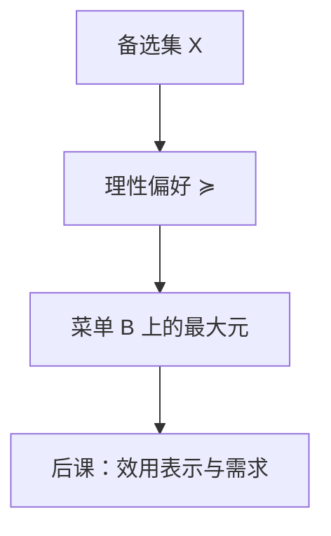

# 偏好、完备与传递

经济学不从「幸福」起笔，而从比较：在给定约束下，决策者能够把备选方案排成序。

<footer>—— 据 Debreu, Theory of Value, 1959；Mas-Colell, Whinston and Green, Microeconomic Theory, 1995 整理</footer>

[上一课](/econ/stochastic-order-prep)把随机占优预备收在数学基础课末。本课是「微观：选择与需求」的第一课。后面的效用、需求、均衡和宏观，都默认你会「完备且传递的偏好」，不再从「人喜欢什么」的心理学讲起。量化栏的[限价簿](/quant/lob-structure)假定已经有人在报价；本栏要先问：报价背后的排序从哪来。后课默认已经读完本课。

## 问题

一个决策者面对集合 $X$（消费束、资产组合、政策）。经验上我们只看见他选了哪个，看不见他「有多喜欢」。若直接把选择写成效用数字，数字从哪来、不同人的数字能否加减，都没有定义。缺口因此不是最大化，而是：先有一套**比较关系** $\succsim$，使「选 $x$ 而不选 $y$」可以被写成 $x\succsim y$，并且这套关系足够整齐，后面才谈得上用函数去代表它。

两条最低要求几乎总是一起出现。完备性：任意一对 $x,y\in X$，要么 $x\succsim y$，要么 $y\succsim x$，要么两者都成立（无差异）。传递性：若 $x\succsim y$ 且 $y\succsim z$，则 $x\succsim z$。缺完备，就有一对方案决策者拒绝比较，需求对应可能是空的。缺传递，就会出现钱泵：循环偏好让人愿意付费绕圈。本课只钉这两条；连续性、单调、凸，是后课为了效用表示才加的。

### 偏好不是效用，效用还没有出场

日常把「效用」当喜欢的同义词。在本栏里，偏好是原始对象，效用是后课的**表示**：一列实数，使得 $u(x)\ge u(y)$ 当且仅当 $x\succsim y$。没有完备与传递，这样的 $u$ 不必存在。因此第一课禁止先写 $\max u(x)$。最大化是有了表示之后的算法，不是偏好本身。

无差异 $x\sim y$ 定义为 $x\succsim y$ 且 $y\succsim x$。严格偏好 $x\succ y$ 定义为 $x\succsim y$ 且并非 $y\succsim x$。后课的无差异曲线是无差异关系的水平集，这里还没有拓扑，谈不上「曲线」。

## 方法

把 $X$ 当成给定的备选集。在消费理论里它常是 $\mathbb{R}_+^n$ 的子集；在本课它只需非空。偏好是 $X$ 上的二元关系 $\succsim$。完备加传递合称理性偏好（rational preference）。理性并不声称决策者算得对，只声称他的排序没有缺口、没有循环。

观测到的是选择对应 $C(B)\subseteq B$：预算或菜单 $B\subseteq X$ 到来时，他从 $B$ 里挑出的集合。若偏好理性，一个自然的选择是 $C(B)=\{x\in B:x\succsim y\ \forall y\in B\}$，即最大元。有限集上理性偏好的最大元非空；无限集还要后课的连续性才能保证。本课不把选择对应当成原始对象——那是[显示偏好](/econ/revealed-preference)的缺口——只把「排序 → 最大元」这条方向钉死。

## 机制

完备性排除「无法比较」。传递性排除循环。两者一起，有限菜单上的选择才不会空、不会转圈。无差异允许并列最优：最大元可以是一个集合，需求可以是对应而不是函数。这不是缺陷，后课的马歇尔需求在价格刚好使两个束无差异时也会集值。

理性偏好仍然极瘦。它不包含凸性（平均是否更好），不包含单调（多是否更好），不包含关于风险的任何结构。那些分别是生产、商品和期望效用课的缺口。也不包含人际比较：两个人的 $\succsim$ 无法加总，社会福利要从另一套公理引进，见后来的[福利定理](/econ/welfare-theorems)。

## 边界

实验里常见违背传递：框架效应、循环选择。本栏主干仍用理性偏好，因为后面的需求、均衡和资产定价都建立在它上面；行为偏离是对照，不是把第一课改成心理学综述。也不要把完备性读成「人知道世界上每一件商品」：它是模型里对 $X$ 的量化， $X$ 本身已经是建模者切出来的。

后课默认：谈到「消费者」时，他带着一套理性偏好。效用函数、斯勒茨基矩阵、一般均衡，都是在这套关系上添结构，而不是另起一套喜欢。

## 小结

- 金融栏的原始对象是备选集上的比较关系，不是效用数字。
- 完备与传递合称理性；缺一则最大元或钱泵会出问题。
- 选择是菜单上的最大元；显示偏好是反过来从选择恢复关系，本课不走。
- 效用表示、预算、风险，都是后课留下的缺口。
- 出处：Debreu, *Theory of Value*；Mas-Colell, Whinston and Green, *Microeconomic Theory* 第 1 章。
