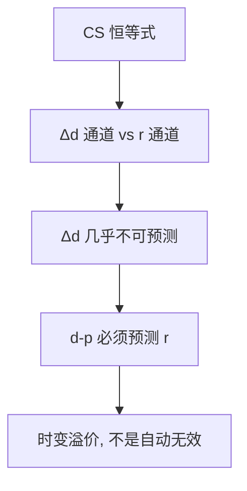

# 现值恒等式与可预测性

若股利增长几乎不可预测，股利–价格比的变动就必须预测回报；否则会计不平。

<footer>—— 据 Campbell, A Variance Decomposition for Stock Returns, Economic Journal, 1991；Cochrane, Discount Rates, Journal of Finance, 2011</footer>

[上一课](/econ/campbell-shiller-decomposition)写出 $d-p$ 是未来 $\Delta d$ 与 $r$ 的预期之和。本课缺口是推论：哪一端承担可预测性。不估计回报回归，不把可预测写成对 [EMH](/econ/emh) 的否证——有效允许经 $m$ 调整后的预期回报变动。

## 问题

把 CS 分解取方差，或对 $d-p$ 做预测回归：左边的变动必须被右边两端分摊。经验上股利增长接近噪声，$\Delta d$ 的可预测部分小，于是 $d-p$ 的大部分变动必须对应预期回报的变动。Cochrane 把这句话收成：贴现率变动是价格变动的主项，不是「股利消息」。缺口是承认这是恒等式加一条经验近似（$\Delta d$ 难预测），不是新的行为假设。

Lucas 树可以两边都动：果实 Markov 既改股利也改 $m$（从而改预期回报）。会计不禁止股利通道；数据若关掉它，树必须主要靠 $m$ 的变动来配合 $d-p$。习惯形成等主干课已经给 $m$ 时变的装置，本课不重写。

Campbell, *Economic Journal* 1991，回报方差分解：意外回报 = 股利消息 − 折现率消息。本课用同一会计谈可预测，不报方差份额的数表。

## 方法

从恒等式：$\mathrm{Cov}(d_t-p_t,\sum\rho^j r_{t+1+j})$ 与 $\mathrm{Cov}(d_t-p_t,-\sum\rho^j\Delta d_{t+1+j})$ 之和等于 $\mathrm{Var}(d_t-p_t)$。一端近零，另一端必须近全。预测回归 $r_{t+1}=a+b(d_t-p_t)+\varepsilon$ 的 $b$ 若显著，首先是会计通道在工作，其次才问 $b$ 是否等于某种 SDF 特化给出的值。

与有效市场：半强式说公开的 $d-p$ 不能产生**经风险调整后**的经济利润。$d-p$ 预测未调整回报，可以是时变溢价——$m$ 的条件均值在变。联合假说：拒绝「恒定预期回报的随机游走」不是自动拒绝 EMH。

不要把 $b$ 的样本显著性写成量化栏因子表。本课连「价值溢价」都不命名——那是特征排序，对象在 [/quant/capm](/quant/capm) 之后。这里只谈总量 $d-p$ 与市场回报。

## 机制

机制是预算。价格今天高（$d-p$ 低），后面要么股利真的高增长把估值撑住，要么回报变低把高价格消化掉。股利增长若像噪声，消化必须走回报。回报走低可以是无风险利率走低，也可以是溢价走低；Lucas 核里两者都随 $y$ 变。信息课序的部分揭示会加一层： $d-p$ 可能还含未被揭示的 $\theta$，会计仍然成立，预期算子换成市场价格生成的信息集。

精确的总额恒等式不必对数线性：Cochrane 强调精神是「价格相对股利必须被未来现金流或未来折现解释」，近似只是为了回归可写。

## 边界

本课不做小样本偏误、不写 Stambaugh 校正。下一课 Shiller 过度波动从同一会计的另一端进入：若预期回报几乎恒定，价格就不该比股利流更抖——与「$d-p$ 预测 $r$」是对偶。两端不能同时关掉。

后课默认：CS 会计加「$\Delta d$ 难预测」⇒ $d-p$ 预测回报。这是贴现率变动，可以与有效共存，只要 $m$ 时变。不是 CAPM 横截面。

## 小结

- 恒等式的方差必须被股利通道与回报通道分摊。
- 股利增长难预测时，$d-p$ 预测回报是会计，不是额外异象。
- 未调整可预测 ≠ 否定 EMH；联合的是时变 $m$。
- 出处：Campbell, *Economic Journal* 1991；Cochrane, *Journal of Finance* 2011。
