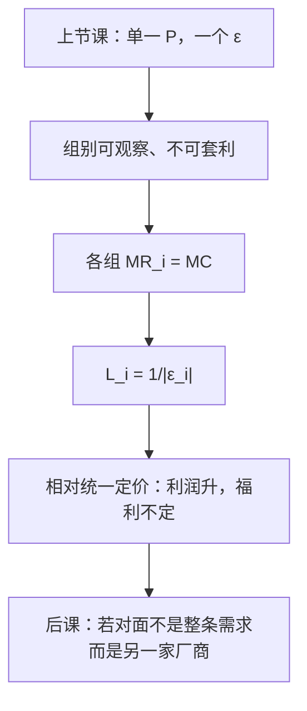

# 价格歧视三级

同一商品对不同人群要不同的价，只要套利被挡住；三级歧视按可观察的组别，用各自的弹性决定加价。

<footer>—— 据 Pigou, The Economics of Welfare, 1920 整理</footer>

[上一课](/econ/natural-monopoly-ramsey)（自然垄断与拉姆齐定价）。在统一标价下写出 $\mathrm{MR}=\mathrm{MC}$ 与 $L=1/|\varepsilon|$。本课不重讲单一价格的无谓损失三角形。缺口是：若垄断者能把需求拆成不能套利的若干段，每一段有自己的弹性，最优不再是一个 $P$。Pigou 的三级正是按可观察组别定价；一、二级在本课只当对照，不展开机制设计。

## 问题

统一价格迫使所有组别面对同一 $P$，勒纳只能钉在「平均」弹性上。若组别 $i=1,\ldots,m$ 的反需求 $P_i(q_i)$ 可分开，且转售被禁止，问题变成

$$
\max_{\{q_i\}} \sum_i P_i(q_i)q_i - c\Bigl(\sum_i q_i\Bigr).
$$

各组 $\mathrm{MR}_i=\mathrm{MC}(Q)$，因而

$$
\frac{P_i-\mathrm{MC}}{P_i}=\frac{1}{|\varepsilon_i|}.
$$

弹性更小的组加价更高。缺口不是再定义一次垄断，而是：**统一勒纳怎样拆成一组勒纳**。产量加总相对统一价格可升可降，取决于需求曲率；本课不把「歧视一定减福利」写成定理。

### 三级不是一级，也不是二级

一级（完全）歧视：每个单位按边际评价收费，产量回到 $P=\mathrm{MC}$，剩余全归卖方——效率缺口消失，分配极端。二级：菜单（两部收费、数量折扣）让消费者自选，信息不完全时典型。三级：卖方看见组别标签（学生、地区、时段），看不见组内个人类型。本课只做三级，因为上一课的弹性公式可以直接按组复制；一级要价能力与二级筛选是信息课的对象，这里不偷运显示原理。

套利是刀刃：若组间能转售，价格差会被倒逼回去，三级崩溃成统一价。挡套利靠合同、服务不可储、法律，不是靠再画一条 MR。

## 方法

给定组别划分与共同的[成本](/econ/cost-minimization) $c(Q)$，解各组 MR 等于同一 MC。常数 MC 时各组独立，互不交叉补贴产量。递增 MC 时各组通过共同的边际成本耦合：一组扩张抬 MC，压另一组产量。比较静态要声明 MC 形状，否则「向弹性低的组提价」会漏掉成本侧。

统一价格是 nested 的特例：强制 $P_i$ 相等，等于加了一道不能分开的约束。放开约束，利润不降。福利没有同样的单调：低弹性组被抽走的剩余，与高弹性组被服务到的新产量，符号不确定。后课若要规范判断，必须指定权重；本课只钉利润最大化的一阶条件。

本课仍是一家卖方。对面出现第二家之后，价格歧视与策略互动缠在一起，那是古诺之后的边界，主干先进入数量竞争。

## 机制

按弹性加价的机制仍是勒纳：每组自己的 $q_i P_i'$ 进入该组 MR。共同 MC 的机制是资源约束：多服务一组的边际支出由总产量决定。挡套利的机制是让「低价组把货倒到高价组」不可行，否则高价组的约束失效，两组 MR 被同一价格焊死。

与上一课无谓损失的关系：三级在各组内部仍是 $P_i\gt \mathrm{MC}$，各组仍有三角形；但高弹性组可能从「根本不被服务」变成「被服务」，三角形以外还有开业效应。不要只用统一价格的那一个三角形做比较。

Pigou 的用语是 first / second / third degree。后来的两部收费文献把二级做深了；本栏信息课会在筛选里再碰非线性价目，这里不提前写信息租金。

## 边界

组别若是自选择的结果而不是外生标签，三级模型误设，应改二级菜单。动态、耐用品、跨期套利会把「不能转售」挖空。规制下的价格上限、必须服务义务，会把 $\mathrm{MR}_i=\mathrm{MC}$ 改成带约束的库恩–塔克，本课不写。

也不把地区定价写成购买力平价或汇率——那是宏观开放课。本课的 $P_i$ 是同一货币下的产品价。

连续类型、隐藏信息的最优关税是二级加机制设计，不是把三级标签取极限。寡头互相歧视要叠猜测，本课 MR 相等不再成立。法律上的成本正当化抗辩应先从 $c$ 里拿走，再谈同 MC 不同 $P$。

后课默认：能分箱且不能套利时，各组勒纳等于各自 $1/|\varepsilon_i|$；下一课把「一家面对需求」换成「几家同时选产量」。

## 小结

- 三级歧视按可观察组别定价，各组 $\mathrm{MR}_i=\mathrm{MC}$，加价随弹性反比。
- 利润不低于统一定价；产量与福利没有一般排序。
- 一级回到有效产量，二级靠菜单；本课不展开。
- 下一课进入寡占：策略变量先取数量。
- 出处：Pigou, *The Economics of Welfare*, 1920；Mas-Colell, Whinston and Green 第 12 章。
