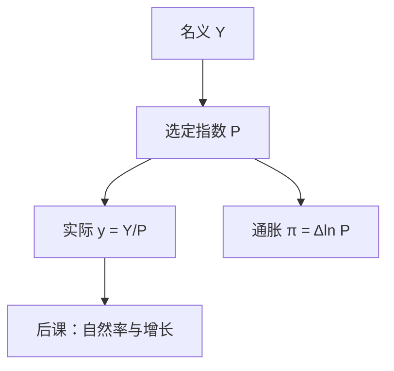

# 价格指数与实际变量

名义账户加总的是当期价格乘数量；要比较两年的「产出」，必须声明用哪一年的篮子去抽掉价格。

<footer>—— 据 SNA 物量与价格核算；Laspeyres / Paasche / Fisher 指数传统</footer>

[上一课](/econ/saving-investment-id)把名义 $Y$ 拆成 $S$ 与 $I$ 的恒等。那些符号仍是当期货币单位。本课的缺口是：同一本账如何分成价格与物量，使「增长」和「通胀」不再是同一个名义增量。后课的自然率与索洛谈的都是实际量；本课只钉缩减。

## 问题

两年的名义 GDP 之比，混着数量变化与价格变化。若所有价格同比例上升、数量不变，名义 $Y$ 仍涨，但没有更多货物。若只盯一种商品的价格，又无法给汽车和理发加总。缺口不是「通胀讨厌」，而是：选一个指数 $P$，使

$$
Y = P\cdot y
$$

里的 $y$ 有物量解释，并且不同指数对应不同的篮子与权重。

Laspeyres 用基期数量加权价格；Paasche 用当期数量。GDP 平减指数接近 Paasche 型（用当期物量）；CPI 常是 Laspeyres 型（固定居民篮子）。两者一般不相等：这是指数问题，不是统计错误。链式加权把基期逐年滚动，减轻长期替代偏误，SNA 推荐物量用链式 Fisher 一类。

实际 GDP 不是「用某年价格重新开一次发票」的唯一答案。声明平减指数，否则 $y$ 无法在后课的生产函数里当作 $F(K,L)$ 的观测。

## 方法

记 $p_t,q_t$ 为价格与数量向量。Laspeyres 价格指数 $P^L_t=\frac{p_t\cdot q_0}{p_0\cdot q_0}$，Paasche $P^P_t=\frac{p_t\cdot q_t}{p_0\cdot q_t}$。名义比 $\frac{p_t\cdot q_t}{p_0\cdot q_0}$ 可分解为价格因子与物量因子，但分解不唯一。Fisher 指数取几何平均，满足若干理想检验中的一部分。

实际 GDP 的常用操作：用平减指数 $P^{GDP}=Y^{\mathrm{nom}}/Y^{\mathrm{real}}$。通胀率取 $P$ 的对数差。相对价格变化时，单一 $P$ 无法保留所有微观价格信息——后课一般均衡用的是价格向量，宏观核算必须先接受加总损失。

名义利率与实际利率的差，费雪方程要等到货币课才作为行为关系出现；本课只准备 $P$ 的定义。工资、汇率的「实际」同样是除以某个 $P$，篮子不同则故事不同。

### CPI 不是 GDP 平减

CPI 跟踪消费者购买的篮子，含进口消费品，不含投资品与出口。平减指数覆盖全部国内生产。进口价格上升抬 CPI、对平减的影响路径不同。后课菲利普斯曲线用的通胀指标必须声明是哪一个 $P$。

## 机制

指数把替代藏进权重。物价上涨时消费者逃向相对便宜的品种，Laspeyres 用旧篮子会高估生活成本；Paasche 用新篮子会低估。质量变化与新产品使 $q$ 的口径漂移：计算机「实际产出」很大一块是质量调整，不是台数。SNA 允许 hedonic 一类调整，但那是测量约定，不是效用函数已经估计出来。

链式指数让长期增长率可加性更好，却失去「用某一固定年价格表示的水平」的简单解释。政策讨论里混用水平与链式增长率，会造成「实际 GDP 加总不等于分量之和」。这是指数公式的性质。

国际比较还要用购买力平价篮子，那是后课 PPP 与发展核算已经碰到的同一把刀：没有一种 $P$ 能同时当生活成本、产出物量和汇率锚。本课只要求：国内时间序列先声明平减，再谈增长。

费雪方程 $i=r+\pi^e$ 要用本课的 $\pi$。名义利率是货币课的对象；这里只准备 $P$ 的定义。篮子选错，实际利率跟着错。

## 边界

没有一种 $P$ 同时是福利度量、生产物量和生活成本。Konüs 生活成本指数需要效用；本课不把 CPI 叫成间接效用。也不要把资产价格塞进 GDP 平减：房价进入 CPI 的是租金等价，资本形成有另一套平减。量化栏的名义报价是微观价格，本栏只借加总指数。

后课默认：增长、失业缺口、货币中性，谈的都是已经缩减过的量，或明确对比名义。下一课要用实际活动对照劳动力未使用的部分。

## 小结

- 名义恒等先于缩减；实际变量依赖指数选择。
- Laspeyres / Paasche / Fisher 权重不同，CPI 与 GDP 平减篮子不同。
- 替代、质量、新产品是测量缺口，不是否定缩减。
- 链式水平不可加，是公式性质，不是统计事故。
- 自然率、索洛、$MV=Py$，都默认本课的 $P$ 与 $y$。
- 出处：SNA 物量核算；Laspeyres、Paasche、Fisher 指数。
