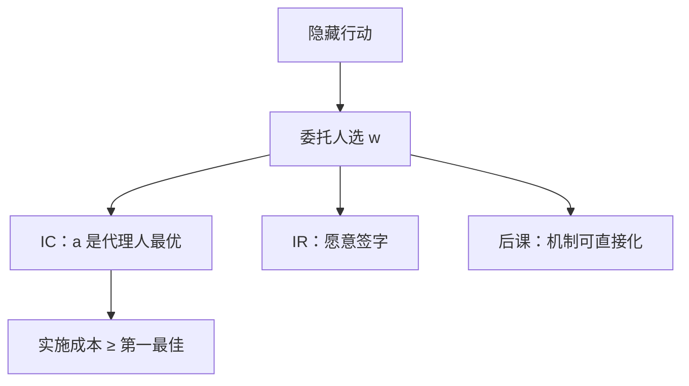

# 委托–代理与激励相容

委托人在代理人的激励相容与参与约束下设计合同；约束最优一般达不到完全信息的风险分担与努力。

<footer>—— Grossman and Hart, An Analysis of the Principal–Agent Problem, Econometrica, 1983</footer>

[上一课](/econ/moral-hazard)说明合同只能写在结果上，激励与保险冲突。缺口是把这句话收成一个规划：委托人选 $w(\cdot)$，代理人的行动是约束里的最优反应，代理人还要愿意签字。本课钉激励相容（IC）与参与（IR），以及一阶方法何时合法。显示原理是下一课：任意间接机制都能收成「直接报类型或直接选合同」。

## 问题

委托人最大化 $\mathbb{E}[x-w(x)\mid a]$（风险中性教具）。代理人选

$$
a\in\arg\max_{\tilde a}\ \mathbb{E}[u(w(x))\mid\tilde a]-c(\tilde a),
$$

且该最大值至少等于保留效用 $\bar u$。第一句是 IC，第二句是 IR。完全信息下 IC 消失，只剩 IR，最优是 $w$ 为常数（代理人风险厌恶时）加强制 $a^*$。隐藏行动后 IC 进入，最优 $w$ 不再常数，$a$ 一般低于 $a^*$。

Grossman–Hart 把有限结果写成：先对每个行动算「实施它的最小成本工资」，再选行动。实施成本来自一组线性不等式（各偏离行动的 IC）。这比对 $a$ 求导的一阶方法更干净：一阶方法要求分布满足凸性/MLRP 等，否则代理人的真正最优可能不是使委托人 FOC 成立的那个点。

### IC 不是「让人高兴」

IC 是约束：代理人在合同给定后仍选你想要的行动。它可以很痛苦——支付方差大、IR 刚绑紧。放松 IC 的办法是监测 $a$、给更多信号，不是劝说。

有限责任把工资下界钉在零，即使风险中性也买不回第一最佳：代理人没有足够皮肤可赔。特许经营要求代理人买下整个随机剩余，财富不够时做不到。

## 方法

两行动 $\{a_L,a_H\}$：IC 变成一个期望效用不等式，IR 一个不等式。通常两者在最优处绑紧。似然比进入 $w(x)$ 的点态条件：

$$
\frac{1}{u'(w(x))}=\lambda+\mu\Bigl(1-\frac{f(x\mid a_L)}{f(x\mid a_H)}\Bigr)
$$

（Holmström 的形式）。$\mu>0$ 是 IC 的影子价格，似然比高的 $x$ 工资高。

连续行动的一阶方法：把 IC 换成代理人的 FOC，要求 $F$ 对 $a$ 的单调似然比与 CDF 凸性，否则用 Grossman–Hart 的离散实施。

## 机制

规划的引擎是：每一块激励必须用一块风险去买。$\mu$ 度量这一交易的贵贱。信号质量好，$\mu$ 小，接近第一最佳；噪声大，$\mu$ 大，或干脆实施 $a_L$。IR 决定租金：道德风险下若 IR 绑紧，代理人没有事前租金，只有风险补偿；这与[筛选](/econ/screening-rent)里优势类型的事前信息租金不同——那里类型在签约前已知于己。

多任务（Holmström–Milgrom）时，对易测任务的强激励会抽走难测任务的努力。IC 是向量，不是一个不等式。本课只钉单任务骨架。

### 实施成本与第一最佳的差

Grossman–Hart 的两步：先对每个推荐行动算实施它的最小成本合约 $C(a)$，再选 $a$ 最大化期望产出减 $C(a)$。 $C(a)$ 大于技术成本 $c(a)$，差额是风险补偿（及有限责任租金）。线性合约 $w=\alpha+\beta x$ 不是一般最优，但在指数效用、正态噪声的 Holmström–Milgrom 极限里可以最优；课堂上用 $\beta$ 读激励强度。

IR 绑紧不表示没有代理成本：代理人剩余可以等于 $\bar u$，相对可观察行动的第一优仍有风险损失。筛选里的信息租金是事前的、类型已知于己的；不要两套账混用。

## 边界

一阶方法失败时，「对 FOC 设计的合同」可能实施错误行动。有限责任、破产，改变 IR 的形状。代理人若也有私型，IC 变两层，需显示原理把报类型与行动一起直接化。

后课默认：委托–代理 = 在 IC 与 IR 下实施行动的成本最小化；下一课证明不必在弯弯绕绕的间接博弈里找合同。

## 小结

- 委托人的规划以 IC、IR 为约束；隐藏行动进入约束而非偏好。
- 有限结果用实施成本（Grossman–Hart）；连续行动的一阶方法有条件。
- IC 的影子价格把似然比写进工资。
- 信息租金（筛选）与风险补偿（道德风险）来源不同。
- 出处：Grossman and Hart, *Econometrica* 1983；Holmström, *Bell* 1979。
