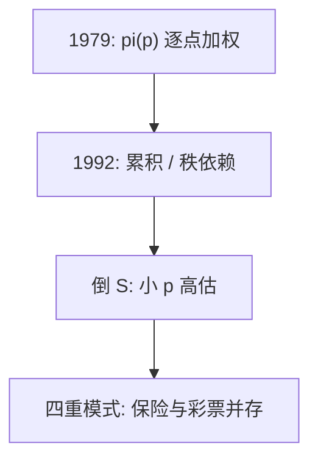

# 概率加权

决策权重不是概率：小概率被抬高，中高概率被压低，四重模式把保险与彩票放进同一张图。

<footer>—— Tversky and Kahneman, Advances in Prospect Theory: Cumulative Representation of Uncertainty, Journal of Risk and Uncertainty, 1992；Prelec, Econometrica 1998</footer>

[上一课](/econ/loss-aversion-reference)钉住 $\lambda$。本课缺口是 $v$ 解释不了的部分：人对概率的扭曲。不重写拐折。

## 问题

原前景理论的 $\pi(p)$ 直接加权各结果，多结果时可能违反一阶随机占优。Tversky 与 Kahneman（1992）改成累积前景理论（CPT）：对排序后的结果用累积概率的加权差，类似秩依赖。Prelec（1998）给出单参数权重 $w(p)=\exp\{-(-\ln p)^\alpha\}$，$\alpha\lt 1$ 时倒 S 形：小 $p$ 高估、大 $p$ 低估。四重模式：收益–大概率厌恶（确定效应）、收益–小概率寻求（彩票）、损失–大概率寻求、损失–小概率厌恶（保险）。

阿莱共同结果效应是确定效应的近亲：把确定的收益换成高概率，偏好翻转。缺口是把「独立性失败」翻译成 $w(p)$，而不是再证 vNM 表示定理。

秩依赖：权重打在累积分布的分位上，不是打在单个原子上。极好与极坏的尾部被抬高，中间被压低。

## 方法

CPT：正结果按累积从好到坏加权，负结果按累积从坏到好加权，各乘 $v$。本课不把函数拟合写成作业。经验含义：人以过高价格买尾部（彩票、虚值期权式的直觉），又以过高价格买灾难保险。资产定价的尾部偏好后段再接，这里只给家庭选择。

## 机制

机制是决策权重对概率的非线性。线性 $\mathbb{E}$ 是 vNM 的独立性；弯的 $w$ 破坏独立性，保留一阶占优（在 CPT 下）。人不是算错了客观 $p$（那是信念课），而是即使知道 $p$ 也用 $w(p)$ 当权重。与现时偏差类似：不是信息集错了，是加总函数错了。

实验室常用确定效应：0.99 的高收益对 1 的确定，人抱住确定。这与企业「做平」对冲的直觉不同，不要写成公司金融。

Prelec 权重把倒 S 收成一个 $\alpha$，便于对照实验，不是新的独立性公理。CPT 的累积构造保证：改进最坏结果不会被权重搞成变差，原 $\pi(p)$ 没有这条。阿莱共同结果：在公共的 0.89 概率上再叠同一结果，vNM 不应改排序；人改了，因为确定的 1 变成了 0.11 对 0.12 的加权比较。本课用这句话接已有的阿莱课，不重证表示定理。

## 边界

权重函数在经验上不稳定，依赖陈述方式（频率还是概率、是否有经验抽样）。经验抽样往往减小平概率高估。本课不把所有保险需求归因于 $w$：风险厌恶与加载同样存在。也不估计期权隐含的尾部。

后课默认：说到概率加权，指倒 S 的 $w$ 或 CPT 累积权重；心理账户回答的是哪些结果被放进同一个前景。

CPT 用累积权重保住占优；倒 S 给出四重模式。独立性失败被写成 $w(p)\neq p$。

人可以知道客观 $p$ 仍用 $w$；那与信念课的错估 $p$ 分工。

## 小结

- CPT 用累积权重修复多结果占优，倒 S 产生四重模式。
- 独立性失败被写成 $w(p)\neq p$，不重推 vNM。
- 保险与彩票并存是加权与损失厌恶的分工，不是矛盾。
- 确定效应是阿莱共同结果的近亲。
- 经验抽样往往会减小平概率高估。
- 出处：Tversky and Kahneman, 1992；Prelec, *Econometrica* 1998。
