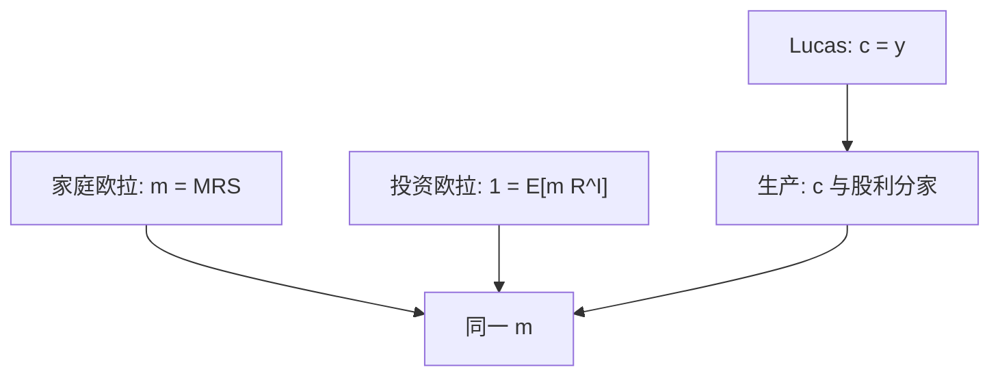

# 生产基础的资产定价

有生产时，投资的一阶条件给资本回报定价；随机折现因子仍可以来自消费者，但股利不再等于果实。

<footer>—— Cochrane, Production-Based Asset Pricing and the Link Between Stock Returns and Economic Fluctuations, Journal of Finance, 1991</footer>

[上一课](/econ/term-structure-of-risk)仍在把支付流切开，支付本身在 Lucas 树里等于外生果实。本课缺口是**生产**：企业用资本与投资技术把果实变成内生，$c$ 与股利分家，$m$ 可以同时从家庭欧拉与从投资欧拉读出。不重写树的 $p(y)$，不把 RBC 校准表搬进来。

## 问题

交换经济：$c=y$，股权是对 $y$ 的要求权。生产经济：产出 $f(k)$，资本积累 $k'= (1-\delta)k+i$，调整成本使投资与 $q$ 有关。企业最大化市场价值，使用同一 $m$ 折现。Cochrane（1991）强调：投资回报（边际上多装一单位资本再拆掉）在最优处被 $m$ 定价，于是资产回报与投资、产出共变——无需先经过消费数据。缺口是给 $m$ 第二条通道：消费太平滑时，投资的波动仍可能给核提供力矩。

这不是否定家庭欧拉，而是对偶。完全市场下两条欧拉描述同一 $m$。测量上消费噪、投资也噪，哪一条好用是实证；本栏只完成映射。

Cochrane, *Journal of Finance* 46(1), 1991。Jermann、Tallarini、Belo 等把调整成本与生产冲击写进定量一般均衡。本课不定量。

## 方法

家庭：$m=\beta u'(c')/u'(c)$。企业：投资的边际成本（含调整）等于边际 $q$；资本的边际产出加价格变化构成投资回报 $R^I$，满足 $1=\mathrm{E}[m R^I]$。若上市公司是资本的要求权，$R^I$ 与股票回报在技术与市场结构的理想情形下对齐。调整成本越凸，投资越平滑，$q$ 越波动——价格波动可以来自安装摩擦，而不只来自 $u'(c)$。

与 [CAPM](/econ/capm-theory)：生产基础不自动给出市场 beta。只有当投资回报与市场完全相关、加总又回到均值方差时，两条特化重合。一般地，生产冲击是 $m$ 的候选状态，不是 Fama–French 的执照。

## 机制

机制是跨期技术替代。今天多投资，明天多资本、少消费（或少股利），最优时两边的边际用同一 $m$ 对齐。果实不再直接等于消费，平滑可以发生在存货、劳动、调整成本上——这正是树解释不了价格波动时的出口之一。风险的期限结构现在可以对准资本的安装周期：短现金流更像当期产出，长现金流更像已安装资本的租金。

不完全市场或融资约束下，企业的 $m$ 可以变成内部影子价格，与家庭 $m$ 分开——下一课序的中介资产定价从这里起步。本课先保持完全、无摩擦，好让对照干净。

$q$ 理论（Tobin, Hayashi）是投资欧拉的确定版。随机折现把它变成资产定价：边际 $q$ 是资本要求权的价格。

## 边界

不要把投资–回报相关写成「所以生产模型赢了消费模型」的赛马。两条欧拉在理论上兼容，数据上可以双双失败。也不要把生产基础写成限价簿：企业 $q$ 不是盘口。本课序「定价的数学骨架」在此收束：从 LOP 到树到会计到生产，无摩擦骨架已经够用。下一课序打开摩擦与中介，$m$ 开始依赖谁的约束在绑紧。

后课默认：生产经济里投资欧拉与消费欧拉对偶同一 $m$；$c$ 不必等于股利。融资约束会把企业核与家庭核劈开，那是下一课序。

## 小结

- 投资回报在最优处被 $m$ 定价；生产给核第二条可读的欧拉。
- 调整成本让 $q$ 与投资分家，价格波动可来自技术摩擦。
- 完全无摩擦时与 Lucas 核兼容；$c$ 与股利不再恒等。
- 出处：Cochrane, *Journal of Finance* 1991；对照 Hayashi 的 $q$、Jermann。
