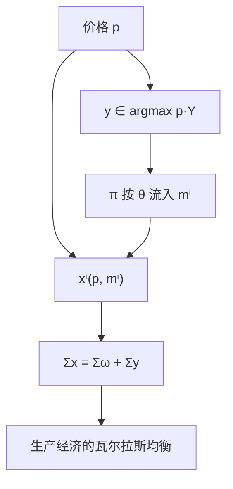

# 带生产的一般均衡

厂商在既定价格下选生产计划，利润按股权流回消费者；出清必须同时包括产品与要素，而不只是纯交换的禀赋搬家。

<footer>—— 据 Debreu, Theory of Value, 1959；Mas-Colell, Whinston and Green 第 16–17 章整理</footer>

定位：[上一课](/econ/welfare-theorems)。两定理在纯交换里把均衡与帕累托接好，并声明生产并行：利润最大化时「更好的计划更贵」，第二定理要生产集凸。本课不重证第一定理的会计。缺口是把厂商写进定义：生产集 $Y^j$、利润分配 $\theta^{ij}$、财富不再只是 $p\cdot\omega^i$，市场出清变成 $\sum x^i=\sum\omega^i+\sum y^j$。

## 问题

纯交换里总供给是禀赋。有生产之后，净产出 $y^j\in Y^j$ 可以创造（或消耗）商品，盒的边长不再外生。消费者 $i$ 持有厂商 $j$ 的份额 $\theta^{ij}\ge 0$，$\sum_i\theta^{ij}=1$。给定 $p$，厂商

$$
y^j(p)\in\arg\max_{y\in Y^j}p\cdot y,\qquad \pi^j(p)=p\cdot y^j(p),
$$

消费者财富 $m^i(p)=p\cdot\omega^i+\sum_j\theta^{ij}\pi^j(p)$，需求 $x^i(p)$ 在预算 $p\cdot x\le m^i(p)$ 上最优。均衡还要求 $\sum_i x^i(p)=\sum_i\omega^i+\sum_j y^j(p)$（免费处置则不等式）。缺口不是再写一次 $z(p)$ 的符号，而是：**利润从哪来、回到谁身上，要素市场怎样被同一组 $p$ 出清。**

[成本最小化](/econ/cost-minimization)与[利润供给](/econ/profit-supply)已在局部均衡写过单家。这里 $w$ 与 $p$ 是同一价格向量的不同分量，要素不再当参数。

### 股权是预算流量，不是控制权

$\theta^{ij}$ 只分配利润，不影响「把 $p$ 当参数」这一竞争假设。厂商不内部化股东的偏好，只最大化 $p\cdot y$——这是第一定理对生产侧成立的关键。若厂商最大化加权股东效用，问题变成另一套目标，本课不走。IRS、非凸 $Y^j$ 让竞争供给对应爆炸或为空，均衡可能不存在；第二定理的分离也失败。那是存在性课的墙，本课先在凸、可歇业的 $Y$ 上把会计钉住。

瓦尔拉斯定律仍成立：把利润加进预算再加总，产出的价值 $p\cdot\sum y$ 与利润项对消，剩下 $p\cdot(\sum x-\sum\omega-\sum y)=0$。

## 方法

经济 $\bigl((\succsim^i,\omega^i,\theta^i),(Y^j)\bigr)$。均衡是 $(p^*,x^*,y^*)$，使 $y^{*j}$ 利润最大、$x^{*i}$ 在 $m^i(p^*)$ 上需求最大、市场出清。私人所有制定义如上；也可以把 $Y$ 写成总量生产集 $Y=\sum Y^j$，对偶上常等价（凸时）。

有效性：配置 $(x,y)$ 可行若 $\sum x\le\sum\omega+\sum y$、$y^j\in Y^j$。帕累托对消费者偏好而言，生产只作为可行性。第一定理的证明几乎照搬：更好的消费更贵，更好的生产计划不会更亏，加总戳破出清。第二定理要 $Y^j$ 凸，否则支撑价格下厂商想冲向无穷或拒绝生产有效点。

不要把 $y$ 写成限价簿上的存货；生产计划是净产出向量，没有时间优先。

## 机制

价格同时给产品与要素标价：厂商比较 MR（在竞争下就是 $p$）与要素成本，消费者比较 MRS 与同一 $p$。内点时 $\mathrm{MRS}=\mathrm{MRT}=p$ 的比率，交换有效与生产有效被同一组相对价格焊住——这是两定理在生产经济里的几何。利润分配改变的是谁有购买力，从而在帕累托集上挑哪一点，不改变「均衡有效」本身；这与第二定理的转移是同一类工具，$\theta$ 的再分配相当于改禀赋。

歇业：$0\in Y^j$ 保证 $\pi^j\ge 0$。若短期有沉没，局部均衡的停产规则仍看可变利润；一般均衡把已沉没的资本当成禀赋中的商品，会计要声明时期。本课用 Debreu 的静态生产集，不把短长期再推一遍。

要素与产品是同一价格向量的不同坐标：劳动带负号进入 $y$，工资是 $p$ 的对应分量。局部均衡把 $w$ 冻住再画产品市场；这里劳动市场必须同时出清，否则「产品市场的竞争均衡」只是投影。CRS 加自由进入时纯利润为零，财富退回 $p\cdot\omega$，看起来像纯交换，但商品清单里已经包含被生产出来的那一部分——配置仍不是禀赋搬家。

Debreu 的商品可以带日期与地点，生产计划是跨期向量。本课有限维、单一静态时期已经够把利润分配说清；无限维 properness 不在主干。

## 边界

劳动供给进入效用时，「要素」与「消费」同一商品的不同符号，定义不改。外部性使 $Y^j$ 依赖他人计划，利润最大化用错了可行集。不完全市场让证券利润与现货生产脱节，GEI 后课再写。也不要用本课重写产业组织的厂商：那里的厂商面对向下需求，不是价格接受的 $p\cdot y$。

后课[存在性](/econ/ge-existence)把生产对应与需求对应一起送进角谷。后课默认：竞争生产经济含 $(Y^j,\theta^{ij})$，财富含利润，出清含净产出。

## 小结

- 厂商利润最大，利润按股权进入消费者预算。
- 出清是禀赋加净产出；瓦尔拉斯定律对消利润项后仍成立。
- 两定理对凸生产集并行；非凸会拆掉供给对应与第二定理。
- 下一课用不动点证明这套对应非空。
- 出处：Debreu, *Theory of Value*；Mas-Colell, Whinston and Green 第 16–17 章。
