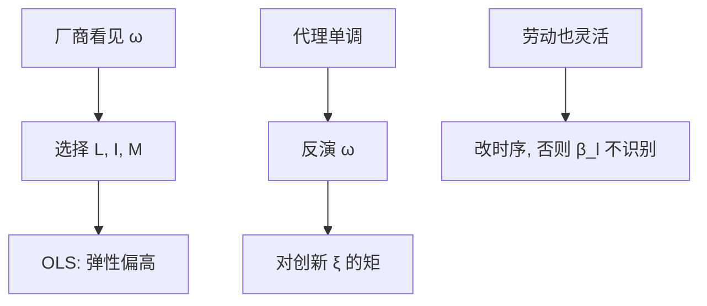

# 生产函数估计

厂商看见生产率再选投入，OLS 把高 $\omega$ 的多雇劳动算进劳动弹性；要用投资或中间投入当代理，把 $\omega$ 从残差里赶出来，规模报酬才不是会计恒等。

<footer>—— Olley and Pakes, The Dynamics of Productivity in the Telecommunications Equipment Industry, Econometrica 1996；Levinsohn and Petrin, RES 2003；Ackerberg, Caves and Frazer, Econometrica 2015</footer>

[上一课](/econ/blp-demand)在产品空间估需求。本课换厂商技术：$Q=F(K,L)\mathrm{e}^{\omega}$。拍卖下一课换另一套结构（出价规则）。本课钉生产函数的内生投入与代理方法。

## 问题

对数产出 $y_{it}=\beta_k k_{it}+\beta_l l_{it}+\omega_{it}+\varepsilon_{it}$。$\omega$ 是厂商知道的生产率，$\varepsilon$ 是事后冲击。高 $\omega$ 的厂多雇 $L$、多投 $K$，OLS 高估投入弹性，规模报酬被夸大，Solow 残差被压小。缺口不是再讲[索洛残差](/econ/solow-residual)宏观核算，而是微观：选择投入的信息集。Olley–Pakes：投资 $i_{it}=i(k_{it},\omega_{it})$ 在单调下可反演 $\omega=h(k,i)$，非参数第一阶段把 $\omega$ 收进函数，第二阶段用存活与 $k$ 的定律识别 $\beta_k$。Levinsohn–Petrin 用中间投入代替投资（投资经常为零）。Ackerberg–Caves–Frazer：若劳动也在 $\omega$ 之后灵活选择，第一阶段不能识别 $\beta_l$，要改时序假设。

固定效应只吸时不变 $\omega$。生产率的 Markov 冲击正是 OP 要捕的。FE 与 OP 不是替代口号，是对 $\omega$ 过程的不同假设。

## 方法

声明时序：资本预定、劳动与中间投入是否同期对 $\omega$ 反应。代理：投资或中间投入严格单调于 $\omega$。第二阶段 GMM：创新 $\xi_{it}=\omega_{it}-\mathbb{E}[\omega_{it}\mid\omega_{i,t-1}]$ 与预定工具正交。退出：OP 用存活概率修正选择（低 $\omega$ 退出使样本里 $\omega$ 截断）。

与宏观核算：加总 Solow 残差含再配置（OP 分解）。本课估的是厂级 $F$，不把宏观 TFP 循环论证。

## 机制

机制是信息。计量者看不见 $\omega$，但看见与 $\omega$ 单调的选择。反演把不可观测变成可观测函数，再靠 Markov 把今天的 $\omega$ 拆成可料与创新，创新与昨天的投入正交。单调失败（投资不可逆、零投资一团）则反演不是函数，LP 的中间投入动机在此。ACF 的要点是：两个灵活投入不能同时在同一阶段从同一个 $\omega$ 里拆出两个弹性。

与[遗漏变量](/econ/ovb-measurement-error)：$\omega$ 是相关遗漏。代理方法是针对这一种遗漏的结构，不是通用 IV。资本测量误差仍衰减 $\beta_k$——Griliches 的警告还在。

Gandhi–Navarro–Rivers 指出：在某些时序与完全竞争下，弹性识别更薄，要靠风险价格或需求边。本课以 OP/LP/ACF 为最小传统，边界上承认识别争论。

## 边界

本课不估 CES 宏观加总全文。不把 TFP 差异写成制度质量的因果（那要设计或另一套结构）。下一课拍卖：对象是出价策略与估值分布，不是 $F(K,L)$。贸易后课的异质企业生产率（Melitz）会用到厂级 $\omega$ 的分布，但估计装置在本课，贸易机制在后课。

后课默认：厂级生产函数先写信息时序与代理单调；OLS 弹性默认有偏。ACF 时序不满足时不要报「第一阶段 $\beta_l$」。宏观残差分解可以引用 OP，但不替代微观识别。

## 小结

- 内生投入：$\omega$ 进入选择，OLS 高估弹性。
- OP / LP：投资或中间投入反演 $\omega$；ACF 纠正劳动时序。
- 第二阶段用 Markov 创新的矩。
- 测量误差与零投资会破坏反演。
- 出处：Olley and Pakes, *Econometrica* 1996；Levinsohn and Petrin, *RES* 2003；Ackerberg, Caves and Frazer, *Econometrica* 2015。
