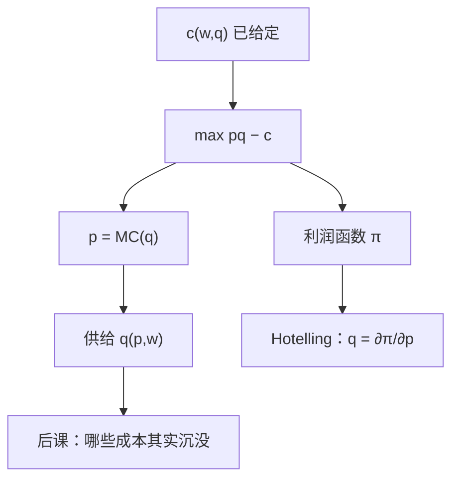

# 利润最大化与供给

利润函数对产出价格的导数就是供给；对要素价格的导数，差一个符号，就是要素需求。

<footer>—— 据 Hotelling, Edgeworth's Taxation Paradox and the Nature of Demand and Supply Functions, Journal of Political Economy, 1932 整理</footer>

[上一课](/econ/conditional-factor-demand)（条件要素需求）。在锁定 $q$ 时给出 $c(w,q)$ 与 Shephard。本课不重讲条件需求，也不把 $c$ 的齐次凹性再证一遍。缺口是：$q$ 仍是参数，厂商还没有对着产品价格说话。没有这一步，后课完全竞争没有厂商供给曲线，垄断没有「先有 MC 再对需求」的接口。

## 问题

把产出价格 $p$ 也当成参数（价格接受者——市场结构课会撤掉这一条）。厂商选净产出，或等价地选 $q$，

$$
\pi(p,w)=\max_q\, pq-c(w,q),
$$

内部解的一阶条件是 $p=\mathrm{MC}(q)$。供给 $q(p,w)$ 是这道方程的解；利润函数 $\pi$ 是最优值。缺口不是再画一条成本曲线，而是把供给从「MC 的图」提升成对偶对象：$\pi$ 对 $p$ 凸、一次齐次，并且

$$
\frac{\partial\pi}{\partial p}=q(p,w),\qquad \frac{\partial\pi}{\partial w_j}=-z_j(p,w).
$$

后者是无条件要素需求：产量已经跟着 $p$ 调过，不再是条件 $z(w,q)$。Hotelling 引理与 Shephard 引理平行，一层在利润，一层在成本。

### 价格接受不是完全竞争市场

本课的 $p$ 仍是参数，只描述单一厂商的最优反应。有多少家厂商、能否自由进入、需求从哪来，下一课之后才拼。把 $p=\mathrm{MC}$ 直接叫「完全竞争均衡」，漏了市场出清与进入。垄断课将把 $p$ 改成 $P(q)$；本课先把接受者这一端钉死，后课才有对照。

若 $\pi<0$ 且一切投入可避，最优是歇业，$q=0$。这依赖技术课的 $0\in Y$。固定成本一旦沉没，歇业规则要改，那是下一课。

## 方法

两步与一步等价：先对每个 $q$ 付 $c(w,q)$，再对 $p$ 选 $q$；或直接在 $Y$ 上 $\max\, p\cdot y$。凸 $Y$ 保证利润问题有解且一阶足够。$\pi$ 对 $(p,w)$ 凸：价格更散，已经选好的计划不会变差，还能再优化——这是包络的另一面。

供给对自身价格不降：$\partial q/\partial p=\partial^2\pi/\partial p^2\ge 0$。这不是偏好，是利润凸。CRS 且无固定成本时，$\pi$ 要么为 $0$ 要么为 $+\infty$，供给对应在 $p=\mathrm{MC}$ 上可以是整条射线。后课长期竞争正是站在这条刀刃上谈零利润。

本课一切投入仍按当期 $w$ 支付，没有沉没。要素市场仍然是参数 $w$，买方垄断不在这里。

## 机制

$p=\mathrm{MC}$ 的机制：多产一单位的边际支出若低于市价，利润还可以涨；高于则应减产。包络把最优 $q$ 的调整消掉，于是 $\pi$ 对 $p$ 的导数直接是产量。无条件要素需求比条件需求多一层产出效应：$p$ 上升 → $q$ 上升 → 所有正常要素多用。Shephard 的 $z(w,q)$ 冻住了 $q$，所以两条曲线不要画成一条。

与消费对偶的对照：Hotelling 之于 $\pi$，相当于 Shephard 之于 $c$、Roy 之于间接效用。三套包络后课会反复用；本课只钉厂商这一套。不要把供给弹性写成马歇尔需求弹性——那是消费者课的 $(p,w)$，符号和齐次次都不同。

Hotelling 1932 讨论的是税收与供给函数的可积，引理是副产品。引用时不要把它与 1929 年线性城市那篇霍特林混成一篇。

## 边界

价格接受在此是技术假设，不是市场结构定理。规模报酬递增时 $\pi$ 问题可以没有有限解，供给对应空洞——技术课已警告。不可微时引理改超微分，供给可以跳跃。

短长期尚未区分。只要有一项投入在决策前已经付出、事后不能收回，本期的相关成本就不是 $c(w,q)$ 的全部。下一课专门切这一刀；本课的 $p=\mathrm{MC}$ 默认 MC 里每一项都可避。

买方若操纵价格，本课的 $\pi(p,w)$ 整段暂停。比例利润税在价格接受下不改产量，那是公共财政接口。也不把供给写成限价簿卖单：这里是计划净产出，价格是参数。

后课默认：价格接受者的供给由 $p=\mathrm{MC}$ 给出，并用利润函数的 Hotelling 引理读写。

## 小结

- 把 $q$ 放开之后，接受者选 $p=\mathrm{MC}$；供给是 $\pi$ 对 $p$ 的导数。
- 无条件要素需求含产出效应，与条件需求不是同一条曲线。
- $\pi$ 凸且一次齐次；CRS 下利润在零与无穷之间刀刃。
- 下一课区分可避成本与沉没成本，改写歇业规则。
- 出处：Hotelling, *JPE*, 1932；Mas-Colell, Whinston and Green 第 5 章。
