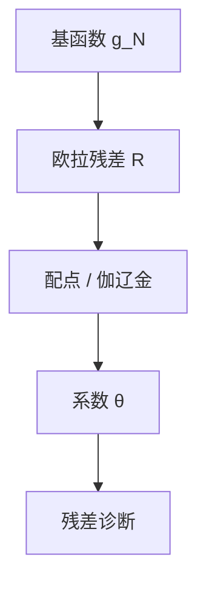

# 投影法

把未知政策写成基函数的线性组合，让欧拉残差在加权意义上为零——配点或伽辽金，而不是只在一点泰勒。

<footer>—— Judd, Projection Methods for Solving Nonlinear Dynamic Economic Models, 1992；Miranda and Fackler, Applied Computational Economics</footer>

[上一课](/econ/perturbation-methods)的局部展开在不可微与大偏离处停下。本课缺口是**全局逼近**：残差投影到有限基上。不重写二阶张量，不把神经网络当新均衡概念。

## 问题

欧拉或贝尔曼残差 $R(s;g)$ 应在状态空间上接近零。取基 $\{\psi_i\}$，令 $g_N(s)=\sum_{i=1}^N\theta_i\psi_i(s)$，选 $\theta$ 使 $\langle R(\cdot;g_N),\phi_j\rangle=0$。配点：$\phi_j$ 是点质量；伽辽金：$\phi_j=\psi_j$。Chebyshev 多项式在光滑问题上指数收敛；有 kinks 时分段或样条更合适。缺口是给 VFI 的插值网格一条「加权残差」的姐妹，而不是再讲压缩。

Time iteration 在欧拉上对政策迭代，常与配点结合。Collard 与 Juillard、Christiano–Fisher 的参数化期望，是同一族。

## 方法

选域（资本、冲击的有界集）、基、积分节点（Gauss–Hermite 对正态冲击）。非线性求解 $\theta$。维数灾难：状态超过三四维，张量积网格爆炸，改用稀疏网格、 Smolyak、或可分结构。异质主体：个人政策用投影，分布用直方图或模拟——后课 Aiyagari / KS。精度用 Euler 方程误差的判断标准（Judd）。

与扰动：同一模型可两套解交叉检验。平滑 NK 用扰动更快；偶尔绑定、非凸投资、离散劳动用投影或混合。

## 机制

机制是函数逼近加均衡残差正交。经济没有变：仍是欧拉加市场出清。变的是 $g$ 的表示。基选错（全局多项式跨 kink）会造成振荡，看起来像多重均衡或古怪 IRF，其实是数值伪迹。诊断残差、加倍节点、对照 VFI，是同一课的纪律。

理性预期在投影里体现为：积分用模型自己的转移，不是用数据回归。适应性学习后课才把预期算子换成估计出来的信念。

Judd, *JEDC* 1992。McGrattan 对投影在宏观的早期应用。

## 边界

本课不估计参数（下一课校准）。高维 HANK 的序列空间方法（Boppart–Krusell–Mitman、Auclert 等）是另一条「沿时间路径线性化」的路，不在本课展开，但精神同为残差为零。不要把投影写成只有异质模型才需要：代表性非凸问题同样需要。

后课默认：全局解 = 投影 / VFI / 配点；局部解 = 扰动。下一课：有了能算的解，参数从哪里来。

## 小结

- 投影用有限基配平欧拉残差，覆盖局部扰动够不到的域。
- kinks 要用对的基；残差诊断防伪迹。
- 与 VFI 是姐妹，不是替代均衡定义。
- 出处：Judd, *JEDC* 1992；Miranda and Fackler。
