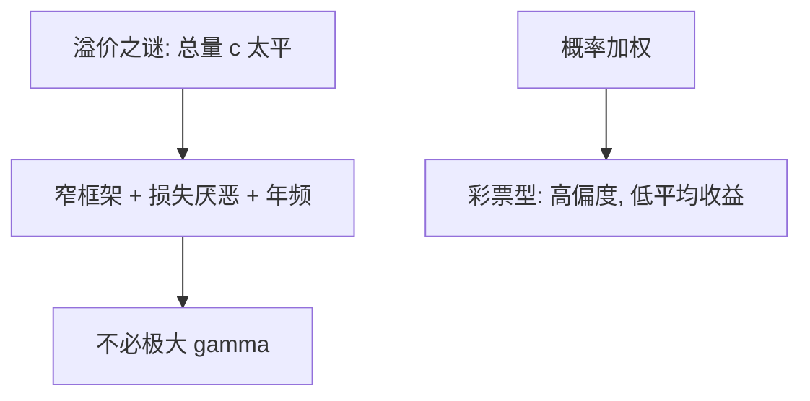

# 前景理论资产定价

若股票被窄框架评价，且一年看一次，损失厌恶足以要很高的股权溢价——不必把 $\gamma$ 顶到两位数。

<footer>—— Benartzi and Thaler, Myopic Loss Aversion and the Equity Premium Puzzle, QJE 1995；Barberis, Huang and Santos, QJE 2001</footer>

[上一课](/econ/hong-stein-diffusion)走信念。本课缺口是评价：把[前景理论](/econ/prospect-theory)与[心理账户](/econ/mental-accounting)接到资产价格，对照[股权溢价之谜](/econ/equity-premium-puzzle)。不重推 Mehra–Prescott 的校准，不重导 vNM。

## 问题

代表性 CRRA 用平滑的总量 $c$ 生成 $m$，溢价要极大 $\gamma$。Benartzi 与 Thaler（1995）：投资者用前景理论评价股票的**名义收益分布**，评价频率约一年（窄框架，不并入总财富）。损失厌恶使一年期股票的价值函数期望为负，除非溢价大到把分布抬离损失区。Barberis、Huang 与 Santos（2001）把它动态化：过去收益改变下一期的损失厌恶或参考点，波动与可预测性同时出现。Barberis 与 Huang（2008）用 CPT 的概率加权给彩票型股票定价：正偏被高估，平均收益可以低。

缺口是改 $v$ 与框架，而不是再改消费过程。

短视损失厌恶：同一长期风险，看的次数越多，碰到损失的次数越多，$\lambda$ 打击越多。评价频率是偏好的一部分。

## 方法

把资产的收益分布送进 $v$ 与 $w$，而不是送进 $\mathbb{E}u(c)$。静态 BT 用历史年收益直方图。BHS 用均衡消费加前瞻性损失厌恶状态变量。本课不把习惯形成（Campbell–Cochrane）重写一遍：习惯改 $u(c-X)$，前景改金融财富的得失，可以并存，对象不同。

## 机制

机制是金融财富被单独记账。欧拉若仍对总消费成立，股票收益的得失另加一项前景效用，有效风险价格上升。这与参与之谜一致：窄框架使一次公平的股权赌注看起来很糟，零持有增加。套利限制仍然需要：若有不受窄框架约束的机构，他们应吃掉溢价——除非委托与基准也迫使他们短视。

不把溢价写成盘口价差。本课 $p$ 仍是均衡价格。

Mehra–Prescott 的缺口是 $\sigma(\Delta c)$ 太小。BT 不改消费过程，改评价对象：一年期名义股票收益的直方图进 $v$，损失区被 $\lambda$ 放大，没有足够溢价则价值为负。评价频率是窄框架的结算规则，与心理账户同一零件。BHS 让过去收益进入下期损失厌恶，波动与可预测性跟着状态走，仍不必两位数 $\gamma$。习惯形成改的是 $c-X$，对象是消费；本课对象是金融财富账户。机构若也不并入总财富（基准、年考核），套利吃不掉溢价。

## 边界

评价频率是自由参数；改成每天或十年，溢价预测大变。BT 用历史分布，不是一般均衡。BHS 更接近均衡，但对 $v$ 的动态有额外假设。本课不宣称前景理论「解决」了谜，只标明一条不靠两位数 $\gamma$ 的通道。量化栏的因子实证不在此重做。

后课默认：处置效应是同一 $v$ 在交易实现上的含义，不是定价核的再校准。

不改 $\sigma(\Delta c)$，改评价对象：一年期名义收益进 $v$，窄框架让 $\lambda$ 要很高溢价。

习惯改 $c-X$，本课改金融财富账户。机构年考核也可以是短视。

## 小结

- 短视损失厌恶用窄框架解释高溢价，不重推 HJ 界。
- CPT 加权给正偏证券低期望收益。
- 与习惯分工：一个改消费效用，一个改金融财富得失。
- 评价频率是自由参数，必须声明。
- CPT 加权给正偏彩票型低期望收益。
- 出处：Benartzi and Thaler, *QJE* 1995；Barberis, Huang and Santos, *QJE* 2001。
