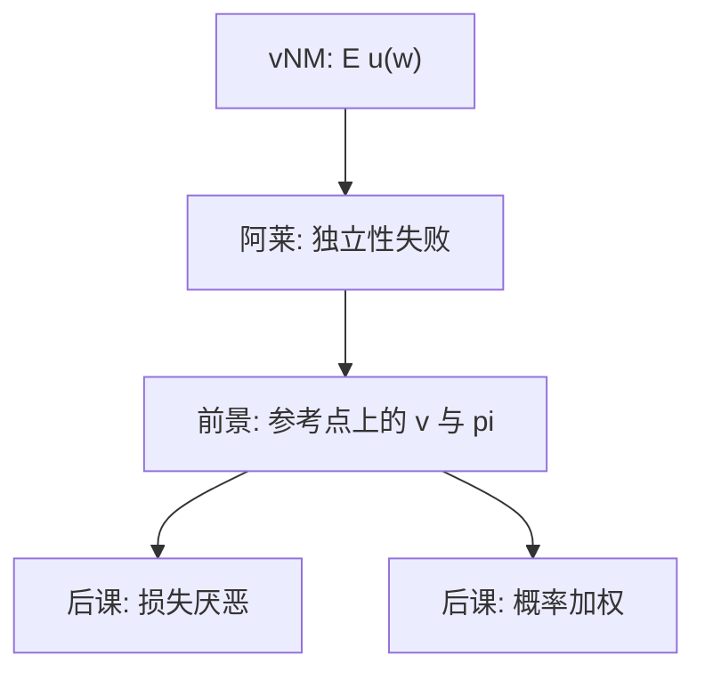

# 前景理论

人比较的不是期末财富的期望效用，而是相对参考点的收益与损失；概率也不按客观值线性加权。

<footer>—— Kahneman and Tversky, Prospect Theory: An Analysis of Decision under Risk, Econometrica 1979</footer>

[上一课](/econ/financial-literacy-defaults)收束家庭金融：素养与默认移动参与，偏好仍被写成 vNM。本课打开行为单元。缺口是：[期望效用](/econ/expected-utility)的独立性在阿莱问题里系统性失败，现场选择更像「编辑前景 + 评价」。不重推 vNM 公理，只标明替换的表示。

## 问题

vNM 把彩票写成 $\mathbb{E}u(w)$，$u$ 定义在财富或消费上。Kahneman 与 Tversky（1979）的实验：同一结果，用收益框架与损失框架选择翻转（反射效应）；极小概率被高估，导致同时买彩票与保险。阿莱课已经拒绝独立性；本课给出替代函数。前景理论把结果写成相对参考点 $x$，价值函数 $v(x)$ 在损失段更陡，权重函数 $\pi(p)$ 替代概率。评价大致是 $\sum \pi(p_i)v(x_i)$（累积前景是后课的概率加权）。

缺口不是再讲[完备传递](/econ/preference-choice)，而是：风险下的表示从期末财富换成参考点上的得失。

1979 年论文先有编辑阶段：合并、分离、简化前景，再评价。框架效应来自编辑，不只来自 $v$ 的形状。后课拆开。

## 方法

对象仍是彩票，表示换成 $(v,\pi)$。$v$ 在参考点处拐折，收益凹、损失凸——这产生风险寻求于损失、风险厌恶于收益。$\pi$ 在小 $p$ 上 $\pi(p)>p$。本课只钉这两块的存在；损失厌恶的校准、Prelec 权重、心理账户，按课序拆开。

资产定价仍用主干的 $m$ 直到本课程后段。本课不把股权溢价改写成前景理论溢价。

## 机制

机制是编码。决策者先把结果标成收益或损失，再分别评价。同一财富分布，参考点不同，选择不同——这在 vNM 里不可能，因为 $u$ 只看期末。保险与彩票可以并存：小概率的损失被 $\pi$ 放大（买保险），小概率的巨奖也被放大（买彩票）。反射效应来自损失段的凸 $v$。

不把「前景」写成限价单。这里没有簿。

编辑阶段决定哪些结果被并、被分、被当成零。同一 vNM 彩票可以编成不同前景，这是后课框架效应的入口。本课只要：替换表示已经足够解释反射与四重模式的雏形；累积形式与 $\lambda$ 的拆开按课序进行。主干的[期望效用](/econ/expected-utility)仍服务于 SDF 与欧拉；补层指出现场风险选择常常不是那条表示。

## 边界

前景理论首先是实验室风险。现场财富、长期消费、一般均衡加总，都不是 1979 年论文的对象。Tversky–Kahneman 1992 的累积前景修正了原权重在多结果上的问题，概率加权课再写。Koszegi–Rabin 的内生参考点更后。本课禁止用前景理论一口吞掉家庭金融所有谜。

后课默认：说到前景理论，指参考点、拐折的 $v$、非线性 $\pi$；损失厌恶与加权作为可拆零件使用。

替换表示已经够用：参考点上的 $v$ 加 $\pi$，反射与彩票–保险并存不再互相矛盾。

主干 SDF 仍用期望效用；补层指出现场风险选择常常不是那条表示。

## 小结

- vNM 排期末财富；前景理论排相对参考点的得失，并用 $\pi$ 加权。
- 不重推导独立性；阿莱是已有缺口，本课给替代表示。
- 反射效应与同时买彩票、保险，是 $v$ 与 $\pi$ 的分工。
- 编辑阶段是框架效应的入口。
- 损失厌恶与加权按后课拆开，本课只钉存在。
- 出处：Kahneman and Tversky, *Econometrica* 1979。
