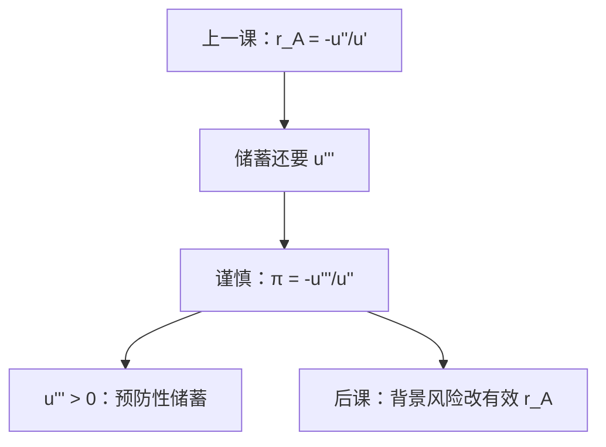

# 谨慎与 Kimball

风险厌恶管的是「讨厌噪声」；预防性储蓄问的是「噪声是否让人更想攒钱」。后者要看三阶导，不是更凹。

<footer>—— 据 Kimball, Precautionary Saving in the Small and in the Large, Econometrica, 1990 整理</footer>

[上一课](/econ/cara-crra)钉了 $r_A$ 的形状：CARA、CRRA、DARA。本课不重解那些微分方程，也不把 Pratt 溢价再推一遍。缺口是：$r_A=-u''/u'$ 只动到二阶。后课随机收入、欧拉方程里的「不确定性提高储蓄」，需要 $u'''$ 的符号。Kimball 把绝对谨慎 $\pi=-u'''/u''$ 收成与 $r_A$ 平行的一套局部理论；凹性不够。

## 问题

两期、第二期收入带零均值噪声 $\tilde\varepsilon$。确定情形的欧拉是 $u'(c_0)=\beta(1+r)u'(c_1)$。噪声进来之后，若仍用同一 $c_1$ 的均值去算，等式一般不再成立。缺口是：何时 $\mathbb{E}u'(w+\tilde\varepsilon)\gt u'(w)$，从而使当期消费下降、储蓄上升？Jensen 要求 $u'$ **凸**，即 $u'''\gt 0$。这叫谨慎（prudence），与 $u''\lt 0$ 的风险厌恶不是同一句话。

Kimball 定义绝对谨慎 $\pi(w)=-u'''(w)/u''(w)$，相对谨慎 $w\pi(w)$。局部上，预防性溢价（为了消除噪声愿意压低多少确定财富）由 $\pi$ 扮演 Pratt 公式里 $r_A$ 的角色。本课只钉这一阶对应，不把「小风险」与「大风险」的全部定理重写。

### 更凹不必更谨慎

$r_A$ 更大是更厌恶二阶风险。$\pi$ 更大是对均值保留展形更想预防性储蓄。可以构造 $u$：$r_A$ 处处更大但 $\pi$ 更小。CARA：$u=-e^{-\alpha w}$，$\pi=\alpha=r_A$，谨慎与绝对厌恶同值。CRRA：相对谨慎 $=\gamma+1$，比相对厌恶多 $1$。不要把「幂效用很厌恶」读成「预防性储蓄很大」而不报 $\gamma+1$。

三次以上的符号还有节制（temperance，$u''''$ 的符号），背景风险下一课才用。本课停在三阶与储蓄。

## 方法

给定两次以上可微、严格递增凹的 $u$，直接读 $u'''$ 是否为正，再算 $\pi$。两期问题把第二期资源写成 $w_1+\tilde\varepsilon$，比较有噪声与无噪声的 $c_0$。$u'''\gt 0$ 则有噪声时 $c_0$ 更低。公平保险已经由凹性给出全额投保；预防性储蓄是**未保险**的未来风险挤占当期消费，对象不同。

CARA 加独立噪声：绝对预防性储蓄与财富无关，和上一课绝对风险需求对 $w$ 无弹性同一机制。CRRA 下预防性项与财富成比例。DARA 不蕴含谨慎，但常用的 CRRA、CARA 都谨慎。二次效用 $u'''=0$，没有预防性储蓄——又一条把它排除出主干的理由。

本课不估计 $\pi$。宏观欧拉若写「不确定提高储蓄」，是在用谨慎，不是把 $r_A$ 改名。也不把 $\pi$ 写成限价簿上的安全垫。多期缓冲存货、习惯形成会把「预防性」与其他储蓄动机混在一起，本课的两期可分 $u$ 是最小工作例子。

## 机制

$u'$ 凸的机制是：同样的均值，展形把质量推到更穷的状态，那里边际效用更高，期望 $u'$ 被拉起。为了压回欧拉，必须提高 $c_1$ 的均值，即先存一笔。这与 Pratt 溢价不同：溢价比较的是「接受风险要多少确定补偿」，预防性比较的是「跨期如何挪动」。展形伤害凹 $u$（SOSD）；谨慎额外决定**何时**用储蓄去缓冲。

与形状课的接口：CRRA 的 $\gamma$ 同时是相对厌恶和跨期替代的倒数——若宏观把同一幂函数兼用在时间和风险上。本课只谈风险侧的三阶；$\gamma+1$ 是相对谨慎，不是跨期替代。

Kimball 1990 的标题「in the small and in the large」对应 Pratt：局部用 $\pi$，全局用谨慎函数的比较。引用不要写成另一条风险厌恶指数。

## 边界

多期、习惯、借贷约束会让「预防性」混进流动性需求。本课只在两期、可自由借贷、单一未保风险上定义。模糊没有 $u'''$ 可算。不完全市场下劳动收入不可保，预防性与背景风险缠在一起——下一课把第二项打开。

局部预防性溢价（Kimball 的 $\psi$）满足 $\psi\approx\tfrac12\pi\sigma^2$，与 Pratt 的 $\pi_{\mathrm{Pratt}}\approx\tfrac12 r_A\sigma^2$ 同形，只是把 $-u''/u'$ 换成 $-u'''/u''$。全局比较：若 $\pi^1(w)\ge\pi^2(w)$ 处处成立，则同一噪声下 $1$ 比 $2$ 存得更多。本课要这条平行，不把大风险定理的全部不等式写完。

也不要把 $u'''\gt 0$ 写成「喜欢正偏度」的完整理论；三阶占优会把这句话收成分布偏序，本课只钉储蓄的一阶条件。背景风险下一课会问：同一份 $u'''$，如何改变对**另一份**可保风险的有效 $r_A$——那不是储蓄欧拉，不要在本课提前焊上。

后课默认：谈到预防性储蓄，先查 $u'''\gt 0$ 与 $\pi$；CARA/CRRA 工作函数都谨慎。风险厌恶指数不够写这一项。

## 小结

- 风险厌恶是 $u''\lt 0$；预防性储蓄需要 $u'$ 凸，即 $u'''\gt 0$。
- 绝对谨慎 $\pi=-u'''/u''$ 在局部扮演 Pratt 公式里 $r_A$ 的角色。
- CARA 则 $\pi=r_A$；CRRA 的相对谨慎是 $\gamma+1$。
- 二次效用无预防性；更凹不必更谨慎。
- 出处：Kimball, *Econometrica*, 1990。
