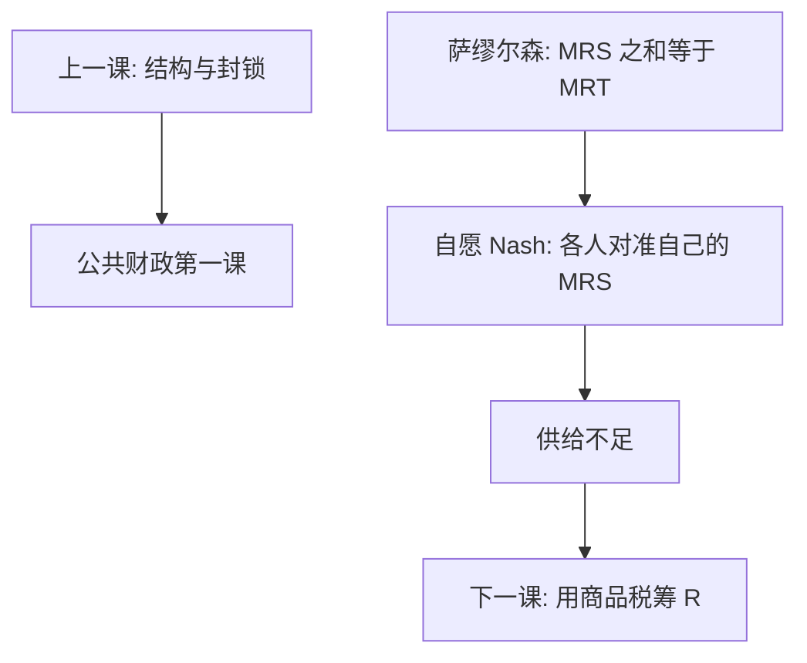

# 公共品自愿供给失败

纯公共品非竞争又难排他，自愿贡献的 Nash 只让每个人对准自己的 MRS；加总后低于萨缪尔森条件。政府介入不是装饰，是把加总评价写进预算。

<footer>—— Samuelson, The Pure Theory of Public Expenditure, Review of Economics and Statistics 1954；Bergstrom, Blume and Varian, Journal of Public Economics 1986；对照 Atkinson and Stiglitz, Lectures on Public Economics</footer>

[上一课](/econ/predation-exclusion)收束产业组织：市场失败来自结构与封锁。本课是**公共财政**第一课；后课默认已经读完：失败换成非排他消费，工具换成税与支出。微观[公共物品与免费搭车](/econ/public-goods)已写下 $\sum\mathrm{MRS}=\mathrm{MRT}$。本课不重推切条件，只补自愿供给均衡为何**系统**不足，好让后课 Ramsey 税有一个必须筹资的理由。

## 问题

$G=\sum_i g_i$，效用 $u_i(x_i,G)$。自愿贡献：给定别人的 $g_{-i}$，个人只让自己的 $\mathrm{MRS}^i_{G,x}$ 对准自己付的那一单位。有效性要求所有受益者的 MRS **加总**对准 MRT。Nash 加总偏小，$G$ 不足。缺口不是「人们不够无私」的道德故事，而是策略替代：别人多出一单位，自己的最优是少出——Bergstrom–Blume–Varian 把财富再分配如何挤出私人贡献写清楚。Lindahl 按各人 MRS 定价可达到有效，但要诚实显示；谎报可压低自己负担。

IO 的封锁关掉的是对手；这里即使完全竞争、没有勒纳，自愿供给仍然失败。两套市场失败不要合成一句。

### 免费搭车不是道德指责

把 underprovision 读成品德，会推出「宣传就能凑齐国防」，并漏掉激励相容。实验里有条件合作、温暖光辉（Andreoni），可以把均衡抬高一截，通常仍到不了萨缪尔森量。政策含义是：显示与强制（税）是正题，劝捐是补充。非竞争但可排他（收费公路）失败轻一层，本课以纯公共品为基准。

Samuelson 1954 给切条件；Lindahl 给个性化价格。Atkinson–Stiglitz 把公共品与最优税放进同一本讲义：后面课要筹的 $R$，有一块就是为了 $G$。

## 方法

自愿博弈的 FOC：$\mathrm{MRS}^i=1$（在 $p_G$ 已折进贡献单位时）。萨缪尔森：$\sum_i\mathrm{MRS}^i=\mathrm{MRT}$。两者的差就是未内部化的他人受益。政府用税筹 $R$、选 $G$，把加总 MRS 写进公共预算——下一课问税怎样扭曲私人品。俱乐部与地方公共品（Tiebout）靠排他与流动减轻免费搭车，收到本课程末的地方财政；全国性非排他对象先承认自愿失败。

不要用加总意愿调查当显示：策略性低报与公共品显示是同一病。

## 机制

机制是正外部性无法通过价格加总。私人品的 MRS 在市场上分别对准价格，加总由数量分担；公共品数量必须同一，$G$ 的评价必须在人与人之间相加。自愿贡献把 $G$ 当私人物品的「共同购买」，每个人只付自己那一阶，他人那一阶被当参数。财富从贡献者转移到非贡献者，私人 $G$ 被挤出——再分配本身不能替代公共提供，除非偏好极端。

与科斯对照：人数少、权利清晰时或可谈判；受益者为全国时，联盟成本等于全体人口，核帮不上。这与公共物品主干课的人数论证相接，本课把它收成财政的入口。

Bergstrom, Blume and Varian, *JPubE* 1986：内部解下，再分配若发生在贡献者之间，总私人供给不变；一旦有人被挤出贡献集，总量才变。政策不能靠「让富人多捐」来自动对准萨缪尔森。

## 边界

本课不写具体税种归宿，不把国防采购写成产业组织。不重做实验公共品博弈的全部设计。Diamond–Mirrlees 的生产效率与商品税在下一课。后课默认：纯公共品的自愿 Nash 低于有效量；政府用扭曲税筹 $R$ 提供 $G$，是次优问题而不是第一最佳的一次总付世界。

## 小结

- 本课是公共财政第一课；后课默认自愿供给不足。
- Nash 只对准私人 MRS，萨缪尔森要对准加总。
- 免费搭车是激励，不是品德鉴定。
- Lindahl 有效但激励不相容。
- 出处：Samuelson 1954；Bergstrom, Blume and Varian 1986；Atkinson and Stiglitz, *Lectures on Public Economics*。
