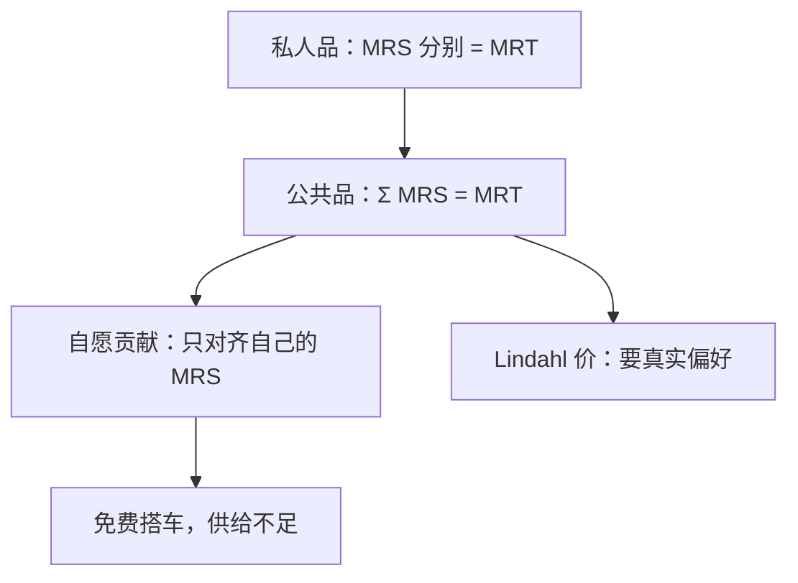

# 公共物品与免费搭车

纯公共品的最优条件是边际替代率之和等于边际转换率；私人品则是各人 MRS 分别等于 MRT。

<footer>—— Samuelson, The Pure Theory of Public Expenditure, Review of Economics and Statistics, 1954</footer>

[上一课](/econ/coase-theorem)在两人、权利清晰、谈判免费时把外部性内部化。缺口是人数与消费技术：一种商品被一人消费并不减少另一人可消费的量，又很难把不付费者排除在外。此时「卖掉排放权」不再是双边交易，联盟会散。本课钉纯公共品的萨缪尔森条件与自愿供给的免费搭车，不写具体税种的归宿。

## 问题

私人品在[埃奇沃思盒](/econ/edgeworth-pareto)里总量守恒：你多一口，我少一口。公共品 $G$ 进入每人的效用，但资源约束是 $c(G)+\sum x^i=w$，不是 $\sum G^i$。有效性的切条件因此从「MRS 相等」改成加总：

$$
\sum_i \mathrm{MRS}^i_{G,x} = \mathrm{MRT}_{G,x}.
$$

左边是所有受益者的边际评价叠在同一单位 $G$ 上。市场若按私人品定价，每人只显露自己的 MRS，加总偏小，均衡供给不足。

自愿贡献博弈里，别人多出一单位，自己的最优是少出——这就是免费搭车。科斯谈判在这里要召集所有受益者，阻塞联盟的规模等于全人口，核的逻辑帮不上小数目交易。

### 非竞争不是非排他的同义词

非竞争（nonrival）说边际成本为零：多一人享用不必再生产。非排他（nonexcludable）说收不了费。灯塔、国防接近两者兼有；收费公路可以排他但仍接近非竞争。排他但非竞争的商品，Lindahl 定价在纸上可行：对人报个性化价格，使各人需求的 $G$ 相同。执行要知道每人的 MRS，又回到显示问题。

Lindahl 均衡：每人面对价格 $p^i$，且 $\sum_i p^i=\mathrm{MC}(G)$，$G$ 对所有人相同。它实现萨缪尔森条件，但 $p^i$ 依赖偏好。谎报偏好可以压低 $p^i$，这是后课机制设计的伏笔。

## 方法

纯公共品经济：私人品 $x^i$，公共品 $G$，技术 $c(G)$。帕累托最优由一个计划者在资源约束下最大化一人效用、其余维持保留水平，一阶条件即萨缪尔森加总。分散化：若能征个性化 Lindahl 价，并配合总额转移，第二定理的逻辑仍可用。做不到个性化价时，统一税融资加公共提供，是用一种工具同时做供给与分担。

自愿供给：效用 $u^i(x^i,G)$，$G=\sum_j g^j$。纳什贡献的一阶条件是各人自己的 MRS 等于私人品的机会成本，加总远小于 MRT。人数上升，每人贡献更接近零。Olson 强调小集团更容易组织，与科斯小数目一致。

本课不引入投票、中位选民；那些是政治机制，不是商品空间补全。

## 机制

为什么必须加总 MRS：一单位 $G$ 同时进入所有人的效用，社会边际收益是竖着加，不是横着比。私人品的市场把横比做成同一价格；公共品没有「每人买自己的那一份」，价格无法按人分开，除非人为做成 Lindahl 价。

免费搭车是占优或纳什意义下的激励，不是道德批评。即使所有人都珍视 $G$，策略仍是让别人出钱。这与[庇古](/econ/externality-pigou)的正外部性是同一缺口的极端：受益者太多，补贴该发给谁，信息与免费搭车缠在一起。

## 边界

萨缪尔森条件是完全信息计划者的一阶条件，不保证能显示。后课[显示原理](/econ/revelation-principle)会处理「问偏好」本身的激励。拥挤使非竞争只在容量内成立，有效条件要加拥挤税。地方公共品、Tiebout 用脚投票，不在本课。

也不要把公共品写成「政府必须生产」。可以公共融资、私人生产。本课只钉配置条件与自愿供给失败。下一课问：用来融资的税，法定纳税人是不是实际负担者。

后课默认：纯公共品的效率标尺是 $\sum\mathrm{MRS}=\mathrm{MRT}$；市场自愿供给达不到。

## 小结

- 非竞争使有效条件从 MRS 相等变成 MRS 之和。
- 自愿贡献只对齐私人 MRS，人数一多就免费搭车。
- Lindahl 价能分权，但要真实的个性化评价。
- 科斯谈判在全人口联盟上失效。
- 出处：Samuelson, *REStat* 1954；Olson, *The Logic of Collective Action*, 1965。
