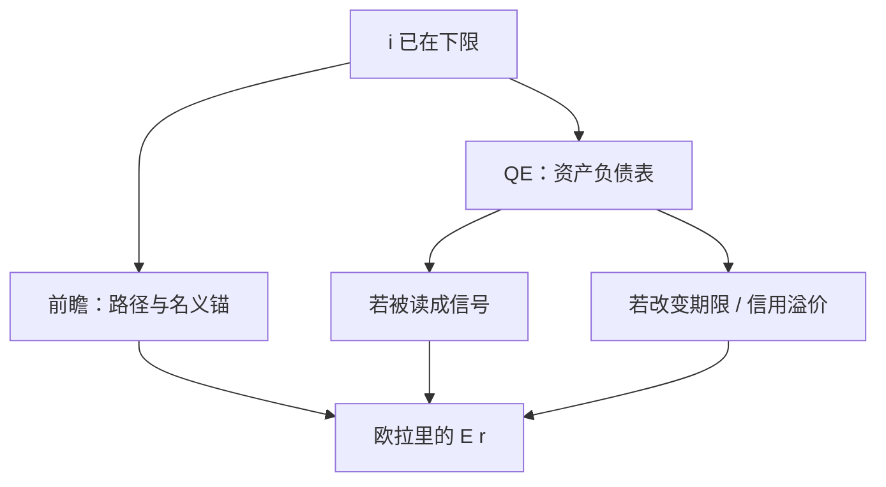

# QE 与前瞻指引

下限上能改欧拉的，是未来实际利率路径与名义锚；资产负债表是一条通道，话是另一条——二者都不是把零下限再讲一遍。

<footer>—— Eggertsson and Woodford, Brookings 2003；Krishnamurthy 对大规模资产购买渠道的分解</footer>

[上一课](/econ/fg-puzzle)（前瞻指引之谜）。已经把工具写成 $\max\{i^{\mathrm{Taylor}},i_{\mathrm{ELB}}\}$，并指出真正起作用的是对未来路径的承诺。本课的缺口是把非常规拆成两件不同的家具：**前瞻指引**（话：状态依存的利率路径）与 **QE**（资产负债表：久期、信用、流动性）。不重写现金为何给出下限，也不发明某一次购买的基点。

## 问题

动态 IS 在 $i$ 卡住时，能降的只剩 $\mathbb{E}\sum$ 未来实际利率，或抬 $\mathbb{E}\pi$。Eggertsson 与 Woodford 的最优是：承诺在下限结束后保持更低更久，并让价格水平回到目标路径。那是话。QE 改变的是央行持有的久期与信用风险，把公众的长期债换成准备金。Krishnamurthy 一类分解问：若预期不变，这只是资产互换；若改变期限溢价、信用利差或被读成对路径的信号，才进 IS。缺口是分开「表」与「话」，避免把资产规模当成松紧的充分统计。

零下限课已经说明工具为何卡住。本课不重写现金的名义回报，只把非常规拆成两件家具。财政乘数下一课才问 $G$；FTPL 再下一课才问盈余现值。这里停在：同样 $i=0$，话与表不是同一导数。

信号渠道把 QE 读成前瞻指引的可见承诺，于是表与话不是加性的两套魔法。政策评估必须声明市场读到的是哪一条。

## 方法

前瞻指引：把 $i$ 的路径写成状态依存（「直到通胀与缺口满足…」），以降低 $\mathbb{E}r$。价格水平目标或平均通胀目标把过去的偏低通胀记入未来超调，正是承诺在下限上的延伸。时间不一致在此翻转：复苏后央行又想立刻回到低通胀、拒绝超调，则话不被信，下限更长。

QE：在相同的 $i=0$ 上改变相对供给。渠道包括——久期提取（压缩期限溢价）、信用与流动性（若买的是有摩擦的券）、再平衡、以及信号。弹性价格且完全市场时，公众的债券换成准备金接近中性；摩擦与分割使部分券的收益率可被相对供给移动。本课不把 CIP 基差当操作成本；市场层平价见 `/quant/irp`。

卢卡斯批判：若公众认为表会在复苏后被立刻对冲、话会在复苏后作废，则当前扩张几乎不进 $\mathbb{E}\pi$。Krugman 的暂时货币是同一句。

### 表不是第四种中性

长期中性仍在：离开下限、价格灵活，多出来的 $H$ 仍要进 $P$ 或被回笼。非常规改变的是下限持续期内的预期与溢价路径，不是否认数量论的长期。铸币税在 $i=0$ 时流量小；目的是抬 $\mathbb{E}\pi$ 与缺口，不是为财政抽税。若市场把它读成货币化，通道串到财政主导，下一课的下一课才是 FTPL。

## 机制

话直接改 $\mathbb{E}i$ 与 $\mathbb{E}\pi$，从而改欧拉。表在无摩擦时改不了相对价格；有偏好栖息或中介约束时，长期债供给下降可以压期限溢价，投资的 $q$ 与抵押约束跟动。把二者混成「印钞」会漏掉：同等规模的 QE，若沟通是「一回到正利率就收」，效应接近资产互换；若沟通是价格水平路径，表是话的可见抵押。

状态依存的指引（「直到通胀回目标」）比日历指引更接近承诺：日历日期一到，再优化的诱惑立刻回来。Eggertsson–Woodford 要的是价格水平路径，不是某一天必须加息。Krishnamurthy 强调购买哪一类券决定渠道：国债久期、MBS 信用、还是被读成财政货币化。渠道声明清楚，才不会把所有资产负债表扩张写成同一乘数。

有效下限可以略负，逻辑不变：当期 $i$ 的边际已切断，比较的仍是路径与表。本课不讨论加密资产当负利率技术。

## 边界

本课不评估某一次 LSAP 的基点，不写外汇微观结构。开放下 QE 还经汇率外溢，蒙代尔再碰。财政乘数是下一课：下限上货币换不来同样的实际利率路径时，$G$ 的导数往往更大。也不要把 CIP 基差当 QE 的操作成本清单；市场层平价仍在 `/quant/irp`。

话与表可以互相读取：大规模购买若被当成「不会立刻收回」，等于把价格水平路径写进资产负债表。反过来，只有话、表不动，承诺的可见抵押更弱。评估必须声明市场读到哪一条，不能把资产规模当充分统计。

后课默认：下限上先分清路径承诺与资产负债表；评估必须说市场读到哪条通道。下一课：财政扩张在下限上的乘数，以及李嘉图是否把它抵消。

## 小结

- 前瞻指引改未来 $i$ 与名义锚；QE 改表，效应依赖摩擦与信号。
- 二者都不是把下限机制重讲一遍。
- 复苏后拒绝超调，是下限上的时间不一致。
- 资产规模不是松紧的充分统计。
- 状态依存指引比日历日期更接近承诺。
- 出处：Eggertsson and Woodford, Brookings 2003；Krishnamurthy 对 QE 渠道的分解。
