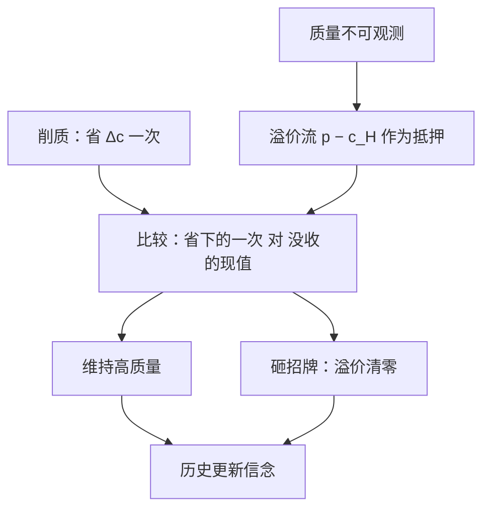

# 质量选择与声誉

看不见的质量要看得见的价格来担保：溢价是押在柜台上的抵押品，砸一次招牌就当场没收——债主是顾客。

<footer>—— 据 Klein and Leffler, AER 1981；Shapiro, JPE 1983 整理</footer>

[上一课](/econ/advertising-economics)的第三读法把广告接到质量：只有付得起沉淀成本的厂商才做得起广告，花钱本身是信号。本课把质量变成**选择变量**：支付买不到质量本身，只能买历史——厂商的质量选择是一个跨期承诺问题。静态一侧是[柠檬市场](/econ/akerlof-lemons)：逆向选择把高质量逐出市场；本课补时间的一侧：声誉如何在重复关系里把质量买回来。[后市场锁定](/econ/aftermarket-lockin)课已写过特例——主件沉没后的售后机会主义；本课推广成一般会计：不可观测的质量，要靠一笔可没收的押金担保。

## 问题

单期市场里，消费者只愿付期望质量的价格：高质量成本 $c_H$，低质量成本 $c_L$，二者差 $\Delta c$ 但售价相同，高质量退出——柠檬均衡。缺口不是把逆向选择重讲一遍，而是问时间如何修复它。做法：让厂商连续多期在同一市场卖，消费者按历史更新对质量的信念；均衡里价格高于高质量的平均成本，溢价流 $(p-c_H)$ 每期都在流，而它**只在继续诚实时才流**。削质的激励约束于是写成：

$$
p-c_H \;\geq\; \frac{1-\delta}{\delta}\,\Delta c .
$$

左边是削质会没收的抵押品现值，右边是削质省下的当期成本。折扣越狠（$\delta$ 越小）或成本差越大，要求的溢价越高。这就是 Klein–Leffler 1981 与 Shapiro 1983 的共同骨架：**溢价不是垄断税，是抵押品的会计需要**；Shapiro 还补了对称的一步——建誉期要亏本卖高价质（押金从亏损里攒出来），溢价是这笔投资的回报率。

折扣因子折算成「未来的期数」更直观：月付市场里 $\delta\approx 0.99$ 时，抵押品约等于一百个月的溢价，能担保的成本差高达当期溢价的百倍量级。押金之厚正是溢价之高的原因。

## 方法

激励约束给可检验的截面含义。其一，质量越难观测的品类溢价越高、品牌越集中；规格品有便宜的第三方检验，不需要押金——[信息中介](/econ/information-intermediaries)的位置由此划清：中介替代押金，押金替代检验。其二，品牌是可转移的抵押：同一块押金担保多条产品线，所以品牌扩张是套保也是透支——把招牌借给低质量延伸品，等于用一份押金担保两笔债。其三，进入者要亏本建誉，进入沉没里多出一项「押金本金」，与[进入、退出与沉没成本](/econ/entry-exit-sunk)的 $F$ 对上账。

动态博弈由 Kreps–Wilson 1982 补齐：有限重复的合作本会被逆向归纳拆掉；只要对手眼里有一点概率遇到「天生诚实」的类型，均衡就会长期维持高质量——声誉的价值来自不完全信息。与[无名氏定理](/econ/folk-theorem)的分工：那课说重复**可以**撑住任何个体理性的结果；声誉文献回答的是哪一个结果**被选中**。

## 机制

抵押会计解释三个反直觉事实。一，高质量厂商愿意「定价过高」且长期不满产：溢价不是市场势力滥用，是抵押品的保管费，降价就等于取回押金。二，事故后的全面召回与超额赔偿，是当众销毁抵押品再重新入金——会计上合理，直觉上难懂。三，游客生意质量普遍差：不是人不诚实，是 $\delta$ 在「不会再来」下坍缩。[后市场锁定](/econ/aftermarket-lockin)的会计在此重逢：锁定压低顾客的退出选项，从而压低有效 $\delta$——锁定越深抵押越薄；长期订阅与平台评分，是把 $\delta$ 抬回的技术。

错在哪：把品牌溢价直接当反垄断证据——它是润滑剂，除非押金被用来挡检验（抵制评测、收买中介）；反过来把「市场会自己担保质量」说死也不行——押金需要消费者记住历史并协调惩罚，匿名市场里天然失灵。

## 边界

本课不写品牌估值，不做规制比较；评级与认证是[信息中介](/econ/information-intermediaries)的对象，这里只管厂商自己的押金。质量多维时，约束只绑不可观测那一维——可观测维度被过度供给（大堂豪华、床垫一般），不是非理性。声誉均衡依赖惩罚协调，现实惩罚更慢更弱，押金的实际担保力低于折算值。后课默认：质量是承诺问题，声誉是抵押；下一课把承诺问题搬进供应链，问合同写不完时谁来拥有资产。

## 小结

- 静态柠檬挤走高质；动态声誉用溢价流做抵押修复。
- 维持条件：溢价现值 $\geq$ 削质的一次性节约，折扣与成本差定溢价高度。
- 建誉期亏本与定价偏高是抵押会计，不是垄断税；游客市场差在 $\delta$ 坍缩。
- 广告沉淀（上一课）与后市场锁定（锁定压低有效 $\delta$）是同一本账的两页。
- 出处：Klein–Leffler 1981；Shapiro 1983；Kreps–Wilson 1982。
